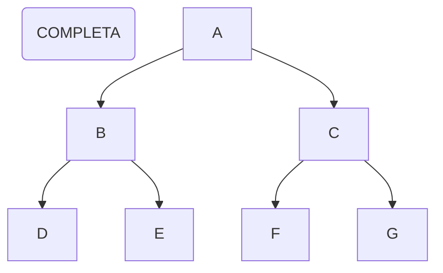
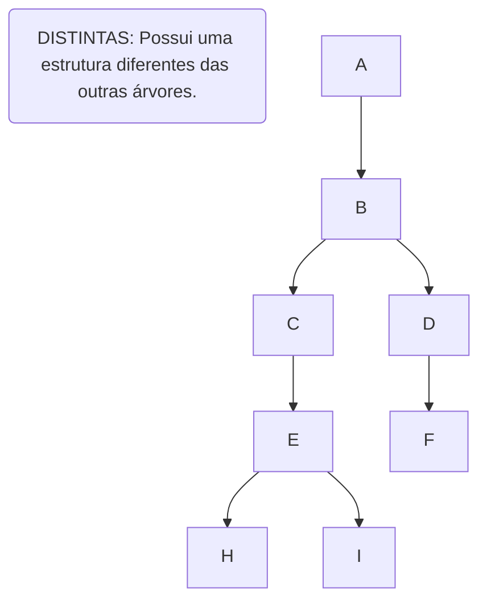
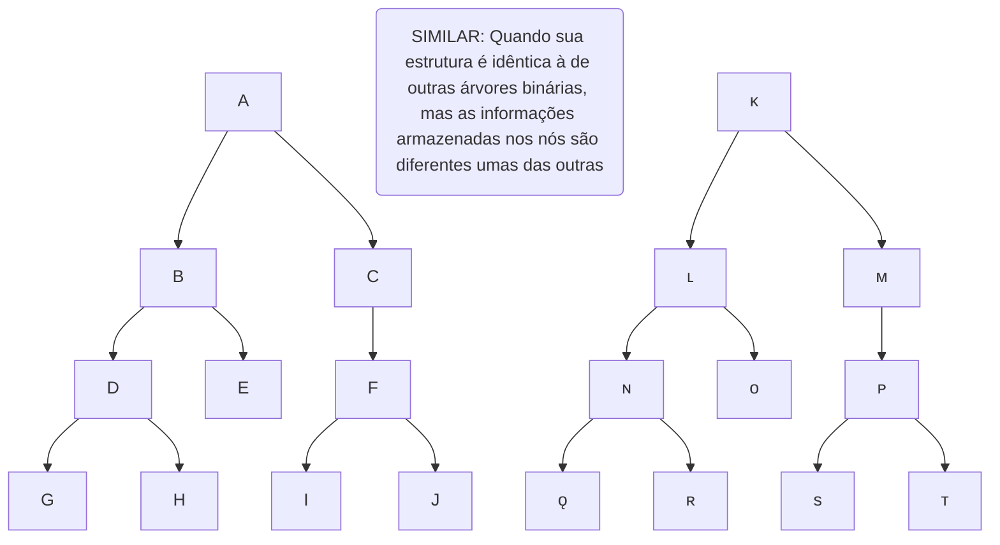
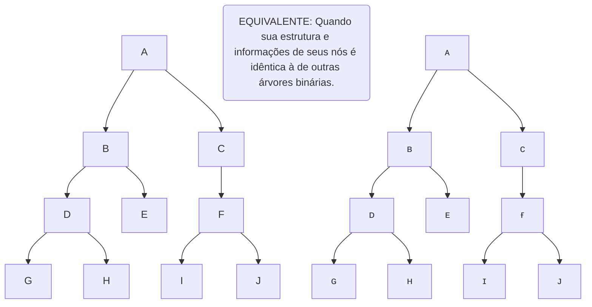
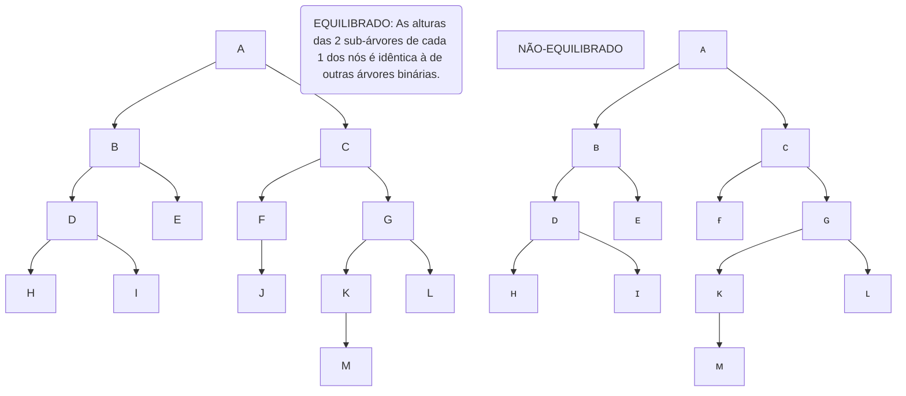
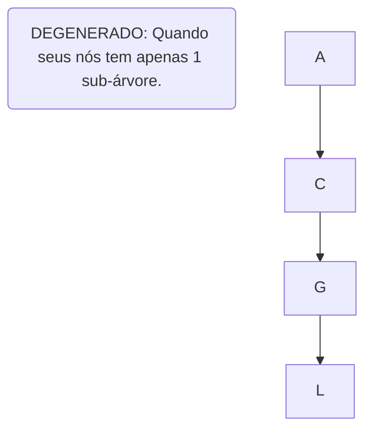

# PENSAMENTO COMPUTACIONAL
 O pensamento computacional é uma estratégia que permite resolver problemas de forma eficiente, criando soluções genéricas para problemas variados pertencentes a uma mesma classe. Ele refere-se ao processo de pensamento envolvido na expressão de soluções em passos computacionais (algoritmos) que podem ser implementados no computador. De forma geral, é a formulação de passos lógicos para a solução e resolução de problemas computacionais (sistemático e eficiente).<br/>
 É baseado em 4 pilares:
<pre>
1. Decomposição >  Dividisão¹ ──────┐
2. Padrões      >            ┌──────┴─────┐
3. Abstração    >       ²Repetição──+──³Foco
4. Algoritmos   >            └──────┼─────┘
                                    v
                              GENERALIZAÇÃO
                                   ||
                              ESTRUTURAÇÃO -> Execução⁴
</pre>
## 1. DECOMPOSIÇÃO:<br/>Dividir um problema complexo em subproblemas.
 Ação de dividir um problema em partes menores; a ideia é resolver as partes do problema para então obter a resposta do todo. Na computação, quando escrevemos algum software ou código, geralmente dividimos a escrita em partes menores que vão sendo construídas aos poucos.<br/>
 É preciso compreender como executar cada etapa de um pensamento computacional. *"Quebrar"* o problema é o 1º passo da resolução de problemas: dividir um problema complexo em problemas menores = problemas mais fáceis de se resolver.<br/>
**Estratégia:**
<pre>
                                        _          _/         __   ___
Processo de quebrar e determinar \\    /_\  |\ |  /_\  |   | |__  |__
partes menores e gerenciáveis    //   /   \ | \| /   \ |__ |  __| |___
                                       ___  /     _____  ____  ___   ____
(RE)Combinar os elementos        \\   |___  | |\ |  |   |___  |___  |___
recompondo o problema original   //    ___| | | \|  |   |____  ___| |____

Ordem de execução de \\ > Sequencial -> Dependência entre tarefas executadas em fila
tarefas menores      // > Paralelo   -> Tarefas podem ser executadas concomitentemente (+ eficiencia - tempo).
</pre>
### *Como Decompor?*
**Identificar/coletar os dados    =>    Agregar os dados    =>    Funcionalidade    =>    Decomposição**
<pre>
Exemplos de Decomposição:

COZINHAR
- Identificar os ingredientes
- Determinar as etapas (sequencial ou paralelo)
- Executar cada etapa
- Agregar/agrupar os ingredientes para finalizar (recompor com coerência)

FUNCIONAMENTO DE UM OBJETO/SISTEMA
- Identificar os componentes
- Papel de cada componente
- Interdependência entre os componentes/peças

CRIAR UM APP
- Finalidade       \ 
- Interface         \  Definição de componentes e etapas
- Funcionalidades   /
- Pré-requisitos   /

DOCUMENTAÇÃO
- O que será abordado     \ 
- Estrutura                \  Definição de componentes e etapas
- Conteúdo de cada tópico  /
- Textos de conexão       /

MOVIMENTOS DE UM AVATAR
                  ___________________AÇÕES____________________
                 ↓                                            ↓
           ____PADRÃO_____                         ________MOVIMENTO______
          ↙               ↘                       ↙       ↓      ↓        ↘
    __VIRAR__          __MOVER__               ANDAR   CORRER  SENTAR  LEVANTAR
   ↙         ↘        ↙         ↘                     ↙      ↘ 
DIREITA  ESQUERDA   CIMA       BAIXO           MOVER PERNA  IMPULSIONAR
</pre>
## 2. PADRÕES
 Observação e identificação de similaridades, recorrências e tendências em dados ou ações. Ação de descrever o que vai acontecer com base em evento anteriores. Na computação, é comum utilizar estruturas de repetição, por exemplo, para blocos de códigos semelhantes que se repetem de alguma forma ou agrupar e reutilizar dados que são usados repetidamente.

### RECONHECIMENTO DE PADRÕES
- *Modelo base*
- *Estrutura variante*
- *Repetição*

 **Roteiro: um modelo de referência que determina uma estrutura invariante e que pode determinar repetição. A partir de um modelo podemos determinar objetos diferentes em que uma estrutura se repete.*

> Exemplo: Cadeiras -> 🦽🦼💺🪑🛋️
><pre>
>Padrão     \ - Pé
>Referência / - Assento
></pre>
### *Como Reconhecer Padrões Dentro do Contexto?*
 *Através das similaridades e diferenças.*

>Exemplo: Fotos de redes sociais (técnica de compressão e armazenamento):
> - Foto > Compressão > Salvo no BD = Processo de Armazenamento Padrão Utilizado por Diferentes Redes Sociais
<pre>
Compressão de Dados:
 _____   _____   _____   _____   _____   _____   _____   _____   _____   _____   \ 
|     | |     | |_____| |_____| |+++++| |+++++| |     | |     | |     | |     |   \ Compressão por
|*****| |*****| |_____| |_____| |+++++| |+++++| |/////| |*****| |     | |/////|   / Reconhecimento de Padrões
|_____| |_____| |_____| |_____| |±±±±±| |±±±±±| |_____| |_____| |_____| |_____|  /

[ ] = 1
[+] = 2
[-] = 2
[/] = 2
[*] = 3
</pre>
### *Por Que Determinar Padrões?*
 *Generalizar com objetivo de obter resolução para problemas diferentes.*
<pre>
 _______________________________________________________________
|                                                               |
| Classificar -> Categorias -> Grupos de Objetos Semelhantes    |
|                                                               |
|                      Caracteristicas \            Grupo de    |
| Classe = estrutura ❮                  ❯ comuns -> Objetos     |
|                      Comportametos   /            Semelhantes |
|_______________________________________________________________|
*Objetos = Instâncias de uma Classe
</pre>
- **Categoria**<br/>Agrupa elementos com base em características/propriedades semelhantes, exemplo: *"mamíferos"*, *"aves"*, etc.
- **Classe**<br/>É uma subdivisão mais específica de uma categoria. No exemplo anterior, a categoria *"aves"* pode ser subdividida em: *"aquáticas"*, *"terrestres"* e *"voadoras"*.

### *Como Detectar e Determinar Padrões?*
*- Grau de Similaridades*<br/>
*- Grupos Conhecidos e Grupos Desconhecidos*

### *Como o Computador Reconhece Padrões?*
**Por comparação**: Se ele não possui a informação não será capaz de realizar a comparação.
<pre>
                                ⬐subjetividade⬎
Como Simular o Comportamento de Machine Learning?

Representação de Atributos
             ⤷  Aprendizado ➝ Conceito Associado  
                                   ao Objeto
                            Armazenar  ⤶
                            os Dados
                               '-⇢ Para consutas posteriores, poder determinar p/
                                     um novo objeto qual categoria ele se encaixa
                                                        |
                                    Regras de          ⤎
                                     Decisão
                                     Exemplo
                                        ↓
 Possui todas as caraterísticas   ❮ Objeto "1"
 de uma determinada categoria "A"
                  ↘
                   Então, objeto "A" é da categoria "1"

Extração de Características  \ 
            ↓                 \ 
           para                ❯ Abordagem
            ↓                 /
   Classificação de Dados    /

Diferentes Métodos e Aplicações
</pre>
## 3. ABSTRAÇÃO
Identificação dos princípios gerais que criam padrões, mantendo o foco nos aspectos essenciais e ignorando os detalhes menos importantes, de modo que a solução possa ser válida para outros problemas da mesma natureza. *"Abstrair o que é mais importante e ordenar as relevancias, extrapolando o conceito do problema para uma forma generalista."*
- Ação de ignorar os detalhes de uma solução de modo que ela possa ser válida para diversos problemas (generalista).
- Isolar aspectos relevantes do problema para tratá-los de forma individual (linkando -> decomposição).
- Na computação, quando pensamos em criar um software, pensamos primeiro no que ele deve ser, deixando os detalhes para depois.
  - **ABSTRAIR**: Observar, um ou mais elementos, avaliando características e propriedades separadas.
  - **ABSTRAÇÃO**: É um processo intelectual de isolamento de um objeto da realidade.
  - **GENERALIZAR**: A partir de um objeto, criar novos objetos relacionados. Tornar geral, mais amplo, mais extenso.
<pre>
Pegar os elementos principais           =>          Extrapolá-lo para o          =>            Tornar
de um determinado objeto                            mundo das ideias                           geral
</pre>
### GENERALIZAÇÃO x ABSTRAÇÃO
 Na lógica, é a operação intelectual que consiste em reunir numa classe geral, um conjunto de seres ou fenômenos similares.

### *Como Classificar os Dados?*
*- Características*<br/>
*- Pontos Essenciais*<br/>
*- Generalizar x Detalhar*
<pre>
Representação dos Dados:

-- Estudantes ------------------------> Características: -----------------------
|  (geral - usado para todos os alunos)                                        |
|                                       >PONTOS ESSENCIAIS:  >DETALHES         |
|                                       -Matrícula           -Trabalho         |
|                                       -Nome                -Filhos           |
|                                       -Idade               -Cursos Extras    |
|                                       -Sexo                -Data de Ingresso |
|                                       -Endereço                              |
|                                       -Campus                                |
|                                       -Curso                                 |
|                                       -Contato                               |
--------------------------------------------------------------------------------
</pre>
## 4. ALGORITMO
 Segundo o dicionário, algoritmos são uma série fixa de tarefas, ações ou raciocínios que, realizados passo-a-passo, levam a determinado resultado pretendido. Tecnicamente falando, é uma sequência finita e não ambígua de instruções computáveis que, aplicadas a um conjunto de dados, conduzem à solução de um problema e/ou permitem realizar certa tarefa. De forma prática, é a ação de pensar na solução de um problema a partir de uma sequência finita de passos. Então podemos dizer que, um algoritmo é um conjunto de regras e procedimento lógicos perfeitamente definidos, que levam a solução de um problema em um número finito de etapas. Na computação, quando escrevemos um código, descrevemos o passo-a-passo lógico que o computador deve fazer para realizar uma tarefa ou atividade. Um programa é basicamente uma sequência de instruções/comandos que são dadas ao computador para efetuar alguma tarefa, ou seja resolver um problema. Programa = Algoritmo = Sistema.<br/>
 **Automatizar: Definir passo-a-passo da execução da tarefa.*
<pre>
Ciclo de Processamento:

         ALGORITMO
             ⤺
Input  ➝  Process  ➝  Output
             ⤻
</pre>
 **O processamento é a execução dos passos lógicos necessários para que os elementos de entrada se transformem em dados/informações na saída.*

 **Ex.: Receita de Bolo**: ingredientes (entrada) -> misturar e assar os ingredientes (processamento) -> saída (bolo).<br/>
Observe que o modo de preparo *- processamento (instruções para realizar a tarefa = algoritmo) -* deve ser apresentado de forma lógica, imperativa/infinitiva e não deve apresentar ambiguidades.
<pre>
Método Lógico:

                 /               Indução
                / Indução -> Fenômeno Observado -> Leis e Teorias
Classificação  /                 Dedução
               \ Fenômeno Observado -> Leis e Teorias -> Previsões e Explicações
                \                Abdução
                 \  Conclusão -> Abdução -> Premissa
Tipos:
                                 Inferência
                                ↙          ↘ 
                           Sintética      Analítica
                           ↙       ↘          ↓
                       Abdução   Indução   Dedução

Design de Algoritmos:

                                   Análise
                             (definir a solução)
                            /                   \
                      Refinamento              Teste
            (Aperfeiçoamento da solução) ー (testar a solução)

Processo Contínuo:

                              Raciocínio Lógico
                             /                 \ 
                       Refinamento         Decomposição
                            |                   |
                        Algoritmos           Padrões
                              \   Abstração  /
</pre>
**Aplicações:**
1. *CS + Math*: Desenvolvimento e Abstração, Reconhecimento de Padrões
2. *CS + Sci/Eng*: Análise de Dados e Design de Soluções, Deficinação e Uso de Abstrações, Testes e Refinamentos de Algoritmos
3. *Math + Sci/Eng*: Desenvolvimento e Abstração, Reconhecimento de Padrões
4. *CS + Math + Sci/Eng*: Modelagem, Definição de Problemas, Definição e Uso de Abstrações, Reconhecimento de Padrões

### Raciocínio Lógico
 Para escrevermos algoritmos usamos a lógica, que é a maneira de organizar nosso raciocínio de forma rigorosa e coerente, em forma de pensamento estruturado (organizado em passos lógicos), para permitir encontrar a conclusão que determina a resolução de um problema.<br/>
 Exemplo de Raciocínio Lógico:<br/>
 Um pai, uma mãe e seu casal de filhos estão sentados em uma mesa. Os homens são Roberto e Sérgio, as mulheres Tereza e Fernanda. Sabe-se que o pai está à frente de Fernanda e o filho à sua esquerda, enquanto a mãe está ao lado de Sérgio.
<pre>
                 Fernanda
                 (FILHA)
            ___________________
  Filho    |                   |    (MÃE)
(ROBERTO)  |                   |   (TEREZA)
           |___________________|   
                    Pai
                  (SÉRGIO)
</pre>

**Processo de resolução de problemas "step-by-step" utilizando instruções:**
><pre>
>O que precisa ser feito?    ⤵
>                          Instruções
>Qual a ordem de execução?   ⤴
></pre>
>Dados -> Manipulação / Processamento dos Dados -> Armazenamento dos Dados

**Aperfeiçoamento = Melhoria = Aprimoramento = Refinamento**: *A partir de uma solução, determinar pontos de melhoria e refinamento.*
<pre>
Ato de Aperfeiçoar:

Encontrar Solução Eficiente    \ Melhor Uso de Recursos
Otimizar Processos             /
Simplificar Linhas de Código   \ Melhores Códigos e Algoritmos
Funções Bem Definidas          /

         ➦ Eficiência \                      Programas:
Computador             ❯        Precisam ser determinadas as instruções 
         ➥ Velocidade / detalhadas p/ a execução da tarefa e processamento dos dados
</pre>

# LÓGICA DE PROGRAMAÇÃO

* *O que é lógica?*<br/>
 Forma de Pensamento estruturada que visa a determinação do que é verdadeiro ou não; Sequência *"óbvia"* a se seguir e executar para atingir um objetivo ou solucionar um problema.

* *O que é problema?*<br/>
 É uma questão que foge a uma determinada regra, é um desvio de percurso o qual impede de atingir um objetivo com eficiência e eficácia e/ou finalizar uma tarefa.

* *O que é lógica de programação?*<br/>
 Organização e planejamento das instruções assertivas em um algoritmo a fim de viabilizar a implantação de um programa.

 A lógica é o conhecimento básico necessário para escrever um algoritmo. Ela é a maneira como organizamos nosso raciocínio de forma coerente e eficiente. Por meio da lógica, raciocinamos sobre o problema e pensamos na sequência de passos necessários para resolvê-lo.

## TÉCNICAS DE LÓGICA DE PROGRAMAÇÃO<br/>Modelos de Desenvolvimento e solução

### Técnica Linear
Ⓐ-----o---o---o-----Ⓑ

- Modelo tradicional
- Não tem vínculo
- Estrutura hierarquica
- Programação de computadores
- Execução sequenciada
- Única dimensão
- Ordenação de elementos por uma única propriedade

### Técnica Estruturada
⠀⠀  ┌----o----┐<br/>
Ⓐ---o----o----Ⓑ

 Organização, disposição e ordem dos elementos essenciais que compõem um corpo (concreto ou abstrato).
<pre>
           /    ➦ Programas
          /  Escrita
Objetivo ❮   Entendimento
          \  Validação
           \ Manutenção
                ➥ Facilitada
</pre>

### Técnica Modular
<pre>
 ________________________ 
| [MÓDULO 1]             |      ->      Partes independentes
|              [MÓDULO 3]|                       ↓
|   [MÓDULO 2]           |      Controladas por um conjunto de regras
|            [MÓDULO 4]  |
|________________________|    *Cada módulo possui suas próprias regras

*Modelo padrão da técnica modular:*
Entrada de dados   ->   Processo de transformação   ->   Dados de saída

       / - Simplificação
Metas ❮  - Decomposição do problema
       \ - Verificação do módulo
</pre>
## FUNDAMENTOS DE ALGORITMOS

**Primeiros passos para começar a programar:**
1. *Tipologia de dados e variáveis*
2. *Instruções primitivas*
3. *Estruturas condicionais e operadores*
4. *Estruturas de repetição*
5. *Vetores e matrizes*
6. *Funções*
7. *Instruções de entrada e saída*

### TIPOLOGIA DE DADOS E VARIÁVEIS
<pre>
          ⬐  INFORMAÇÃO     ↰
  input de                   que geram
   DADOS                       DADOS
inicializam              processam e tratam
      ↳       INSTRUÇÕES
        realiza operações que ⬏
</pre>
#### TIPOS DE DADOS
 Dados são qualquer objeto que possa ser manipulado pelo computador, um dado pode ser um número, uma letra ou uma palavra que se transforma em informação utilizável quando contextualizadas. Diferentes tipos de dados de dados são representados de diferentes maneiras pelo computador, por xemplo, um número inteiro não é armazenado internamente da mesma forma que um caracter (embora algumas linguagens de alto nível permitam até certo ponto ignorar a representação interna dos dados). Para algumas linguagens tipadas, é necessário declarar qual o tipo de dado e qual o comportamento que o dado deverá ter (em alguns casos como em sistemas embarcados, deve-se especificar também o tamanho do dado a ser aceito pela variável). Então, em tipos de dados devemos especificar o formato do dado que será armazenado em uma variável, ou seja, numa posição de memória. Assim, ao declararmos uma variável, além do identificador, precisamos informar o tipo de dado que aquele endereço (variável) pode armazenar. O tipo de dado implica também no espaço de memória a ser reservado e ajuda a verificar se o que está sendo armazenado naquela posição é coerente com o que o programador pretendia, pois, em nível de máquina, todos os dados são representados usando uma sequência finita de *bits*. Já se deduz deste fato que nem todos os dados são representáveis em um computador. A definição de um tipo de dado inclui a definição do conjunto de valores permitidos e as operações que podem ser realizadas sobre esses valores. Quando um dado é usado em um programa, seu tipo deve ser determinado para que o tradutor saiba como manuseá-lo e armazená-lo. Dependendo da linguagem, pode ou não ser necessário declarar expressamente o tipo de cada dado no programa. Ou seja, se o programador pretendia armazenar um número mas o usuário digita uma letra, isso é uma incoerência e pode causar erros. Os espaços na memória são diferentes para cada valor, e por isso foram criados os *"Tipos de Dados"*, para criar um padrão de tamanho de variáveis, a *tipagem de dados* refere-se à forma como declaramos os tipos de variáveis. Por exemplo, alguns declaramos como *inteiros*, outros como *strings*, ou *pontos flutuantes*, e assim por diante, e algumas linguagens nem é necessário declarar o tipo por ser de *tipagem dinâmica*, isso quer dizer que diferente da *tipagem forte* presente nas linguagens de *tipagem estática* onde precisamos definir qual o tipo da variável (fazendo com que aquela variável aceite apenas aquele tipo de dado durante toda a execução do programa, não permitindo assim operações entre objetos de diferentes tipos), linguagens com *tipagem fraca* mudam os tipos de dados aceitos pelas variáveis durante a execução do código, dando maior flexibilidade, mas também maior chance de problemas durante a execução do programa. Vejamos quais são os principais *tipos básicos* (ou *primitivos*) de dados presentes nas linguagens:
<pre>
           / Int: -3, -2, -1, 0, 1, 2, 3...
Numéricos ❮
           \ Double¹ (+ precisão / + gasto de memória) / Float² (- precisão / - gasto de memória): -5.5, -1.5, -0.555, 1.3, 5 (5.0), 5.9...

Char      ❮ ? A # b + C ! d $

String    ❮ palavras e frases

Bool      ❮ Lógico: FALSO (0) | VERDADEIRO (1)
</pre>
##### TIPAGEM DE DADOS

```C++
#include <iostream>
#include <locale.h>
using namespace std;

int main() {
    setlocale(LC_ALL, "");

    // tipos de dados & variáveis
    int inteiros = 3;
    float pontoFlutuante = 0.99;
    double decimais = 9.99;
    char letra = 'a';
    const char* letras = "abcde";
    string texto = "Dev C++";
    bool condicao = true;

    // imprimindo
    cout << "Inteiros: " << inteiros << "\n";
    cout << "Decimais: " << decimais << "\n";
    cout << "Ponto Flutuante: " << pontoFlutuante << "\n";
    cout << "Caractere: " << letra << "\n";
    cout << "Caracteres: " << letras << "\n";
    cout << "String: " << texto << "\n";
    cout << "Booleana: " << condicao << "\n";

    return 0;
}
```

##### ESTRUTURA DE DADOS
 São as diferentes estruturas utilizadas para representar a informação em um computador. Neste sentido, uma estrutura de dados é uma forma de organizar um conjunto de dados elementares, de forma eficiente, com o objetivo de facilitar seu uso e manipulação.<br/>
 Vamos pensar em um exemplo de estrutura de dados, se você possui uma livraria e está desenvolvendo uma aplicação para ter um controle do estoque, com uma estrutura de dados eficiente você poderá ter as informações representadas, não apenas de um livro em particular, mas de todos os livros que você tem em um sistema. Desta forma, com estruturas de dados você pode lidar com grandes quantidades de informações de forma otimizada.<br/>
 Se buscarmos o conceito formal de estrutura de dados, veremos que ele não está muito distante do que já descrevemos: *"uma estrutura de dados é uma coleção de dados que pode ser caracterizada por sua organização e pelas operações que nela são definidas".*<br/>
 Em conclusão, *estruturas de dados são geralmente baseadas na capacidade do computador de recuperar e armazenar dados em qualquer lugar em sua memória.*

##### ESTRUTURA DE BANCO DE DADOS
 Antes de entrarmos nos diferentes tipos de estruturas de dados existentes, vejamos a **diferença** *entre uma estrutura de dados e uma estrutura de banco de dados.* Como dissemos antes, quando nos perguntamos *o que é uma estrutura de dados na programação*, especificamos que é **uma forma de organizar um conjunto de dados com o objetivo de facilitar a sua manipulação.**</br>
 Por outro lado, a **estrutura de um banco de dados** *também é um conjunto de dados, mas com a diferença de que eles pertencem ao mesmo contexto, sendo armazenados  sistematicamente para uso posterior.* Para entender melhor o conceito, vejamos um exemplo, pense em uma biblioteca nos anos 90. Naquele tempo, para encontrar um livro, era preciso procurá-lo em arquivos em uma parede da biblioteca. Ali, dentro de pequenas prateleiras, estavam os arquivos ordenados por ordem alfabética e por assunto. Então, você escreveu o código e o levou ao bibliotecário que, através desses números, pôde encontrar a prateleira onde estava o livro e entregá-lo a você.<br/>
 Foi o que fizeram os bibliotecários, catalogando livros de forma sistemática para saber onde procurá-los, é o que conhecemos hoje como estrutura de um banco de dados. Por que as estruturas de banco de dados são úteis? Porque, pensando nisso do ponto de vista da programação, atualmente é possível armazenar grandes quantidades de informações de forma segura, bem como acelerar os processos de busca, tornando-os mais eficientes.</br>
 Pensando nisso a partir da programação da estrutura de dados, poderíamos estabelecer uma outra diferença com relação ao armazenamento. O banco de dados é armazenado na nuvem ou no disco rígido do PC sob a forma de tabelas, onde a estrutura se refere a como essa tabela é composta e como a informação é organizada.</br>

###### TIPOS DE ESTRUTURAS DE DADOS
 Os tipos de estruturas de dados podem ser oganizados usando 2 tipos diferentes de estruturas:
 - **ESTRUTURAS ESTÁTICAS DE DADOS**: São aquelas em que o tamanho da memória ocupada é definido durante a escrita do programa e não pode ser alterado durante a execução.
 - **ESTRUTURAS DINÂMICAS DE DADOS**: Estes não tem as limitações de tamanho da memória ocupada. Ao utilizar um tipo de dados específico, chamado de *ponteiro*, é possível construir estruturas de dados dinâmicas que são suportatadas pela maioria das linguagens.<br/>
 Ao contrário das estruturas estáticas (que contém um espaço definido para armazenar um número fixo de elementos), uma estrutura de dados dinâmica se modifica e expande durante a execução do programa. podem ser classificados em dois grupos distintos: **estruturas de dados lineares** e **não-lineares**.
    - **ESTRUTURAS DE DADOS LINEARES**: As estruturas de dados lineares são caracterizadas pelo fato de que seus elementos são colocados lado a lado e relacionados de forma linear. Cada elemento da estrutura pode ser composto por um ou vários sub-elementos ou campos que podem pertecenr à qualquer tipo de dado. Existem 3 tipos de estruturas lineares:
      1. Pilhas
      2. Filas
      3. Listas
    - **ESTRUTURAS DE DADOS NÃO-LINEARES**: As estruturas de dados não-lineares também são conhecidas como *multi-linked*. Nessas estruturas, cada elemento pode ser ligado a qualquer outro componente. Isso significa que cada elemento pode ter múltiplos sucessores ou múltiplos predecessores. Existem 2 estruturas de dados não-lineares:
      1. Árvores
      2. Redes

#### MANIPULAÇÃO DE DADOS

##### DECLARAÇÃO
variável = nomeDaVariavel / nome_da_variavel / nome-da-variavel

##### Regras
- *Atribuição de 1 ou mais caracteres*
- *1º caractere do nome deve ser uma letra*
- *O `-` e `_` são os únicos carateres especiais permitidos*
- *Proibido o uso de palavras reservadas*

##### TIPAGEM DE COMPORTAMENTO

###### VARIÁVEL
 Para utilizar qualquer dado inputado, este precisa ser armazenado na memória do computador, e, para que possamos armazenar este dado, é necessário realizar a **RESERVA DE MEMÓRIA**. *A reserva de memória se dá através da declaração de variáveis*, podemos fazer a analogia da memória do computador com um armário de gavetas, utilizadas para guardar coisas de maneira organizada, por exemplo, podemos utilizar uma gaveta para armazenar roupas íntimas, outra para blusas, outras para calças e assim por diante. Para facilitar a localizaçao, normalmente fazemos uso de **IDENTIFICADORES**, *ou seja, colocamos "etiquetas" para identificar o conteúdo de cada gaveta*. Sabemos que os espaços dentro das gavetas são limitados, portanto, é preciso saber quando a gaveta está cheia. De fato, cada programa que está armazenado na memória do computador ocupa um espaço, a memória do computador é toda endereçada, ou seja, cada byte de memória possui um endereço de modo que se possa controlar quais posições estão livres ou ocupadas, e também para saber o que está armazenado em cada endereço. Esses endereços obedecem à referências em notação binária ou hexadecimal, e seria muito complicado para os programadores utilizarem essas referências, assim, as linguagens de programação permitem que se atribua um nome (ou seja, identificadores), para as posições de memória da máquina. Isso ocorre através do que chamamos de **DECLARAÇÃO DE VARIÁVEIS**. *Em programação, uma variável é um local da memória do computador cujo o conteúdo pode ser modificado. São como ponteiros (ou "apelidos" que damos) para o caminho até a posição de memória onde nosso valor está guardado.* Em outras palavras, para manipular e utilizar os dados em um programa, eles devem ser alocados em variáveis. Por exemplo, se reservarmos memória para armazenar o preço de um produto, num determinado momento o conteúdio pode ser R$ 3,15, em outro momento poderá ser R$ 3,95 e etc. Esse local de memória é de fato o endereço da memória RAM, e é reprentada por um identificador, que é o nome da variável criada (ou seja, um *"apelido"* que daremos para um endereço de memória de acordo com o conteúdo que o nosso programa precisa armazenar), cujo o conteúdo pode-se alterar no decorrer da execução do programa. Por exemplo, se precisamos reservar memória para armazenar a idade de 2 pessoas, podemos por exemplo identificar essas posições como `idade1` e `idade2`, em que cada uma ocupa uma posição na memória. No exemplo, `idade1` tem o conteúdo igual a *29* e `idade2` tem o conteúdo igual a *26*, sendo `idade1` e `idade2` os identificadores (ou seja, o nome das variáveis) *29* e *26* os respectivos conteúdos no atual momento. Lembrando que uma variável só pode assumir 1 valor por vez.

- **Características de variáveis**
  - *Mutáveis*
  - *Inconstantes*
  - *Incertas*
  - *Instáveis*

 Uma variável é uma estrutura de armazenamento de dado. Podendo assumir qualquer um dos valores de um determinado conjunto de valores, contudo, ela está restrita ao seu tipo, ou seja, ela só pode assumir um tipo de valor por vez.
<pre>
           /    AÇÃO   -> modificação/alteração/manipulação de estado
Pápeis da ❮      ou
variável   \  CONTROLE -> monitorada/vigiada
</pre>

###### TIPOS DE VARIÁVEIS
 O **escopo** (*scope*) de uma variável é o contexto (a área do programa) no qual a variável é visível/acessível (declarada), e portanto pode ser usada. O escopo determina a acessibilidade de nosso código, ou seja, de onde podemos acessar nossas variáveis. Temos dois escopos para as variáveis:
 - **Global**: Podemos acessá-los de qualquer lugar em nosso código.
 - **Local**: Podemos acessá-los apenas dentro do escopo em que foram definidos. Normalmente funciona. Eles serão acessíveis de dentro da própria função ou de funções aninhadas em níveis mais altos do que a função anterior. Ou seja, variáveis locais podem ser vistas de dentro para fora, mas nunca de fora para dentro da função.

 A recomendação geral é definir como variáveis locais todas as variáveis que são usadas exclusivamente para executar as tarefas atribuídas a cada função. As variáveis globais são usadas para compartilhar variáveis entre funções de uma maneira simples.

* **var:**
  - Tipo global, ou seja, é acessada em *"qualquer lugar"* do código.
  - Pode ser reatribuída e redeclarada.
  - Não respeita o escopo de bloco (por exemplo, dentro de uma instrução `if` ou `for`).

```JS
var x = 10;

if(true) {
    var x = 20; // A variável 'x' é a mesma dentro e fora do bloco
    console.log(x) // 20
}

console.log(x); // 20
```

- **let:**
  - Introduz o escopo de bloco, o que significa que a variável é visível apenas dentro do bloco onde foi declarada (por exemplo, dentro de um `if`, `for` ou {}).
  - Pode ser reatribuída, mas não declarada no mesmo escopo.

```JS
let y = 10;

if(true) {
    let y = 20; // A variável 'y' possui um valor dentro do bloco
    console.log(y) // 20
}
// e outro valor fora do bloco
console.log(y); // 10
```

###### CONSTANTE
Tudo aquilo que é fixo e estável.
><pre>
>Exemplo: π = 3.14, Φ = 1.618, dobro (valor * 2 = dobro), metade (valor / 2 = metade)
>                                      var  const  var             var  const  var
><pre>

###### TIPOS DE CONSTANTES

* **const:**
  - Similar ao `let` em relação ao escopo de bloco.
  - No entanto, uma vez atribuída, o valor não pode ser substituído/reatribuído.

```JS
const Z = 10;

Z = 20;

console.log(Z); // Isso resultaria em erro, pois `const` não permite reatribuição
```

* **define**:
  - O `#define` em C++ é uma diretiva de pré-processador que é usada para definir macros, que são substituições de texto.
  - Processamento Prévio: O `#define` é uma diretiva de pré-processador. Isso significa que ele é processado pelo compilador antes de qualquer compilação real do código.
  - Sem Verificação de Sintaxe: Quando você usa `#define`, o pré-processador simplesmente substitui cada ocorrência do token definido pelo texto correspondente, sem verificar a sintaxe. Portanto, é importante garantir que a substituição seja feita corretamente para evitar erros de compilação difíceis de depurar.
  - Substituição de Texto: O `#define` é usado para substituir um token por outro em todo o código. Não há tipo de dados associado à macro definida por `#define`, é apenas uma substituição de texto.
  - Substituição Direta de Texto: O `#define` não é afetado por escopos de bloco ou por escopo de função. Isso significa que a substituição ocorrerá em todo o código, independentemente do escopo.
  - Não é recomendado para tipos complexos: Enquanto o `#define` é útil para definir constantes simples ou para criar abreviações de código, ele não é recomendado para substituição de tipos complexos, estruturas de controle ou funções. Para isso, normalmente são usados tipos de dados constantes ou funções inline.
  - Escopo Global: As macros definidas por `#define` têm um escopo global, o que significa que elas são válidas em todo o código após a definição, até o final do arquivo ou até que sejam substituídas por outra diretiva #undef.

```C++
#include <iostream>
#include <locale.h>
using namespace std;

// constantes
#define APRESENTACAO cout << "Primeiro nome: " << NOME;
#define NOME "Raphael";

#define SOBRENOME "K. Dias Santos";
const int anoNascimento = 2000;

int main() {
  setlocale(LC_ALL, "Portuguese");

  const string sexo = "Masculino";

  APRESENTACAO;
  cout << "\nSobrenome: " << SOBRENOME;
  cout << "\nAno de nascimento: " << anoNascimento;
  cout << "\nSexo: " << sexo;
}
```

###### OBJETO
 Em JavaScript, um objeto é uma coleção dinâmica de propriedades, onde cada propriedade é uma associação entre um nome (ou chave) e um valor. Esse valor pode ser uma simples string, um número, um booleano, ou mesmo outra estrutura complexa como um array ou mesmo um outro objeto, permitindo a criação de estruturas de dados aninhadas e complexas.
```JS
let pessoa = {
    nome: "Raphael",
    profissao: "FullStack",
    experiencia: 5,
    stacks: ["JavaScript", "TypeScript"]
}
```

###### VETORES E MATRIZES
<pre>
         ┌──┐
VARIÁVEL |  |
         └──┘
         ┌──┬──┬──┐
VETOR    |  |  |  |
         └──┴──┴──┘
         ┌──┬──┬──┐
MATRIZ   ├──┼──┼──┤
         ├──┼──┼──┤
         └──┴──┴──┘
</pre>

###### VETOR
 Container ou Matriz Unidimensional, um vetor é caracterizado por uma variável dimensionada com tamanho pré-fixado, ou seja, é uma variável com tamanho fixo que irá receber *n* valores. Diferente da variável que armazena apenas 1 valor por vez, um vetor pode armazenar *n* valores indexados nas respectivas posições quais foram armazenados. Ou seja, vetor é um agrupamento contíguo de variáveis que armazenam valores do mesmo tipo. Um vetor possui 4 importantes características, são elas: nome (identificador), tamanho (define o número de dados que podem ser armazenados), tipo (tipo dos dados armazenados) e índices (indica a posição de cada dado no vetor).

###### MATRIZ
 Uma Matriz é um vetor bidimensional utilizado para armazenar valores do mesmo tipo, ou seja, é uma tabela organizada em linhas e colunas no fomarto M x N, onde M representa o nº de LINHAS (horizontal) e N o nº de COLUNAS (vertical).
<pre>
          colunas
            n ↓
       • • • | • • •    \ 
linhas • • • | • • •     \   - coleção de variáveis/vetores
  m →  • • • | • • •      \ 
─────────────┼────────>    ❯ - contidas/armazenadas juntas em memória
       • • • | • • •      /
       • • • | • • •     /   - índices (serve para pesquisar/consultar as informações dentro da matriz)
       • • • | • • •    /
             v
</pre>
>Exemplo:<br/>
> Armazenar as notas dos alunos para calcular posteriormente a média.
><pre>
>Aluno_1       Aluno_2    \  vetores:                           1    2
>nota_A = 10   nota_A = 9  ❯        nota_aluno1 = [A, B]  \  1 [10 | 05] ← m
>nota_B = 5    nota_B = 3 /         nota_aluno2 = [A, B]  /  2 [09 | 03] ← m
>                                                               n↑   n↑
>
>indice:
>          /               m   n                           m   n
>vetores ❮  notas_aluno1 [1 | 1] = 10   |   notas_aluno2 [2 | 1] = 9
>          \ notas_aluno1 [1 | 2] =  5   |   notas_aluno2 [2 | 2] = 3
>
>Dados das notas dos alunos:
>
>      ⌐---------------------------- N ----------------------------¬
>     /  ALUNO   1º TRIMESTRE   2º TRIMESTRE   3º TRIMESTRE   MÉDIA
>    /  RAPHAEL       9.5            9.9            9.3        9.5
>M ❮   DÉBORAH       9.5            9.5            9.9        9.6
>    \  DIEGO         9.3            9.3             9         9.2
>     \ FÁTIMA         9              9              9          9
></pre>

###### DEFININDO VETORES/MATRIZES
```C
int vetor[5];
string alfabeto[] = {"A", "B", "C", "D", "E"};

int matriz[3][3];
string tabela[3][3];
```

###### PILHAS (LAST-IN, FIRST-OUT)
 As pilhas são um tipo abstrato de dados, cujo os elementos vão se agrupando uns sobre os outros, a inserção de novos elementos é feita apenas em uma extremidade, que é chamada de *topo*.
<pre>
┌───┐
| ↓ | <- topo
├───┤
| ↓ |
├───┤
| 1 |
└───┘
</pre>
 Quando é necessário obter um elemento que esteja na zona central, é necessário desempilhar os elementos acima dele. Isto se deve a seu mecanismo LIFO, no qual o último elemento que é colocado na pilha é o primeiro que pode ser retirado. Os elementos são trazidos apenas em uma extremidade, que neste caso seria o topo da pilha. Sua implementação pode ser realizada por meio de um vetor (ou *array*). Para isso, são utilizados dosi métodos: `push()`, que insere um elemento na posição livre seguinte da pilha, e `pop()` que extrai o último elemento do vetor.

###### FILAS (FIRST-IN, FIRST-OUT)
 São caracterizadas por permitir a inserção e remoção de elementos livres de maneiras opostas. Neste caso, as **exclusões** *são feitas no início da linha*, enquanto as
**inserções** *são feitas na outra extremidade*, ou seja, no final. Os elementos entram na fila pelo "final" e saem da fila pelo "início". Sua implementação também pode ser feita através de um array, usando o método `shift()`, que *retira* o elemento mais ao "final" da fila e "empurra" os demais para "a frente".
<pre>
 in ┌───┬───┬───┐ out
  → | → | → | 1 |  →
    └───┴───┴───┘
</pre>
 As filas na estrutura de dados têm um mecanismo conhecido como FIFO. Assim, a diferença com as pilhas está na forma como os dados entram e saem. A utilidade das filas está no armazenamento de dados que precisam ser processados por ordem de chegada.
 
###### LISTAS
 Podem ser definidas como uma sequência de elementos composta de elementos que são colocados um após o outro, que tem a particularidade de um elemento apontar para o próximo elemento, e este para o seguinte, e assim por diante. De tal maneira que percorrer uma lista, é simplesmente ir passando do primeiro elemento, um a um, até o último elemento. Onde cada elemento é conectado ao próximo através de um link contendo a posição do próximo elemento.<br/>
 A implementação das listas pode ser feita usando objetos que se conectam uns aos outros, e também podem ser utilizados arrays.
<pre>
 ┌───┐  ┌───┐  ┌───┐  ┌───┐
 | 1 ├─>| 2 ├─>| 3 ├─>| 4 |
 └───┘  └───┘  └───┘  └───┘  
</pre>

###### ÁRVORES
 As árvores, na estrutura de dados, são uma estrutura não-linear utilizada para representar dados com uma relação hierárquica na qual cada elemento tem um único ancestral e pode ter vários sucessores. Uma classificação de árvores na estrutura de dados pode ser feita:
  - **ÁRVORE GERAL**: Cada elemento pode ter um número ilimitado de sub-árvores.
  - **ÁRVORE BINÁRIA**: Estruturas de dados homogênea, dinâmica e não-linear onde cada elemento pode ser seguido por no máximo 2 nós. Dentro delas podemos encontrar:

---

---

---

---

---

---

###### REDES
 As redes, em estruturas de dados, são outra estrutura não-linear, assim como as árvores. Seu conceito é: *formalmente, uma rede é um conjunto de pontos - uma estrutura de dados - e um conjunto de linhas, cada uma das quais une um ponto a outro. Os "pontos" são chamados de **nós** (ou vértices) da rede, e as linhas são chamadas de **bordas** (ou arcos)*.<br/>
 Se nos perguntarmos o que é uma rede e para que serve, podemos dizer que é uma estrutura matemática que nos permite modelar os problemas cotidianos por meio de uma representação gráfica, formada por nós, que exibe as realações entre os diferentes componentes.<br/>
 Podemos usar como exemplo uma rede social, onde são estabelecidas relações entre pessoas que, por sua vez, geram relações entre elas, interagindo, formando assim uma rede.


## INSTRUÇÕES
 A instrução irá executar um tipo de ação pré-determinada para manipular o dado. Aprofundando, instruções são como palavras-chave (vocabulário) de uma determinada linguagem de programação que tem como finalidade comandar os recursos do computador que irá executar ações/tarefas manipulando e tratando dados. Para invocarmos e executar as propriedades de uma instrução, usamos seu nome, o nome de cada instrução é único, e para manter isso, cada linguagem tem sua **PALAVRA RESERVADA**. *Palavra reservada é toda palavra que é feita especialmente para o compilador daquela linguagem e o programador não pode usar ela para outro fim que não o definido pelo compilador (a não ser que seja uma String).*
<pre>
 ____________________________↱________   operadores:
|         cálculos matemáticos        |   - binários
|                                     |   - unários
|         /  variáveis  \             |
| inputs ❮ >>operações>> ❯ informação |   -> Instruções refere-se a quantidade de operandos (valores ou 
|         \ constantes  /             |      expressões) com os quais um operador trabalha em um cálculo
|_____________________________________|
</pre>

### OPERADORES DE ALTERAÇÃO/MANIPULAÇÃO DE ESTADO/DADO
>atribuição...(=): a = 10
<pre>
OPERADORES BINÁRIOS                      OPERADORES UNÁRIOS
- adição..........(+): a + b             - positivo.........(+): +a          - adição e atribuição..................(+=): a += 15
- subtração.......(-): a - b             - negativo.........(-): -a          - subtração e atribuição...............(-=): a -= 5
- multiplicação...(*): a * b             - incremento......(++): ++a | a++   - multiplicação e atribuição...........(*=): a *= 5
- divisão.........(/): a / b             - decremento......(--): --a | a--   - divisão/módulo e atribuição.....(/= | %=): a /= 2 | a %= 2

OPERADOR          OPERAÇÃO             TIPO        PRIORIDADE MATEMÁTICA     TIPO DE RETORNO DE RESULTADO
   +         MANUTENÇÃO DE SINAL      UNÁRIO                1                          POSITIVO
   -          INVERSÃO DE SINAL       UNÁRIO                1                          NEGATIVO
 ^ / **         EXPONENCIAÇÃO         BINÁRIO               2                       INTEIRO OU REAL
   /              DIVISÃO             BINÁRIO               3                            REAL
   /              DIVISÃO             BINÁRIO               4                          INTEIRO
   *           MULTIPLICAÇÃO          BINÁRIO               3                       INTEIRO OU REAL
   +               ADIÇÃO             BINÁRIO               4                       INTEIRO OU REAL
   -              SUBTRAÇÃO           BINÁRIO               4                       INTEIRO OU REAL
</pre>
Exemplo: π * r² = area

### OPERADORES LÓGICOS/COMPARAÇÃO/RELACIONAIS
<pre>
- AND.......................(&&): true && true
- OR........................(||): true || false
- NOT/negação lógica.........(!): !true
- maior......................(>): 1 > 0
- maior ou igual............(>=): 1 >= 1
- menor......................(<): 0 < 1
- menor ou igual............(<=): 0 <= 0
- valor igual...............(==): A == a
- valor e tipo iguais......(===): A === A
- diferente............(!= | <>): a != b | a <> b
</pre>

#### AND
 Verifica se/Precisa que todas as entradas atendem/satisfazem o requisito da condição.<br/>
✔ - A == true && B == true<br/>
✗ - A == true && B == false<br/>
✗ - A == false && B == false<br/>
<pre>
CONDIÇÃO 1      CONDIÇÃO 2      RESULTADO
  FALSA           FALSA           FALSO
VERDADEIRA        FALSA           FALSO
  FALSA         VERDADEIRA        FALSO
VERDADEIRA      VERDADEIRA      VERDADEIRA

Exemplo:
programa{
  funcao inicio(){
    inteiro A = 5, B = 5
    se((A < 10) e (B < 10)){
      escreva("verdadeiro, são menores que 10")
    }senao{
      escreva("falso, um ou todos os números é maior que 10")
    }
  }
}
</pre>

#### OR
 Apenas uma das condições precisa atender ao requisito.<br/>
✔ - A == true  || B == true<br/>
✔ - A == true  || B == false<br/>
✗ - A == false || B == false<br/>
<pre>
CONDIÇÃO 1      CONDIÇÃO 2      RESULTADO
  FALSA           FALSA           FALSO
VERDADEIRA        FALSA         VERDADEIRA
  FALSA         VERDADEIRA      VERDADEIRA
VERDADEIRA      VERDADEIRA      VERDADEIRA

Exemplo:
programa{
  funcao inicio(){
    inteiro A = 15, B = 5
    se((A < 10) ou (B < 10)){
      escreva("verdadeiro, condição OU satisfeita")
    }senao{
      escreva("falso, condição OU não satisfeita")
    }
  }
}
</pre>

#### NOT
 Operador de negação, inverte o resultado lógico.
- A == true -> !A == false<br/>
<pre>
CONDIÇÃO        RESULTADO
  FALSA         VERDADEIRA
VERDADEIRA        FALSA

Exemplo:
programa{
  funcao inicio(){
    logico a = falso
    escreva(!a)
  }
}
</pre>

## ESTRUTURAS DE CONTROLE
 São parte fundamental de qualquer linguagem. Sem elas, as instruções de um programa só poderiam ser executadas na ordem em que são escritas (ordem sequencial). As estruturas de controle permitem que esta ordem seja modificada. Há 2 categorias de estruturas de controle:
 1. **CONDICIONAL**
 2. **LOOPS**

### ESTRUTURAS CONDICIONAIS E SEUS OPERADORES
 Permitem que diferentes conjuntos de instruções sejam executados, dependo se uma determinada condição é verdadeira ou não. Em termos de programação, se uma condição é ou não verificada, se traduz em uma *expressão lógica*, tomando o valor *VERDADEIRO* (true) ou *FALSO* (false). Nos casos mais simples, a condição é geralmente uma comparação entre 2 dados, tais como: se **a < b** faz uma coisa, do contrário fará outra coisa.
  - *CONDIÇÃO* = ESTADO DE UM OBJETO
  - *CONDICIONAL* = EXPRESSA UMA CONDIÇÃO
<pre>
Exemplo de estrutura condicional:
(START)  ➝  /a, b/  ➝  [a == b]
                          ↓
          condição -> ❮ V || F ❯  ➝  |F|  ➝  [EXCEÇÃO]
                        ↓             ~
                       |V|
                        ~
                        ↓
                      (END)
</pre>
#### TIPOS DE ESTRUTURAS CONDICIONAIS
 Podemos definir estruturas condicionais como: *instruções a serem seguidas em caso afirmativo*. Observe que, em ambos os casos (quer a condição seja ou não verificada), os *"caminhos bifurcados"* são posteriormenteunidos em um ponto, ou seja, o fluxo do programa recupera seu caráter sequencial e continua a ser executado.
<pre>
 SIMPLES                COMPOSTA                      ENCADEADA
[CONDIÇÃO]             [CONDIÇÃO] ➝ [EXCEÇÃO]        [CONDIÇÃO] ⬎
    ↓                      ↓                          ↓        [CONDIÇÃO] ⬎
[OPERAÇÃO]             [OPERAÇÃO]                 [OPERAÇÃO]       ↓       [OPERAÇÃO]
                                                                [EXCEÇÃO]

>>>>> CONDICIONAL SIMPLES
É o tipo mais simples de estrutura condicional. É utilizada para implementar ações condicionais do tipo:
- Se uma determinada condição for cumprida, executar uma série de instruções e, em seguida, proceder.
- Se a condição não for cumprida, não execute as instruções.
[CONDIÇÃO]                            (START)                 programa{
    ↓                                    ↓                      funcao inicio(){
[OPERAÇÃO]                            /A, B/                      logico condicao = verdadeiro
                                         ↓                        se(condicao == verdadeiro){
                                   [X <- A + B]                     escreva("CONDICIONAL SIMPLES")
                                         ↓                        }
                                 N ┌-❮X  > 10❯-┐ S              }
                                   |           |              }
                                   |         ❮ X )
                                   └----⟶○⟵----┘
                                         ↓
                                       (END)

>>>>> CONDICIONAL COMPOSTA
Este tipo de estrutura permite a implementação de condicionantes nos quais existem 2 alternativas. Em outras palavras,
neste tipo de estrutura há uma escolha: o programa fará uma coisa ou outra:
- Se uma determinada condição for verificada, executar uma série de instruções (bloco 1).
- Se a condição não for cumprida, executar outro conjunto de instruções (bloco 2).
[CONDIÇÃO] ➝ [EXCEÇÃO]                (START)                 programa{
    ↓                                    ↓                      funcao inicio(){
[OPERAÇÃO]                            /A, B/                      inteiro decisao = 0, condicao = 1
                                         ↓                        se(condicao == decisao){
                                   [X <- A + B]                     escreva("CONDIÇÃO COMPOSTA: ", decisao)
                                         ↓                          }senao{
                                 N ┌--❮X = 10❯--┐ S                   escreva("CONDIÇÃO COMPOSTA: ", decisao)
                                   |            |                   }
                              [R = X - 5]  [R = X + 5]           }
                                   |            |             }
                                   └----⟶○⟵-----┘
                                         ↓
                                       ❮ R )
                                         ↓
                                       (END)

>>>>> CONDICIONAL ENCADEADA
Permite a implementação de condições mais complexas, nas quais as condições são encadeadas, verificadas e o fluxo sequencial
do programa continua da seguinte maneira:
- Se a condição 1 for verificada, executar as instruções do bloco 1.
- Se a condição 1 não for verificada, verificar a condição 2, se esta for satisfeita executar as instruções do bloco 2.
- Caso nenhuma das condições precedentes forem verificadas, executar as intruções do bloco 3.
[CONDIÇÃO] ⬎                          (START)                 programa{
 ↓         [CONDIÇÃO] ⬎                  ↓                      funcao inicio(){
[OPERAÇÃO]  |       [OPERAÇÃO]         /A, B/                      inteiro resultado, condicao = 15
            ↓                             ↓                        se(condicao <= 10){
          [EXCEÇÃO]                 [X <- A + B]                     resultado = condicao + 5
                                          ↓                          escreva("CONDIÇÃO COMPOSTA: ", resultado)
                                  N ┌-❮X <= 10❯-----┐ S            }senao{
                              N     |     S         |                  se(condicao >= 20){
                              ┌-❮X >= 20❯-┐    [R = X + 5]               resultado = condicao - 5
                              |           |         |                    escreva("CONDIÇÃO COMPOSTA: ", resultado)
                         [R = X * 2]   [R = X - 5]  |                  }senao{
                              |           ↓         |                      resultado = condicao * 2
                              └----------⟶○⟵--------┘                      escreva("CONDIÇÃO COMPOSTA: ", resultado)
                                          ↓                            }
                                        ❮ R )                       }
                                          ↓                      }
                                        (END)                 }
</pre>

### ESTRUTURAS DE REPETIÇÃO
 Uma estrutura de repetição irá executar um determinado trecho de um programa a partir dos parâmetros determinados dentro dessa estrutura. Elas permitem que um conjunto de instruções seja executado repetidamente, seja um número pré-determinado de vezes, ou até que uma determinada condição seja verificada. Existem 2 tipos de loops, dependendo se sabemos ou não o número de repetições que nosso loops irá fazer:
 1. **DETERMINADOS**: `for` - Nos determinados sabemos o número de vezes que a instrução será repetida.
 2. **INDETERMINADOS**: `while` & `do-while` - Nos indeterminados, não sabemos ao certo quantas vezes um loop se repetirá, já que será repetido até que se cumpra uma condição, que a priori, não sabemos quando será cumprida.
<pre>
     ⤺
trecho de um /  - Controle de fluxo
  programa   \  - Laço/Malha/Loop de repetição
     ⤻

                    / Nº de repetições pré-fixadas
CONDIÇÃO DE PARADA ❮              ou
                    \ Até a condição ser satisfeita
</pre>

#### TIPOS DE ESTRUTURAS DE REPETIÇÃO
<pre>
1. CONDIÇÃO DA REPETIÇÃO NO INÍCIO
Permite implementar a repetição do mesmo conjunto de instruções, desde que uma determinada condição seja verificada: o
nº de vezes qaue o ciclo será repetido não é definido a priori. No início de cada iteração, a expressão lógica é avaliada,
se o resultado for VERDADEIRO, o conjunto de instruções é executado e iteratiza novamente, ou seja, o passo 1 é repetido.
Se o resultado for FALSO, a execução do loop é interrompida e o programa continua a ser executado.
ENQUANTO(CONDIÇÃO NÃO FOR SATISFEITA){
  FAÇA INSTRUÇÕES
}

2. CONDIÇÃO DA REPETIÇÃO NO FINAL
Funcionamento semelhante ao WHILE, contudo, ele executa o bloco de instruções ao menos uma vez antes de avaliar a expressão
lógica, pois essa verificação é feita ao final do loop, após a realização das intruções do bloco. Com isso é importante saber
implementá-lo, para que o programa não tenha comportamentos inesperados.
FAÇA{
  REPITA INSTRUÇÕES
}ATÉ(CONDIÇÃO SER SATISFEITA)

3. ESTRUTURA DE REPETIÇÃO COM NÚMERO DE REPETIÇÃO INDEXADA
Este tipo de estrutura permite implementar a repetição de um determinado conjunto de instrução por um nº pré-determiado
de vezes. Isto é feito usando uma VARIÁVEL DE CONTROLE DE LAÇO (também chamada de ÍNDICE), que percorre um conjunto
pré-fixado de valores em determinada ordem. Para cada valor de índice desse conjunto, o mesmo conjunto de instruções
é executado uma vez.
PARA(VALOR INICIAL; CONDIÇÃO DE PARADA/FAÇA ATÉ; ITERAÇÃO/ALTERAÇÃO DO VALOR INICIAL ATÉ ATENDER A CONDIÇÃO DE PARADA){
  FAÇA INSTRUÇÕES
}
</pre>

**EXEMPLOS:**
<pre>
>>>>> ENQUANTO (WHILE)
 Pense numa pessoa indo cortar a grama, a estrutura de repetição lógica a ser aplicada seria:

TESTE LÓGICO  / ENQUANTO(GRAMA ALTA)FAÇA{
              \   ↱   APARAR A GRAMA  ⬎
REPETIÇÃO     /   REPITA(INDEFINIDO)ATÉ 
              \       GRAMA APARADA}

VAMOS VER O PSEUDOCÓDIGO:
 ↱ variável   ↱ dado booleano
grama    =    falso
 ↱ strutura while
enquanto(grama == falso)faça{
  &lt;instrução para cortar a grama&gt;
  &lt;atualiza status da altura da grama&gt;
}

VAMOS VER O PROGRAMA:
programa{
  funcao inicio(){
    logico grama = falso
    inteiro altura_da_grama = 10, status_altura_da_grama = 0
    enquanto(grama == falso){
      altura_da_grama = altura_da_grama - 1
      escreva("CORTANDO A GRAMA\n")
      se(altura_da_grama == 1){
        grama = verdadeiro
        escreva("GRAMA CORTADA")
      }
    }
  }
}

>>>>>  REPITA ATÉ/ENQUANTO (DO...WHILE)
 Assemelha-se ao ENQUANTO (WHILE), porém a ordem do teste lógico e da repetição é:

  FAÇA{
    INSTRUÇÕES/REPETIÇÃO
  }ATÉ(CONDIÇÃO LÓGICA)

 Ou seja, executa a instrução ao menos 1x.

Imagine que está procurando um artigo em uma revista, a estrutura de repetição lógica seria:

              / REPITA{
REPETIÇÃO    ❮    ↱ ANALISAR CONTEÚDO ¬
              \   └  VIRAR A PÁGINA   ↲
TESTE LÓGICO ❮ }ATÉ(ARTIGO ENCONTRADO)

VAMOS VER O PSEUDOCÓDIGO:
 ↱ variável   ↱ dado booleano
grama    =    falso
 ↱ strutura while
enquanto(grama == falso)faça{
  &lt;instrução para cortar a grama&gt;
  &lt;atualiza status da altura da grama&gt;
}

VAMOS VER O PROGRAMA:
programa{
  funcao inicio(){
    logico artigo = falso
    inteiro revista = 10, virar_pagina = 1, artigo_encontrado = 5
    faca{
      revista = revista - virar_pagina
      escreva("VIRAR A PÁGINA\nANALISANDO CONTEÚDO: página ", revista, "\n")
      se(revista == artigo_encontrado){
        artigo = verdadeiro
        escreva("ARTIGO ENCONTRADO página: ", revista)
      }
    }enquanto(artigo == falso)
  }
}

>>>>>  PARA(INÍCIO; ENQUANTO ATÉ; DE N EM N){FAÇA INSTRUÇÕES} (FOR(){})

  TESTE LÓGICO -> FEITO NO INÍCIO
  Nº DE REPETIÇÕES -> DEFINIDAS/FIXAS

VAMOS VER O PSEUDOCÓDIGO:
programa{
  funcao inicio(){
//        ↱ variáveis             ↱ nº inteiro
  inteiro contador, somatorio  =  0
//*index: é a variável que armazena o novo valor de "contador" após cada iteração
//       ↱ index*     ⬐ nº repetições ⬎  ⬐ contagem ⬎
    para(contador = 1;  contador <= 10  ;  contador++  ){
      somatorio += contador
      escreva("somatorio: ", somatorio, "\n")
    }
  }
}

A estrutura do for adiciona o valor atual de "contador" (=1) ao valor atual de "somatorio" (=0),
fazendo isso até "contador" atingir o valor de parada definido (=10).

1ª iteração: (contador = 1) + (somatorio = 0) = (somatorio = 1)
2ª iteração: (contador = 2) + (somatorio = 1) = (somatorio = 3)
3ª iteração: (contador = 3) + (somatorio = 3) = (somatorio = 6)
4ª iteração: (contador = 4) + (somatorio = 6) = (somatorio = 10)
5ª iteração: (contador = 5) + (somatorio = 10) = (somatorio = 15)
6ª iteração: ...

>>>>>> EXPLICANDO O FOR

Exemplo:
//  ↱ valor de início   ↱ condição de parada   ↱ iteração até atender a condição de parada (i = i + i)
for(i = 1;              i <= 5;                i++){                               valor início ↲   ↳ passo
    console.log("i: ", i)
}

 *A cada iteração, "i" recebe um novo valor:

- Inicialização -> i = 1 (i++ -> i = i + 1)
- 1º incremento:
   i = 1 + 1 -> i = 2
- 2º incremento (repetição da condição i++ -> i = i + 1):
   i = 2 + 1 -> i = 3
- 3º incremento (repetição da condição i++ -> i = i + 1):
   i = 3 + 1 -> i = 4
- 4º incremento (repetição da condição i++ -> i = i + 1):
   i = 4 + 1 -> i = 5
- Assim suscetivamente até satisfazer a condição, ou seja, irá repetir o passo da instrução até que o valor de "i"
seja igual ao valor de parada (=5).

1ª iteração: i = 1
              ↱ var     ↱ nº de passos
2ª iteração: (i = 1) + (i = 1) -> i = 2
3ª iteração: (i = 2) + (i = 1) -> i = 3
4ª iteração: (i = 3) + (i = 1) -> i = 4
5ª iteração: (i = 4) + (i = 1) -> i = 5

>>>> COMBINANDO ESTRUTURAS: CONDICIONAIS + REPETIÇÃO

programa{
  funcao inicio(){
    caracter rodar

    enquanto(rodar != 'n'){
    
    inteiro opcao, numero, resultado, i
    caracter alternativa

    escreva("Escolha:\n1 - WHILE\n2 - DO-WHILE\n3 - FOR\n>> ")
    leia(opcao)

    enquanto(opcao < 1 ou opcao > 3){
      escreva("Escolha 1, 2 ou 3: ")
      leia(opcao)
    }

    escolha(opcao){
      caso 1:
        escreva("\n----- TABUADA WHILE -----\n")
        escreva("Digite um número: ")
        leia(numero)
        enquanto(numero <= 0 ou numero > 10){
          escreva("Número inválido, digite outro número: ")
          leia(numero)
        }
        escreva("C - Crescente\nD - Decrescente\n>> ")
        leia(alternativa)
        se(alternativa == 'C' ou alternativa == 'c'){
          i = 1
          enquanto(i <= 10){
            resultado = numero * i
            escreva(numero, " x ",  i, " = ", resultado, "\n")
            i++
          }
        }se(alternativa == 'D' ou alternativa == 'd'){
          i = 10
          enquanto(i > 0){
            resultado = numero * i
            escreva(numero, " x ",  i, " = ", resultado, "\n")
            i--
          }
        }se(alternativa != 'C' e alternativa != 'c' e alternativa != 'D' e alternativa != 'd'){
          escreva("ALTERNATIVA INVÁLIDA\n")
        }
      pare
      caso 2:
        escreva("\n----- TABUADA DO-WHILE -----\n")
        escreva("Digite um número: ")
        leia(numero)
        enquanto(numero <= 0 ou numero > 10){
          escreva("Número inválido, digite outro número: ")
          leia(numero)
        }
        escreva("C - Crescente\nD - Decrescente\n>> ")
        leia(alternativa)
        se(alternativa == 'C' ou alternativa == 'c'){
          i = 1
          faca{
            resultado = numero * i
            escreva(numero, " x ",  i, " = ", resultado, "\n")
            i++
          }enquanto(i <= 10)
        }se(alternativa == 'D' ou alternativa == 'd'){
          i = 10
          faca{
            resultado = numero * i
            escreva(numero, " x ",  i, " = ", resultado, "\n")
            i--
          }enquanto(i > 0)
        }se(alternativa != 'C' e alternativa != 'c' e alternativa != 'D' e alternativa != 'd'){
          escreva("ALTERNATIVA INVÁLIDA\n")
        }
      pare
      caso 3:
        escreva("\n----- TABUADA FOR -----\n")
        escreva("Digite um número: ")
        leia(numero)
        enquanto(numero <= 0 ou numero > 10){
          escreva("Número inválido, digite outro número: ")
          leia(numero)
        }
        escreva("C - Crescente\nD - Decrescente\n>> ")
        leia(alternativa)
        se(alternativa == 'C' ou alternativa == 'c'){
          para(i = 1; i <= 10; i++){
            resultado = numero * i
            escreva(numero, " x ",  i, " = ", resultado, "\n")
          }
        }se(alternativa == 'D' ou alternativa == 'd'){
          para(i = 10; i > 0; i--){
            resultado = numero * i
            escreva(numero, " x ",  i, " = ", resultado, "\n")
          }
        }se(alternativa != 'C' e alternativa != 'c' e alternativa != 'D' e alternativa != 'd'){
          escreva("ALTERNATIVA INVÁLIDA\n")
        }
      pare
    }

    escreva("\nDeseja realizar uma nova operação? ")
    leia(rodar)
    se(rodar == 'n'){
      escreva("----- PROGRAMA ENCERRADO -----")
    }senao{escreva("\n")}
    }
  }

}
</pre>

##### QUEBRA DE CICLOS DE REPETIÇÃO
 As vezes é necessário interromper a execução de um ciclo de repetição em algum ponto do bloco de instruções que está sendo repetido. Embora seja desencorajado realizar interrupções dessa maneira ao invés de usar as variáveis de controle, logicamente, seu uso dependerá se alguma condição for verdadeira ou não. A interrupção pode ser feita de 2 maneiras:

 1. Abandona e sai do ciclo de repitação (`break`);
 2. Abandona a atual iteração (*"pula uma repetição"*) e continua a próxima (`continue`).

 Ambos podem ser usados para quebrar qualquer loop. Quando o comando `break` é usado dentro de um loop `for` por exemplo, o *indice* do loop é retém fora do loop seu último valor atribuído.

```JS
let text = '';

for (let i = 0; i < 20; i++) {
  if (i === 3) {
    continue; // output: "012456789" <- skip 3
  } else if (i > 10) {
    break; // output: i = 10 <- stop 10
  }
  text = text + i;
}

console.log(`${text} - ${i}`); // output: 012456789 - 10
```

### FUNÇÕES
 *"Subalgoritmo", "bloco", "método", "função", "subprograma", "subrotina"*... São instruções que realizam tarefas específicas, são trechos de códigos com instruções/objetivos específicos que podem ser chamadas dentro do código principal. Ajudam na decomposição e modularização do algoritmo para torná-lo mais legível.

#### Bloco de instruções (códigos), identificado por *nome* e *parâmetros* ("assinatura")
  - *Definição*: Objetivo da função
  - *Nome*: Essencial para chama-la no código principal
  - *Invocação*: Quais objetos e bibliotecas está invocando
  - *Variável Local*: É destruída após encerrar a função
  - *Variável Global*: É acessada dentro e fora da função
<pre>
Exemplo função média escolar:
programa{
  funcao inicio(){
    real nota1, nota2

    escreva("Digite a 1ª nota do aluno: ")
    leia(nota1)
    escreva("Digite a 2ª nota do aluno: ")
    leia(nota2)

    media(nota1, nota2)
  }

  funcao media(real nota1, real nota2){
    real media
    media = nota1 + nota2 / 2

    escreva("Média do aluno: ", media)
  }
}
</pre>

## DESENVOLVIMENTO DE PROGRAMAS
Ao desenvolver um programa, podemos nos fazer perguntas como:

- *O programa segue uma programação modular?*
- *Ele tem uma estrutura básica ou é caótico?*
- *Os procedimentos e funções estão bem desenvolvidos?*

A principal razão para usar um computador é para resolver problemas (no sentido geral), ou, em outras palavras, processar informações para obter um resultado a partir de dados de entrada. Durante a história dos computados, a forma como os computadores são programados sofreu grandes mudanças. A pesquisa teórica levou a um conjunto de princípios que formam o conhecimento central de uma metologia de programação. Isso consiste em obter *programas de qualidade*. Durante o desenvolvimento de programas, devemos seguir algumas boas práticas básicas:

- *Estruturas com sequência de passos tendo o objetivo bem definido.*
- *Funções que executam tarefas específicas.*
- *Simplicidade no conjunto de operações que resultam em uma sucessão de finitas ações.*

Tendo em mente que um programa ao longo da sua vida é escrito apenas uma vez, mas lido, analisado e modificado muitas vezes, é de grande importância adotar técnicas apropriadas de projeto e desenvolvimento. Isso pode ser avaliado no código por meio de diferentes características:

- **A corretude** do programa; critério indispensável, no sentido de que queremos obter programas coerentes que resolvam os problemas para os quais foram projetados.
- **A compreensibilidade** do código; que inclui legibilidade e boa documentação, características que permitem maior facilidade e conveniência na manutenção dos programas;
- **A eficiência** da metodologia aplicada para a construção; que expressa os requisitos de memória e tempo de execução do programa.
- **A flexibilidade** na verificação e tratamento de exceções; a capacidade do programa de se adaptar às variações do problema inicial.
- **A transportabilidade** no uso do software; que é a possibilidade de usar o mesmo programa em sistemas diferentes sem fazer mudanças significativas em sua estrutura.

São necessárias 3 etapas principais para o desenvolvimento de um programa:
1. **ANÁLISE**: Primeiramente é necessário estudar o problema, definindo-se bem quais são so dados a serem informados na entrada, como esses dados serão processados e quais são os dados de saída esperados. Depois de processados, os dados de entrada processados são apresentados ao usuário por meio dos dispositivos de saída. Essas informações são importantes para que o objetivo do programa seja bem definido.
2. **ALGORITMO**: Após a análise e a identificação dos dados de entrada e saída, escreve-se o algoritmo, que, basicamente, é o passo-a-passo da resolução do problema em questão. Na construção do algoritmo, utilizamos a lógica.
3. **CODIFICAÇÃO**: Nessa fase, o algoritmo criado deve ser codificado em uma linguagem de programação. A escolha da linguagem de programação depende do conhecimento do desenvolvedor, do tipo de aplicativo que vai ser desenvolvido ou até mesmo do local em que o aplicativo vai ser executado (na internet sem necessidade de download, ou instalado).
<pre>
-> Análise
- Estudo e definição dos
 dados de entrada e saída                                         -> Codificação
           ↓                                                  ⬐   - O algoritmo é codificado de acordo com
  ------------------------       -----------     ------------      a linguagem de programação escolhida
 | Instruções  Detalhadas | ->  | Algoritmo | -> | Programa |
  ------------------------       -----------     ------------
                        -> Algoritmo ⤴
                        - Descreve o problema por meio de ferramentas
                          narrativas, fluxogramas ou pseudo-códigos
</pre>

### Como Construir um Algoritmo
  - *Compreensão do problema* -> Pontos mais importantes
  - *Definição dos dados de entrada* -> Dados fornecidos e cenário
  - *Definir processamento* -> Cálculos e restrições
  - *Definir dados de saída* -> Resultados pós processamento
  - *Utilizar um método de construção* -> Design de construção de algoritmo
  - *Teste e diagnóstico* -> Refinamento de algoritmo

### ESTRUTURA DE UM SOFTWARE E SEU AMBIENTE DE DESENVOLVIMENTO

Exemplo:<br/>
APP DE VIAGENS

features:
 1. solicitar veículo
 2. cadastrar usuário
 3. cadastrar motorista
 <pre>
  __________________________________________________________________________________________
 |       FEATURE       |        INPUT         |        PROCESS       |        OUTPUT        |
 |---------------------|----------------------|----------------------|----------------------|
 |- CADASTRAR USUÁRIO  |- CLICAR NO BOTÃO:    |- VERIFICA SE CPF IN- |- MSG: "USUÁRIO CADAS-|
 |                     |   "ADD NEW USER"     |FORMADO POSSUI IRRE-  |TRADO COM SUCESSO!"   |
 |                     |                      |GULARIDADES           |                      |
 |                     |- DIGITAR: NOME, CPF, |                      |                      |
 |                     |  E CC                |- VALIDA CC           |                      |
 |---------------------|----------------------|----------------------|----------------------|
 |- SOLICITAR VEÍCULO  |- CLICAR NO BOTÃO:    |- VERIFICA MOTORISTAS |- MSG: "SEU MOTORISTA |
 |                     |  "SOLICITAR VIAGEM"  |MAIS PRÓXIMOS NA RE-  |ESTÁ A CAMINHO"       |
 |                     |                      |GIÃO                  |                      |
 |                     |- INSERIR DESTINO     |                      |- ATUALIZA TELA COM O |
 |                     |                      |- AO QUE ACEITAR, É   |TEMPO ESTIMADO DE CHE-|
 |                     |                      |INFORMADO OS DADOS DA |GADA DO MOTORISTA     |
 |                     |                      |VIAGEM E DO PASSAGEIRO|                      |
 |                     |                      |                      |- EXIBE DADOS DO MOTO-|
 |                     |                      |                      |RISTA E DO VEÍCULO    |
 |---------------------|----------------------|----------------------|----------------------|
 |- CADASTRAR MOTORISTA|- CLICAR NO BOTÃO:    |- VERIFICA SE CPF E   |- MSG: "MOTORISTA CA- |
 |                     |  "SOLICITAR CADASTRO"|VEÍCULO POSSUEM IRRE- |DASTRADO COM SUCESSO!"|
 |                     |                      |GULARIDADES           |                      |
 |                     |- ADICIONA DADOS E    |                      |                      |
 |                     |INFORMAÇÕES PESSOAIS  |                      |                      |
 |                     | E DO VEÍCULO         |                      |                      |
 |_____________________|______________________|______________________|______________________|
</pre>

### CONSTRUÇÃO DE ALGORITMOS
Para criar um algoritmo, podemos utilizar diferentes representações, sejam elas textuais ou gráficas. A escolha pela forma de representação depende do nível de detalhamento que se quer dar ao algoritmo.
1. **DESCRIÇÃO NARRATIVA**: É a forma mais simples de representar um algoritmo. Os passos executados são descritos em linguagem natural. Essa representação, no entanto, não é muito utilizada porque a linguagem natural pode dar oportunidade a interpretações incorretas, ambiguidades e imprecisão. Por não se ter regras, limites e nem um padrão bem definido, algumas pessoas são capazes de detalhar bem os passos, outras pessoas não.
2. **FLUXOGRAMA**: Utiliza símbolos de formas geométricas padronizadas com significados bem definidos para representar os diferentes passos a serem executados, também chamados de *comandos*. O fluxograma possibilita uma representação mais precisa, detalhada e menos abstrata que a descrição narrativa.
3. **PSEUDOCÓDIGO**: Aqui se tem a padronização do fluxograma e a facilidade de texto da descrição narrativa, criando algoritmos estruturados. Consiste em uma representação textual simplificada de um algoritmo, utilizando uma linguagem intermediária entre a linguagem natural e uma linguagem de programação. No pseudocódigo, são utilizados comandos e estruturas lógicas semelhantes às encontradas em linguagens de programação, mas sem a necessidade de respeitar a sintaxe rigorosa dessas linguagens. Essa abordagem permite que o algoritmo seja entendido de forma clara e padronizada, facilitando sua implementação posterior em uma linguagem de programação.

<pre>
                       / - Sem conceitos novos
Narrativa             ❮  - Utilização de linguagem natural em forma de texto estruturado
(Descritiva)           \ - Podem haver diversas interpretações possíves (ambiguidade)

1. receba os dados
2. trate os dados
3. decida com base nos dados
4. exiba o resultado/dados

                       / - Fácil entendimento
Fluxograma            ❮  - Utilização de símbolos pré-definidos para representação visual de uma sequẽncia de ações lógicas
(estrutura gráfica)    \ - Necessário conhecimento prévio da estrutura e símbolos

Estrutura e símbolos:
    _____
   (_____) -> INÍCIO/FIM
    __↓__
   /____/  -> ENTRADA DE DADOS
      ↓
     / \   -> ESTRUTURA DE DECISÃO
     \ /
    __↓__
   |_____|  -> ATRIBUIÇÃO / AÇÃO / RESULTADO DA DECISÃO / OPERAÇÃO
      ↓  ___
❮...) ~ |...| -> RESULTADO OPERAÇÃO
         ~~~
    __↓__
   /_____\  -> SAÍDA DE DADOS

                      / - Regras pré-definidas
Pseudo-Código        ❮  - Passos a serem seguidos
                      \ - Pseudo-linguagem de programação

programa {
  funcao inicio() {
    var dados
    escreva("INSIRA OS DADOS\n")
    leia(dados)
    escreva("resultado:", tratamento_de_dados(dados))
  }

  tratamento_de_dados(var dados) {
    var dados
    escreva("dados tratados")
  }
}
</pre>

**Exemplos de construção de algoritmos:**
<pre>
1. Multiplicação de 2 nºs

            /  Passo 1 - Recebe os valores
Narrativa  ❮   Passo 2 - Multiplica
            \  Passo 3 - Imprime o resultado

            ___ 
           |    (START)  ➝  /N1, N2/
           |                   ↓
Fluxograma-|              [M = N1 * N2]
           |                   ↓
           |                  |M|
           |                   ~
           |                   ↓
           |___              (END)

Pseudo-Código ❮ N1 * N2 = M

2. Contagem de Intervalos de Números entre 1 e 200

2.1. Como analisar os padrões?

1 + 2 \                |   200 + 1 \  Decrementar o maior
1 + 3  \ Ineficiênte   |   199 + 2  \         +
1 + 4  /               |   198 + 3  / Encrementar o menor
1 + 5 /                |   197 + 4 /
                              ↙                              / 200 + 1 = *201*
                      Qual o benefício?  ->  Gera um PADRÃO ❮  199 + 2 = *201*
                        DECOMPOSIÇÃO                         \ 198 + 3 = *201*

2.2. Como expressar de forma generalista?
  ⬐ dcmps ⬎ ⬐ padrão
| 200 + 1 = 201 |         /  Valor  \   SIM      ABSTRAÇÃO     Podemos expressar através de variáveis,
| 199 + 2 = 201 |   ->   ❮    se     ❯   ->    ❮ Qnts vzs? ❯ = para tornar uma soma de intervalos específico
| 198 + 3 = 201 |         \ Repete? /                          para algo mais generalista, onde essa mesma
                                                     ↓         solução pode ser aplicada em outros cenários
                                                               similares a este.
                                      Em um intervalo de *200* números
                                      onde usamos sempre *2* números a
                                      cada soma, podemos dividir um nº
                                       pelo outro para encontrarmos o
                                        valor da quantidade de vezes
                                        em que este processo ocorre:
                                              | 200 / 2 = 100 |
                              Então, sabemos que encontraremos o resultado *201*
                              todas as *100* vezes que realizarmos este processo
                                resultando em 20.100 intervalos entre 1 e 200:
                                            |     resultado      |
                                            | 201 x 100 = 20.100 |
                                                      ~
2.3. Como expressar em variáveis?
((y / 2) * ((y - 1) + (x + 1)))

> [x = 1, y = 200] -> intervalo (1 e 200)
                    =
  (y - 1) + (x + 1) = resultado parcial
                    =
    (200 - 1 = 199) + (1 + 1 = 2) = 201
    (199 - 1 = 198) + (1 + 2 = 3) = 201
    (198 - 1 = 197) + (1 + 3 = 4) = 201
                   ...

> y / 2 = total
            ⤷ total      x     resultado parcial
          (200 / 2 = 100) * ((y - 1) + (x + 1) = 201)
                          =
                      resultado
                  100 * 201 = 20.100

Algoritmo:

Passo 1. Recebe os valores (x e y)
Passo 2. Resolva: y/2 = total
Passo 3. Resolva: (y - 1) + (x + 1) = resultado parcial
Passo 4. resultado = total x resultado parcial
Passo 5. Imprima o resultado

Código:

programa{

  funcao inicio(){
    inteiro x = 1, y = 200
    escreva(soma_intervalo(x, y))
  }

  funcao soma_intervalo(inteiro x, inteiro y){
    inteiro total_intervalo, resultado_parcial, resultadoParcial
    
    total_intervalo = y / 2
    para(resultado_parcial = 1; resultado_parcial <= y; resultado_parcial++) {
      resultadoParcial = ((y - 1) + (x + 1))
      escreva(resultadoParcial, " - ", resultadoParcial, "\n")
    }

    inteiro resultado = total_intervalo * resultadoParcial

    retorne resultado
  }
}

3. Adivinhe o número
 O problema consiste em determinar o número escolhido por uma pessoa dentro de um intervalo,
usando perguntas com respostas de "sim" e "não".

> Busca por varredura:

- O número é 1? \ 
- O número é 2?  ❯ Ineficiênte
...             /

> Busca Binária:

- P: O número é maior que 50? \ 
- R: Não                       \ 
- P: O número é menor que 20?   ❯ Nº menor de tentativas
- R: Sim                       /
...                           /

Algoritmo:

Passo 1. Ordenar o vetor
Passo 2. Módulo de L/2 (L = tamanho do vetor)
Passo 3. Acessar estrutura
Passo 4. Repita até encontrar o número
Passo 5. Imprima o resultado

Código:

programa{
  funcao inicio(){
    escreva("--- ADIVINHE O NÚMERO ---")

    recomecar:

    escreva("Digite um número: ")
    cin >> adivinha;

    se(adivinha == 9 || adivinha == 10){
      escreva("Parabéns! Você acertou!")
    }senao(adivinha >=5 && adivinha < 9 || adivinha > 10 && adivinha < 13){
      escreva("Está perto, tente novamente!")
      vapara recomecar;
    }outro{
      escreva("Tente denovo!\n")
      vapara recomecar;
    }
  }
}
</pre>
 Exemplo prático:<br/>
 Uma pessoa tem um orçamento limitado para gastar no mercado, como isso pode ser resolvido de forma simples com algoritmo?

```Py
# algoritmo
orcamento = float(input("ORÇAMENTO: "))
total_gasto = 0
decisao = ''

while decisao != 'N' and decisao != 'n':

  valor = float(input("\nValor do item: "))
  qntd = int(input("\nQntd do item: "))

  total_gasto += valor * qntd

  decisao = input("\nOutro item (S/N): ")

if total_gasto > orcamento:
  print("\n\nSALDO INSUFICIENTE\norçamento: ", orcamento, "\ntotal: ", total_gasto, "\nfaltam: ", total_gasto - orcamento)
elif total_gasto <= orcamento:
  print("\n\nCOMPRA EFETIVADA", orcamento, "\ntotal: ", total_gasto, "\ntroco: ", orcamento - total_gasto)
```

**Exemplo criação de programa:**

**Média Escolar**<br/>
Uma diretora decide fazer um programa para saber qual a média dos alunos da escola:
- O método de avaliação utilizado por cada professor pode ser diferente, mas todos os métodos resultam em uma nota final.
- A nota dos alunos é uma abstração. Podemos não saber exatamente qual o médoto utilizado para gerar a nota de cada aluno diferente, mas astraimos isso e extraimos a informação mais importante que é comum a todos: a nota.
<pre>
             / Passo 1 - Recebe os valores
            /  Passo 2 - Calcula a média
Narrativa  ❮   Passo 3 - Imprime o resultado
            \  Passo 4 - Regra de aprovação
             \ Passo 5 - Imprime o resultado

            ____
           |     (START) ➝ /N1, N2/
           |                   ↓
Fluxograma-|          [M = (N1 * N2) / 2]
           |                   ↓
           |                  |M|
           |                   ~
           |             YES   ↓    NO
           |   |APROVADO| ⟵ &lt;M ≥ 6&gt; ⟶ |REPROVADO|
           |                   ↓
           |____             (END)

Protótipo:

algoritmo "media"
  var
    recuperacao, soma, media, nota, qntd, armazenamento: real
    calcular, aluno: caractere
  inicio
    escreva("Digite o nome do Aluno: ")
    leia(aluno)
    escreva("Quantas notas serão? ")
    leia(qntd)
    escreval()
      enquanto armazenamento < qntd faca
        escreva("Digite uma nota: ")
        leia(nota)
        soma <- nota + soma
        armazenamento <- armazenamento + 1
      fimenquanto
    media <- soma/qntd
    escreval()
    escreva("Média do aluno :", media)
    escreval()
    se(media >= 7) entao
      escreva("ALUNO APROVADO!")
      escreval()
      escreval()
    senao
      armazenamento <- armazenamento + 1
      escreval()
      escreva("ALUNO DE RECUPERAÇÃO!")
      escreval()
      escreva("Digite a nota da recuperação: ")
      leia(recuperacao)
      media <- (soma+recuperacao)/armazenamento
      se(media >= 7) entao
        escreval()
        escreva("ALUNO APROVADO!")
        escreval()
        escreva("Média do aluno: ", media)
        escreval()
        escreval()
      senao
        escreval()
        escreva("ALUNO REPROVADO!")
        escreval()
        escreva("Média do aluno: ", media)
        escreval()
        escreval()
      fimse
    fimse
fimalgoritmo
</pre>

```Python
# teste protótipo
notas = int(input("Quantas notas voce vai digitar? ")) # 2
notas_aluno = [float(input(f"Digite a {i+1}ª nota: ")) for i in range(notas)]
media = sum(notas_aluno) / len(notas_aluno)
print(f"media = {media:.2f}") # 6.0

if media >= 6.0:
    print('Aprovado')
else:
    print('Reprovado') # Aprovado
```

#### Refatoração
<pre>
programa{
    funcao inicio() {
        real notas[5]
        inteiro parada

        escreva("Quantas notas serão? ")
        leia(parada)

        para(inteiro i = 0; i < parada; i++) {
          inteiro nota
          escreva("Digite a ", i + 1, "ª nota: ")
          leia(nota)
          notas[i] = nota
        }
      escreva("Média do aluno: ", media(notas, parada))
    }

    funcao real media(real notas[], inteiro parada) {
        real soma = 0

        para(inteiro i = 0; i < parada; i++) {
          soma = soma + notas[i]
        }
      real media = soma / parada
      retorne media
    }
}
</pre>

```Python
def calcular_media(notas):
    return sum(notas) / len(notas)

def main():
    notas = []
    parada = int(input("Quantas notas serão? "))

    for i in range(parada):
        nota = float(input(f"Digite a {i+1}ª nota: "))
        notas.append(nota)

    media = calcular_media(notas)
    print("Média do aluno:", media)

if __name__ == "__main__":
    main()
```

### LINGUAGENS DE PROGRAMAÇÃO
 Uma linguagem de programação é um sistema com uma estrutura de comunicação semelhante à humana que permite que os dispositivos se entendam e interpretem e executem as instruções do usuário. A linguagem de programação é a transformação de uma ideia, estruturada com raciocínio lógico utilizando lógica de programação, para criar um algoritmo, que, através de uma linguagem de programação - que possui seu próprio conjunto de símbolos e comandos - define através de instruções, um programa de computador escrito em código fonte e traduzido para linguagem de máquina, para ser executada por algum equipamento e realizar a tarefa a qual foi designada. A programação é um conjunto de instruções ordenadas e sucessivas destinadas a executar uma tarefa específica. Estas instruções são chamadas de "código fonte", que são exclusivas para cada idioma e são projetadas para cumprir uma função específica. As linguagens de programação têm um vocabulário que é regido por um conjunto de regras gramaticais que utilizam uma sintaxe que, neste caso, nos permite dar instruções concretas a uma máquina e para que ela as interprete. A programação é o processo de análise, projeto, implementação, teste e depuração de um algoritmo, a partir de uma linguagem que gera um código fonte executado no computador. Ou seja, uma linguagem de programação é um método composto por um conjunto de regras sintáticas e semânticas para implementação de um código fonte. A principal função das linguagens de programação é escrever programas que permitam a comunicação usuário-máquina.

```C
#include <stdio.h>

int main() {
  int x, y;

  printf("Digite um número inteiro: ");
  scanf("%d", &x);
  printf("Digite outro número inteiro: ");
  scanf("%d", &y);
  if(x > y) {
    printf("O maior valor é %d.\n", x);
  } else {
    printf("O maior valor é %d.\n", y);
  }
  return 0;
}
```

### SINTAXE E SEMÂNTICA
 As instruções de uma linguagem de programação devem obedecer as regras de escrita definidas, são chamadas essas regras de: sintaxe e semântica, (assim como ocorre também na linguagem natural). Sintaxe é como aprender a escrever palavras corretamente em uma língua, enquanto a semântica trata de como usar essas palavras para formar frases que fazem sentido.
- **SINTAXE**: É o *"como"* escrever o código; É a forma como as instruções de uma linguagem são escritas. Refere-se ao conjunto de regras que define a estrutura e o formato válido para escrever código em uma linguagem de programação. É como a *"gramática"* de uma linguagem. Exemplo em Python:

```Py
  print("Hello world!")
```
 O código acima segue a sintaxe correta do Python para imprimir uma mensagem no console, visto que a mensagem está dentro de aspas e parênteses, ou seja, a simbologia para que a impressão da mensagem na tela aconteça está coerente com o que se espera nessa linguagem. No entanto, se escrevermos algo como:
```Py
  print "Hello world!"
```
 Apesar da semântica estar correta (que tem como finalidade realizar a saída dos dados usando a instrução `print()`), iremos receber uma mensagem de erro de sintaxe porque faltam os parênteses ao redor da mensagem. Os mais comuns erros de sintaxe são relacionados à escrita: a falta de símbolos obrigatórios (como parênteses, ponto-e-vírgula, vírgulas, endentação e etc), palavras reservadas escritas incorretamente, estruturas de código mal formatadas, entre outros.
- **SEMÂNTICA**: É a *"organização"* do código, ou seja, O QUE o código faz; Complementar à sintaxe, corresponde à descrição do significado das instruções válida de uma linguagem. Refere-se ao significado/comportamento do código, é o que garante que o código faça o que se espera dele, ou seja, que ele tenha lógica e funcione corretamente. Como:
```Py
  resultado = 10 / 2 # divisão válida
```
 Esse código tem uma semântica correta, já que a operação de divisão é válida. No entanto, considerando se vissemos algo assim:
```Py
resultado = 10 / 0 # divisão inválida
```
 Apesar de a sintaxe estar correta, a semântica está errada, porque dividir por zero não é permitido, gerando um erro lógico durante a execução.
 <pre>
     	                            SINTAXE                             SEMÂNTICA
 Pergunta-chave     	 "Está escrito corretamente?"	                "Faz sentido?"
 Erro	                 O programa não será executado     O programa é executado, mas pode falhar
                           (erro de compilação).             ou produzir resultados errados.
 Foco	                 Estrutura e formato do código.        Significado e lógica do código.
</pre>

### ESTRUTURA DE TIPOS
 Refere-se ao sistema que uma linguagem de programação utiliza para definir, manipular e verificar os tipos de dados. Ela estabelece como os tipos são tratados e como as conversões entre tipos são realizadas. A estrutura de tipos pode influenciar diretamente a flexibilidade, a segurança e a facilidade de uso da linguagem.

#### SISTEMAS DE TIPOS
 O sistema de tipos define como diferentes tipos de dados são representados e como podem ser combinados. Ele inclui:
 - *Definição de Tipos*: Como os tipos de dados são declarados e definidos (por exemplo, inteiros, strings, listas).
 - *Verificação de Tipos*: Como a linguagem garante que as operações sobre variáveis e expressões sejam realizadas com tipos compatíveis.
 - *Conversão de Tipos*: Como e quando os tipos podem ser convertidos entre si (conversões implícitas ou explícitas).

##### CLASSIFICAÇÕES DOS SISTEMAS DE TIPOS
 A estrutura de tipos pode ser classificada de várias maneiras, incluindo:
 - *Tipagem Fraca*: A linguagem permite conversões implícitas entre tipos diferentes. Pode levar a ter comportamentos inesperados devido a conversões automáticas.
 - *Tipagem Forte*: A linguagem exige que as conversões entre tipos sejam feitas explicitamente, o que ajuda a evitar erros de tipo.
 - *Tipagem Dinâmica*: O tipo de uma variável é determinado em tempo de execução. Isso permite maior flexibilidade, mas pode resultar em erros de tipo que só são detectados quando o código é executado.
 - *Tipagem Estática*: O tipo de uma variável é definido em tempo de compilação e não pode ser alterado durante a execução. Isso ajuda a detectar erros de tipo mais cedo, geralmente durante a compilação.

##### ESTRUTURAS DE TIPOS ESPECÍFICAS
 Além da tipagem geral, existem estruturas e conceitos específicos associados a tipos:
 - *Tipos Primitivos*: Tipos básicos fornecidos pela linguagem, como inteiros, caracteres e booleanos.
 - *Tipos Compostos*: Tipos formados por combinação de tipos primitivos, como arrays, listas, ou structs.
 - *Tipos Abstratos*: Tipos definidos pelo usuário que podem encapsular dados e operações, como classes e interfaces em linguagens orientadas a objetos.
 - *Polimorfismo*: A capacidade de uma função ou operação atuar sobre diferentes tipos de dados de maneira uniforme, muitas vezes implementada através de generics ou templates.

#### GRAU DE ABSTRAÇÃO
 Uma linguagem de programação pode ser de BAIXO NÍVEL ou de ALTO NÍVEL. Assim como nas linguagens naturais existem seus vocabulários com regras, na linguagem de programação não é diferente, é preciso que exista um termo (comando) que solicite a entrada de dados, outro para solicitar a saída de dados e assim por diante. Assim como as linguagens naturais se diferenciam por idiomas, também são diferenciadas as linguagens de programação, e, dependendo da linguagem escolhida para se criar um programa, ela pode ser muito próxima da linguagem natural, mas isso significa que será necessário traduzi-la para a linguagem compreendida pelo computador. A linguagem de baixo nível (ou linguagem de máquina) é uma linguagem muito próxima da linguagem binária (que é o que o computador entende), linguagens de baixo nível dão maior controle sobre o hardware, por isso, e também pela sua sintáxe complexa e de difícil leitura, torna-se bem complexo o uso de linguagens desse tipo (a depender da tarefa a ser executada). Já as linguagens de alto nível apresentam uma sintáxe mais próxima da linguagem humana, contém palavras reservadas extraídas do vocabulário corrente (geralmente em inglês) e por isso possuem um desenvolvimento de programas mais rápido. Cada linguagem é melhor indicada para cada categoria de problemas específicos, e definimos qual linguagem usar para a resolução do problema em questão através do grau de abstração. O grau de abstração funciona como uma escala para linguagens: quanto mais abaixo, mais próximo da linguagem de máquina, e quanto mais alto, mais próximo está da linguagem humana. Existem 3 tipos de grau de abstração:
 1. **Baixo Nível**: Possui símbolos que representam o código de máquina propriamente. Sua concepção é menos flexível, ou seja, a torna mais específica ao tipo de sistema para que foi escrita, é usada para controlar diretamente o hardware do dispositivo para tirar o máximo de proveito dos componentes, não sendo possível (ou tão facilmente) migrada e executada em outros dispositivos além do qual foi originalmente criada, por ser exclusivamente dependente da arquitetura da máquina. Elas só podem comandar as operações primárias para a operação do dispositivo e tendem a ser complexas, razão pela qual são frequentemente utilizados pelos fabricantes de hardware. Com esta linguagem de programação de baixo nível é possível reproduzir áudio e vídeo, exibir imagens, realizar operações matemáticas, seguir o movimento do ponteiro, manipular a memória, e etc. Dentro deste grupo estão:
    - **1.1 Linguagem de Máquina**: Essa linguagem comanda a máquina para realizar as operações que são fundamentais para seu funcionamento. Consiste na combinação de 0's e 1's para formar os comandos compreensíveis pelo hardware. Este idioma tem uma velocidade de execução muito superior aos idiomas de alto nível.
    - **1.2 Linguagem de Montagem**: É um derivado da linguagem de máquina e é composto por abreviações de letras e números chamados de *"mnemônicos"* (mnemonics = relativo à memória). Os mnemônicos são instruções simbólicas que representam comandos específicos que o processador pode executar. Eles servem para simplificar a escrita do código em comparação com a utilização direta de números binários ou hexadecimais que o hardware entende. Com o aparecimento desta linguagem, foram criados programas de tradução para converter programas escritos em linguagem de montagem em linguagem de máquina. Uma vantagem sobre o código da máquina é que os códigos-fonte eram mais curtos e os programas criados ocupavam menos memória.
 2. **Médio Nível**: Possui símbolos que podem ser diretamente traduzíveis para código de máquina, mas também possui símbolos que precisam ser processados por um compilador. Ou seja, são linguagens muito próximas da linguagem natural, mas com um poder de acesso ao kernel maior do que linguagens propriamente de nível mais alto, por serem  "interpretadas" para linguagens de baixo nível. Permitindo operações de alto nível enquanto fazem a gestão local da arquitetura do hardware do sistema. Eles são necessários  para certas aplicações como a criação de sistemas operacionais, pois permitem um manuseio abstrato (independente da máquina, ao contrário do montador), mas sem perder muito da potência e eficiência das linguagens de baixo nível.
 3. **Alto Nível**: Possui símbolos complexos que necessitam da interpretação de um compilador para que sejam transformados em linguagem de máquina. Tratam-se de linguagens com propósitos universais, são executadas em plataformas (não diretamente pelo hardware do sistema) o que permite maior flexibilidade de uso pois seus comandos são intepretados para que possam ser executados por qualquer sistema já que são independentes da arquitetura informática, assim, em princípio, um programa escrito em linguagem de alto nível pode ser migrado de uma máquina para outra sem qualquer problema.
<pre>
                                              LINGUAGEM QUE O
                    --------------         COMPUTADOR ENTENDE
  PROGRAMA          | COMPILAÇÃO |       E EXECUTA AS INSTRUÇÕES
     ||             --------------                 ||
 LINGUAGEM DE =>     TRADUÇÃO PARA    =>       [ASSEMBLY]
  ALTO NÍVEL     LINGUAGEM DE MÁQUINA              ||
     ||            -----------------         PROGRAMA OBJETO
 CÓDIGO FONTE      | INTERPRETAÇÃO |            EXECUÇÃO
                   -----------------
</pre>

### IMPLEMENTAÇÕES DE LINGUAGEM<br/>TRADUTORES
São programas especiais (compiladores ou intépretes) que converter instruções escritas em código fonte, para instruções escritas em linguagem de máquina (binário - 0 e 1).
<pre>
COMPILAÇÃO   -\   1. Geração do programa objeto
(TRADUÇÃO)   -/   2. Execução do programa objeto

              ---/--
              --/---

INTERPRETAÇÃO => Programa fonte executado *"diretamente"*: lê a linha -> traduz -> executa
</pre>

#### COMPILAÇÃO
 O script de uma linguagem de programação é traduzido em sua linguagem de máquina equivalente e então um programa executável é obtido. Os tradutores do tipo compilador convertem o código fonte de um programa em código de máquina, gerando um recurso adicional, um arquivo contendo o progama traduzido, que será usado para executar o programa.<br/>
 O programa fonte será convertido, frase por frase, em código de máquina, criando um *programa objeto* ou *código objeto*. Quem realiza este processo é o *"pré-processador"*, ele se encarrega de incluir arquivos, expandir macros, remover comentários e outras tarefas similares.<br/>
 Entretanto, para criar o programa final autoexecutável, será necessário um processo adicional: *a ligação (ou montagem) realizado pelo programa assembler, ou "linker"*.<br/>
 O linker é um programa que constrói o *arquivo executável*; adicionando ao *programa objeto* os cabeçalhos necessários e as funções de biblioteca utilizadas pelo programa, ele leva os *arquivos objetos* gerados nas primeiras etapas do processo de compilação (pelo pré-processador) e os recursos necessários da(s) biblioteca(s), remove os processos e dados que não são necessários e liga o código à biblioteca para aumentar seu tamanho e comprimento. O resultado final será um programa auto-executador que não precisará de nenhuma ferramenta adicional para fazê-lo. Simplesmente solicitamos para *"rodar"* e ele o fará.<br/>
 *Muitos compiladores, ao invés de gerar código objeto, geram um programa de linguagem assembly que deve então ser convertido em um executável por um programa assembly, executável por meio de um programa de montagem.<br/>
 **Vantagens**
 - Rápida execução.
 - Não há necessidade de transmitir o código fonte.
 - O código compilado não pode ser "aberto" por outros.
 - O código compilado é compactado em um único arquivo.
 - O processo de criação do executável é feito apenas uma vez, tendo um arquivo pronto sempre a disposição para executar o programa.
 - Linguagens com maior eficiência e poder de controle.
 **Desvantagens**
 - O código compilado normalmente ocupa muito espaço em disco, pois incorpora algumas bibliotecas do sistema no próprio código.
 - O compilador trabalha em todo o programa uma única vez e o leva inteiro como entrada.
 - A depuração de um programa envolve a recompilação após as mudanças.
 - O compilador não permite a execução de um programa até que ele esteja completamente livre de erros.
 - Os erros são relatados depois que o programa inteiro é verificado quanto à sintáctica e outros erros.
 - Linguagens mais difíceis de depurar.
<pre>
C/C++, JAVA:
________________        _________        _________________
|PROGRAMA FONTE|   ->   |COMPILA|   =>   |PROGRAMA OBJETO|   =   EXECUTA O PROGRAMA OBJETO
----------------        ---------        -----------------

Processo de compilação:
                                                                                 ANÁLISES - PRÉ-PROCESSADOR
                            ┌ ─ ─ ─ ─ ─ ─ ─ ─ ─ ─ ─ ─ ─ ─ ─ ─ ─ ─ ─ ─ ─ ─ ─ ─ ─ ─ ─ ─ ─┐⤸
┌────────┐                  | ┌────────┐     ┌────────┐     ┌────────┐     ┌─────────┐ |
|PROGRAMA|  -\  [file1.cpp] | |lexycal |  \  | syntax |  \  |semantic|  \  |  code   | |
| FONTE  |  -/  [file2.cpp] | |analyzer|  /  |analyzer|  /  |analyzer|  /  |generator| |
└────────┘                  | └────────┘     └────────┘     └────────┘     └──┬───┬──┘ |
 \                          |                                    ┌────────────┘   |    |
  \                         |                                    v                v    |
   \     ⌐ □                |                               ┌─────────┐    ┌─────────┐ |
    \   /                   └─ ─ ─ ─ ─ ─ ─ ─ ─ ─ ─ ─ ─ ─ ─ ─|file1.obj|─ ─ |file2.obj|─┘
     \ /                                                    └─────────┘    └─────────┘
      □ ------- ⎘        ⠀⠀⠀⠀⠀      ⠀⠀┌───────┐               ⇘           ⇙
     / ⇘┌───────────┐   ⠀    ⠀⠀⠀  ┌────┴─┐ ⠀   |              ┌─────────────┐
    ⎗⠀⠀|BIBLIOTECAS|  ----------\⠀|      | ⠀   | -----------\ | L I N K E R |
     \  | EXTERNAS  |  ----------/ |      | ⠀   | -----------/ └─────┬─┬─────┘
      \ └───────────┘          ⠀   |      |─────┘⠀     ⠀⠀⠀⠀⠀⠀⠀⠀    | |
       □                        ⠀  └──────┘               ⠀⠀⠀    ⠀⠀ | |
                                      EXTERNAL                ⠀⠀     | |
                                     LIBRARIES                        \/
                                                             > EXECUTION RESULTS <
</pre>
##### ANÁLISES DE CÓDIGO<br/>PRÉ-PROCESSADOR
Na fase em que o código fonte está sendo compilado, são feitos 3 tipos de análises:
1. *Lexical analyzer*
2. *Syntax analyzer*
3. *Semantic analyzer*

###### LEXICAL ANALYZER
 Análise lexica, também conhecida como scaner ou leitura, é a primeira fase do processo de compilação, e sua função é realizar a leitura do programa fonte caractere por caractere e agrupar os caracteres em *"lexemas"* (produzir uma sequência de símbolos léxicos conhecidos como *tokens*). Neste processo, a análise léxica *particiona*, *classifica* e *elimina*.
<pre>
             PARTICIONA                            CLASSIFICA                                  ELIMINA
                 |                                      |                                         |
  identifica os elementos léxicos    -\        esses elementos são:             -\        durante esse processo,
       (tokens) e os agrupa          -/      identificadores, palavras          -/     são eliminados caracteres de
                                            reservadas, números, strings,             espaço em branco, comentários...
                                            etc (ou seja, todo o conteúdo                 
                                        relevante no código para que funcione)            
</pre>

###### SYNTAX ANALYZER
 A sintáxe de um programa é a forma como ele define (através de palavras reservadas, de indexação e de símbolos especiais) qual a estrutura relacionada para a codificação dentro daquela linguagem específica (ou seja, define a corretude do programa).

>PADRÃO/GRAMÁTICA = Depende da linguagem usada.

###### SEMANTIC ANALYZER
 Semântica é o estudo do significado. Incide sobre a relação entre significantes, como: palavras, frases, sinais e símbolos (ou seja, é a lógica do programa).
<pre>
Exemplo de erro de semântica:

     ⬐ erro de semântica     \  /
if(x = 0):                     X
  print("o valor é nulo")     / \ 


     ⬐ semântica correta         /
if(x == 0):                   \ /
  print("o valor é nulo")      V 
</pre>
 Por causa da lógica errada (uso de operador de atribuição no lugar do operador de comparação) o programa não fez aquilo que é esperado, não sendo possível seguir com a compilação, obrigando o desenvolvedor a debugar antes de seguir com o deploy do projeto.

#### INTERPRETAÇÃO
 Executa diretamente o código fonte conforme a sua estrutura, ou seja, ele lê, traduz e executa linha a linha do script ao invés de analisar e gerar o programa objeto primeiro, como é feito na compilação.
<pre>
JAVASCRIPT, PYTHON:
__________________        ______
| PROGRAMA FONTE |   ->   | LÊ |   =   EXECUTA O PROGRAMA
------------------        ------
</pre>

##### INTERPRETADOR
 O processo de interpretação é mais direto do que o processo de compilação, pois não há necessidade de gerar um código intermediário antes da execução, a interpretação e a execução do programa acontecem em tempo real e independente do sistema operacional utilizado. Em vez disso, o código-fonte é interpretado e executado diretamente pelo interpretador. O código da máquina gerado no momento da tradução não é armazenado para posterior execução mediante solicitação. Portanto, o programa produzido com uma linguagem de programação traduzida por um intérprete sempre precisará do intérprete para poder ser executado. Não há independência entre as fases de tradução e execução. Toda vez que o programa precisar ser executado, o tradutor terá que converter o código fonte em código de máquina (interpretar). Esta característica significa que, como regra geral, os idiomas que utilizam este tipo de tradutor oferecem um desempenho inferior. Por outro lado, eles oferecem um melhor ambiente de programação, depuração e manutenção do que o outro conjunto de tradutores: os compiladores.
 **Vantagens**
 - Depuração rápida do código, já que não há  necessidade de recompilar após uma mudança.
 - Manutenção fácil e rápida do código fonte.
 - O intérprete executa o programa desde a primeira linha e para a execução somente se encontrar um erro.
 - O intérprete não gera código de memória intermediário, sendo mais eficientes em termos de memória.
 **Desvantagens**
 - O usuário tem acesso ao código e pode copiá-lo ou modificá-lo.
 - A execução é desacelerada, é necessário uma declaração de cada vez como entrada, já que a interpretação linha por linha é necessária cada vez que o programa é executado.
 - Um intérprete não gera um código intermediário conhecido como código de máquina.
 - O erro é relatado quando o primeiro erro é encontrado. O resto do programa permanece sem controle até que o erro seja resolvido.
<pre>
           ANÁLISE LÉXICA E SINTÁTICA                                        EXECUÇÃO
                      |                                                         |
      o interpretador analisa o código-fonte                      Após a análise léxica e sintática,
   para identificar tokens e construir a estrutura      -\      o interpretador executa o código linha
   de sintaxe. Isso pode ocorrer em conjunto, pois      -/   por linha ou instrução por instrução, conforme
  o interpretador pode processar cada linha de código         ele é interpretado. Não há geração de código
          à medida que é encontrada.                         intermediário separado; o interpretador executa
                                                                      diretamente as instruções.
</pre>

#### JIT
 Teoricamente, qualquer linguagem pode ser compilada ou interpretada e, por isso, há algumas linguagens que possuem ambas implementações mescladas, processo chamado de *Just in time* (JIT), que veio aperfeiçoar a produção.<br/>
 Com o JIT nós continuamos a interpretar os códigos. Entretanto, nós também iremos compilá-los, mas apenas a parte do código que iremos usar no momento da execução. Isso representa um aumento muito grande de performance. Pois iremos usar o processo de compilação, que já é rápido, e ele será executado em partes isoladas do código, apenas na hora certa (“just in time”).<br/>
 Assim, temos à disposição “o melhor dos dois mundos”: a velocidade da compilação junto da simplicidade de depuração.<br/>
 Na linguagem Java, por exemplo, é gerado um recurso de *bytecode*: código pré-compilado que precisa ser interpretado pela *JVM* ou Máquina Virtual Java para ser executado.

#### TRANSPILAÇÃO
 Linguagem de mais alto nível convertida para uma lingaguem mais baixa e então segue o fluxo, temos como exemplo, o TypeScript, que é convertido para JavaScript e então lido pelo Node.JS para ser executado pelo computador.<br/>
 Transpilação ou *Transpiling*, converte o código fonte de uma linguagem de programação em um código fonte equivalente da mesma ou de uma linguagem de programação diferente.<br/>
 Por exemplo o Babel, um transpilador de código JavaScript. Babel converte o código JavaScript da moderna versão ECMAScript 2015+ em uma versão antiga e compatível com os navegadores inferior.<br/>

Dada uma função arrow ES2015 por exemplo:
```JS
  [2, 4, 6].map((n) => n * 2);
```
…Babel irá convertê-lo em sua versão ES5:
```JS
  [2, 4, 6].map(function(n){
    return n * 2;
  });
```

### PARADIGMAS DE PROGRAMAÇÃO
 Toda linguagem é baseada em um paradigma. Há também linguagens baseadas em vários, sendo consideradas nestes casos multiparadigmas. Quase todas as línguas modernas são multiparadigmáticas. Combinam facilmente as capacidades das abordagens imperativa e declarativa.<br/>
 Os paradigmas são modelagens de escrita de código que podem ser aplicados a várias linguagens, desde que estas permitam. É possível ainda aplicar mais de um paradigma a uma mesma solução em uma linguagem previamente escolhida.<br/>
 Um paradigma pode ser entendido como um tipo de estruturação ao qual a linguagem deverá respeitar. A depender do objetivo proposto, a solução que a linguagem oferecerá obedece a um tipo de paradigma. Portanto, o que vai definir o paradigma utilizado será a tratativa dada ao problema.<br/>
 Diferentes tarefas de programação podem ser resolvidas de diferentes maneiras: talvez você possa precisar escrever uma função, ou criar uma classe separada com métodos, e assim por diante. Todas essas variantes são combinadas em diferentes abordagens de programação, também chamadas de paradigmas.<br/>
 É como se você tivesse que resolver um simples problema durante a execução de uma mudança doméstica. Imaginemos que você tenha que levar um piano do primeiro ao terceiro andar de sua residência. O problema, já se sabe qual é. Mas de qual forma (paradigma) resolver essa questão?<br/>
 Pode-se optar por carregá-lo manualmente pelos andares acima. Esse seria um paradigma bastante trabalhoso, por exigir do esforço de várias pessoas. No entanto, outro paradigma para esse problema poderia ser o de elevá-lo por meio de um carrinho. Menos pessoas seriam necessárias e um menor esforço seria aplicado. Por fim, surge a ideia de usar um paradigma mais prático: elevar o piano pelo lado de fora da edificação utilizando um motor fixado no terceiro andar e acionado por controle remoto. Esforço quase zero e problema resolvido com mais inteligência.<br/>
 Na comparação com a programação, esse seria um paradigma bem elegante (em termos de código). Para escolher bem, é preciso conhecer antes as alternativas.<br/>
 Então, por definição, um paradigma é apresentado como: um exemplo que serve como modelo a ser seguido. Sendo assim, um paradigma é um padrão ao qual linguagens de programação podem seguir. Eles indicam a forma como a linguagem deve operar para possilibitar a resolução de problemas.<br/>
 Cada paradigma foi criado para atender uma necessidade, cada um apresneta maiores vantagens sobre os outros dentro do desenvolvimento de determinado sistema, alguns propõe evoluções a outros e todos têm aplicabilidade possibilitando que desenvolvedores(as) codifiquem programas que resolvam algum problema. Cada paradigma oferece técnicas apropriadas para uma aplicação específica.<br/>
 É uma forma de resolução de problemas com diretrizes e limitações específicas de cada paradigma utilizando linguagem de programação. São eles:
<pre>
- IMPERATIVO    |   - LÓGICO                   |   - COMPUTAÇÃO CONCORRENTE
- DECLARATIVO   |   - REATIVO                  |   - PROGRAMAÇÃO DE BANCO DE DADOS
- ESTRUTURADO   |   - MATEMÁTICO               |   - PROGRAMAÇÃO ORIENTADO A ASPECTOS
- PROCEDURAL    |   - COMPUTAÇÃO PARALELA      |   - PROGRAMAÇÃO ORIENTADA A EVENTOS
- FUNCIONAL     |   - COMPUTAÇÃO DISTRIBUÍDA   |   - PROGRAMAÇÃO ORIENTADA A OBJETOS
</pre>
 Escolhido(s) o(s) paradigma(s) de desenvolvimento adequado(s) ao projeto, isso permitirá que sejam desenvolvidas aplicações com grande produtividade. Haverá unicidade na orientação de escrita do código entre a equipe, tornando-o mais legível e promovento facilidade na manutação e melhoria(s) ao longo da sua existência. Além disso, manter o mesmo paradigma determinará o objetivo dos desenvolvedores sobre a composição da estrutura e execução do sistema. Isso permite que as técnicas adequadas sejam utilizadas no projeto em questão. É essencial manter essa metodologia durante todo o trabalho para que funcione adequadamente, seja de fácil leitura/entendimento e manuntenção.<br/>
 Para exemplificar os paradigmas, é utilizado no decorrer do tema um exemplo bastante simples.<br/>
 A necessidade é selecionar os números pares em um intervalo de 1 a 10, e apresentar o resultado.
```Python
# IMPERATIVO (ESTRUTURADO)
numbers = [1, 2, 3, 4, 5, 6, 7, 8, 9, 10]
even_numbers = []

for number in numbers:
  if(number % 2 == 0):
    even_numbers.append(number)

print(even_numbers)

# DECLARATIVO (FUNCIONAL)
numbers = [1, 2, 3, 4, 5, 6, 7, 8, 9, 10]
even_numbers = list(filter(lambda number: number % 2 ==0, numbers))

print(even_numbers)
```
 No script acima o código IMPERATIVO está ESTRUTURADO e o DECLARATIVO é FUNCIONAL. A diferença entre eles não está apenas na quantidade de código escrito, mas nas intenções expressadas em cada instrução.<br/>
 Programar está associado a conhecer as possíveis formas de enviar instruções ao computador, logo compreender cada paradigma facilita o aprendizado de qualquer linguagem, a ponto de torná-las menos importantes.

#### IMPERATIVO
 O paradigma imperativo é um dos mais antigos paradigmas da programação. É um paradigma menos flexível, por conta da sequencialidade em que são construídas suas instruções. Softwares que seguem este paradigma são programados por meio de ordens condionais e blocos de comandos (para os quais as respostas das condições devem voltar uma vez que a instrução tenha sido realizada). Está intimamente relacionado com a arquitetura da máquina. O foco principal desse paradigma é em *"como"* atingir um objetivo.<br/>
 Um programa imperativo é semelhante às ordens expressas pelo modo imperativo nas línguas naturais. O paradigma imperativo determina que as intruções passadas ao computador devem especificar o passo-a-passo das ações que serão executadas. Tais ações mudam o estado do programa através do uso de variáveis que ficam armazenadas em memória, até chegar a um resultado esperado. O foco do paradigma está em determinar o *"como"* deve ser feito.<br/>
 A programação imperativa permitiu uma codificação menos focada no código de máquina, o que também abriu as portas para a implementação de programas mais elaborados e menos dependentes do hardware.<br/>
 Nesse tipo de construção, as instruções devem ser passadas ao computador na sequência em que devem ser executadas. Ou seja, o desenvolvedor deve passar o roteiro dos procedimentos que a máquina irá executar. Nesse caso a solução do problema depende de alguma metodologia que descreva a experiência e a ordem a ser seguida pelo usuário ao executar o programa.<br/>
 Esse tipo de programação é recomendada em projetos nos quais não se espera que haja mudanças significativas ao longo do tempo (programa estático), quando se tratar de uma operação complexa *- em que os diferentes estados da aplicação necessitem de visualização explícita*, ou quando não existirem muitos elementos compartilhados.<br/>
 O paradigma consiste em várias instruções e, após a execução de todas, o resultado é armazenado ou exibido. Por exemplo, se você deseja exibir a frase `Olá, <nome do usuário>!` na tela, como o programa deve fazer isso?<br/>
 Através das seguintes etapas:
- solicitar o nome do usuário
- guardar o nome do usuário
- exibir o resultado esperado, isto é, a frase: "Olá, &lt;nome do usuário&gt;!"

##### DERIVAÇÕES PI
 A programação imperativa é dividida em 4 grandes categorias:
 1. *ESTRUTURADO*
 2. *PROCEDURAL*
 3. *COMPUTAÇÃO PARALELA*
 4. *PROGRAMAÇÃO ORIENTADA A OBJETOS*

#### DECLARATIVO
 O paradigma declarativo surgiu como uma abstração para simplificar a programação e permitir que os desenvolvedores se concentrem no problema, delegando a implementação de baixo nível para o sistema. Ele determina que as instruções passadas ao computador devem especificar a sequência lógica e o resultado esperado, sem determinar o fluxo de controle. O foco está em determinar *"o quê"* precisa ser resolvido, o que é um contraste a programação imperativa que determina *"o como"*.<br/>
 Historicamente o paradigma declarativo tem menos destaque do que o imperativo, porém ainda assim, possui algumas linguagens famosas baseadas no seu conceito, cita-se algumas como: SQL, HTML, JavaScript, Erlang e LISP.<br/>
 Continuando com os exemplos anteriores, mas transportando o cenário para uma modelagem de dados relacional, vamos considerar uma tabela NUMBERS a qual contém registros de 1 a 100.<br/>
 A necessidade é obter a soma dos números pares entre 1 e 10.<br/>
 No exemplo, um código declarativo em SQL:

```SQL
  select sum(number) from numbers where mod(number, 2) = 0 and number <= 10
```

 Um código reduzido, onde as instruções estão focadas no resultado esperado e não em como o computador chegará ao resultado.<br/>
 Muitas linguagens e frameworks dão suporte a uma *"mistura"* de códigos relacionados ao paradigmas imperativo e declarativo, o que tem uma aplicabilidade e pode auxiliar desenvolvedores na resolução de problemas, mas que precisa ser utilizado de forma consciente. O uso inadequado pode gerar códigos de difícil manutenção e evolução, como em cenários abaixo:
- Código declarativo com código imperativo *"embutido"*, com uso de condicionais e outras estruturas de características imperativas.
- Composição de código declarativo através do uso de strings, que são montadas a partir de código imperativo.
- Códigos declarativos mistrurados a imperativos, cuja lógica busca indicar ao computador o *"como fazer"*, o que contraria o propósito do paradigma.

 Em linguagens como SQL e HTML, são comuns as situações apresentadas. Para estes casos, o indicado é ter atenção a como o paradigma declarativo trabalha. Normalmente uma linguagem declarativa possibilitará o recebimento de parâmetros, os quais podem ser utilizados, mas sem que haja lógica imperativa na resolução. Toda lógica imperativa deve ser executada antes da execução do código declarativo, e este deve apenas saber trabalhar com os parâmetros recebidos.<br/>
 Atualmente o paradigma declarativo tem ganho destaque através do uso de um outro paradigma que deriva dele, o funcional, o qual dá mais poder para desenvolvedores, inclusive evitando a inadequada mistura de declarativo e imperativo.<br/>
 Como vimos, a programação declarativa é um paradigma de programação no qual é importante especificar o problema e o resultado esperado de sua solução. Ou seja, em contraste com o paradigma imperativo, onde é necessário responder à pergunta **"COMO FAZER ISSO?"**, você precisa fazer as perguntas **"O QUE PRECISA SER FEITO?"** e **"QUAL SERÁ O RESULTADO DO TRABALHO?"**. Portanto, em vez de fornecer instruções passo-a-passo, você diz ao sistema o que precisa no resultado e deixa que ele encontre uma solução.

##### DERIVAÇÕES PD
 A programação declarativa é dividida em 3 grandes tipos de paradigmas:
 1. *FUNCIONAL*
 2. *LÓGICO*
 3. *REATIVO*
 4. *PROGRAMAÇÃO DE BANCO DE DADOS*

#### ESTRUTURADO
 Simplificadamente, este paradigma é a construção de uma estrutura de blocos aninhados. O paradigma estruturado determina que as instruções passadas ao computador podem ser formadas por 3 estruturas, sendo:
 1. *SEQUÊNCIA*: as instruções são codificadas na sequência a serem executadas.
 2. *CONDIÇÃO*: um bloco de código só é executado se uma condição for verdadeira (`if`-`else`, `switch case`).
 3. *REPETIÇÃO*: um trecho de código pode ser executado repetidas vezes (`for`, `while`, recursividade).

 Vamos ao exemplo da necessidade de somar números pares de um determinado intervalo e apresentar o resultado. A programação estruturada permite maior dinamismo ao software, desta forma é possível coletar os dados e não ficar preso a um conjunto estático.

```Python
numbers = [1, 2, 3, 4, 5, 6, 7, 8, 9, 10]
summation_even_numbers = 0

for number in numbers:
  if (number % 2 == 0):
    summation_even_numbers += number

print(summation_even_numbers) # 30
```
 O código acima ainda atua sobre um conjunto estático de dados, o que fixa a execução para o intervalo de 1 a 10.

 Já o código abaixo amplia a capacidade do software e permite que agora ele seja aplicado a qualquer conjunto de números informados na execução. O que mostra a importância do paradigma estruturado para a evolução no desenvolvimento de software.
```Python
input = input("Digite os números no formato: 1,2,3...\n> ")

numbers = [int(numeric) for numeric in input.split(",")]
summation_even_numbers = 0

for number in numbers:
  if (number % 2 == 0):
    summation_even_numbers += number

print("\n", summation_even_numbers)
```

 Destaca-se também neste paradigma a capacidade de modularização ou criação de subrotinas. Este paradigma se popularizou por propor uma forma de raciocínio intuitivo, onde há legibilidade e compreensão de cada bloco de código e também por de certa forma, em época, se opor ao uso de GOTO. A programação estruturada dominou a forma de programar até a década de 90, sendo desbancada com a popularização da POO, porém ela ainda é bastante indicada para pessoas que estão aprendendo programação por ser uma forma simples de programar.<br/>
 Muitos softwares ainda possuem sua codificação seguindo o paradigma estruturado, o que não caracteriza ser uma boa ou má codificação, porém normalmente não condizem com as intenções dos desenvolvedores. Isso porque muitas vezes estes creem estar usando paradigmas como PROCEDURAL ou POO, mas o código continua seguindo o modelo ESTRUTURADO.<br/>
 Exemplos:
 - grandes blocos de código estruturado fazendo muitas coisas distintas em um único método.
 - rotinas completas encapsuladas em classes mas que não representam um objeto de fato.
 - classes/métodos com múltiplas responsabilidades, onde o que determina o código a ser executado ainda são as condicionais e repetições, muitas vezes utilizadas em excesso.

 O problema com relação aos pontos citados está em que muitos times de desenvolvimento não conseguem distinguir a diferença entre o uso ESTRUTURADO, PROCEDURAL e POO, o que na prática leva a implementação de baixa qualidade com códigos confusos e de alto custo de manutenção. A programação estruturada é útil e aplicável, porém, seu uso sem considerar paradigmas complementares pode contribuir para códigos de baixa legibilidade.

#### PROCEDURAL
 Este paradigma também é conhecido como o princípio de *"ocultação dos procedimentos e dados"*, que consiste em dividir um programa em módulos (ou sub-programas, estes que podem ser compostos também por um grupo de módulos), a fim de torná-lo mais legível e administrável. O paradigma procedural, determina que as instruções a serem passadas ao computador podem ser agrupadas em procedimentos (equiparável a métodos, funções e rotinas). Os procedimentos podem ser invocados durante a execução do software e visam a reutilização do código em pontos diferentes do mesmo, já que eles devem suportar a especificação de argumentos, variáveis locais, chamadas recursivas, dentre outros.<br/>
 Este paradigma é baseado no conceito de chamadas de procedimento, as instruções são estruturadas em procedimentos também conhecidos como sub-rotinas ou funções. Estes procedimentos são uma lista de instruções para dizer ao computador o que fazer passo-a-passo. Em outras palavras, o computador pega os dados de entrada e os processa sequencialmente em chamadas sucessivas e procedimentos separados (ideia de sequência), lembrando-se de cada nova alteração. O paradigma procedural é excelente para programação de uso geral. Neste paradigma, o programador descreve um passo-a-passo detalhado do que deve ser cumprido pela máquina. Vários tipos de linguagem de programação suportam este tipo de paradigma, como Cobol, Fortran, Pascal, C, Java, C++, Kotlin, Python, PHP, JavaScript e ColdFusion.<br/>
 Em continuidade ao exemplo de código estruturado, a necessidade agora é fazer a soma dos números pares e ímpares de um determinado intervalo, e apresentar o resultado. A programação estrutural permite o uso de procedimentos, desta forma fica mais fácil reaproveitar lógica e código.

```Python
def convert_to_numbers(string_numbers):
  numbers = [int(numeric) for numeric in string_numbers.split(",")]
  return numbers

def sum_numbers(numbers):
  summation_numbers = 0

  for number in numbers:
    summation_numbers += number

  return summation_numbers

def sum_even_numbers(numbers):
  even_numbers = []

  for number in numbers:
    if number % 2 == 0:
      even_numbers.append(number)

  return sum_numbers(even_numbers)

def sum_odd_numbers(numbers):
  odd_numbers = []

  for number in numbers:
    if number % 2 != 0:
      odd_numbers.append(number)

  return sum_numbers(odd_numbers)

input_str = input("\nDigite os números no formato: 1,2,3...\n> ")
numbers_list = convert_to_numbers(input_str)

print("\nSoma números pares: ", sum_even_numbers(numbers_list))
print("Soma números ímpares: ", sum_odd_numbers(numbers_list))
```

 Com mais requisitos a serem atendidos, o código começa a ficar extenso, o que mostra a importância do paradigma procedural para possibilitar o reaproveitamento e organização do código.<br/>
 Com o surgimento da POO, muitos times de desenvolvimento marginalizam de certa forma o uso puro de procedimentos, porém esse paradigma ainda é bastante aplicável mediante necessidades mais simples que não requerem uma modelagem mais complexa no código. Em soluções corporativas, as quais normalmente possuem times de desenvolvimento grandes, o uso massivo de programação procedural geralmente leva a códigos de difícil manutenção e evolução, o que não é necessariamente exclusividade ou culpa deste paradigma, e sim o pouco cuidado ou conhecimento de desenvolvedores. O fato é que para cenários mais complexos, outros paradigmas oferecem mais recursos para contribuir com a organização e qualidade do código.

#### FUNCIONAL
 Suas instruções baseadas em funções tem como objetivo declarar ao computador o resultado esperado, e não o passo-a-passo para a construção deste resultado como nos demais paradigmas derivados da programação imperativa. Essa forma de compor o código traz duas características que a tornam bastante diferente das demais, que são a imutabilidade e por consequência a não mudança de estado do software.<br/>
 Uma função é um bloco de código que realiza uma tarefa específica e pode ser invocado várias vezes.<br/>
 Este é um paradigma de programação no qual o processo de computação é interpretado como a computação dos valores das funções. A função neste caso é semelhante a uma função matemática, ou seja, uma função na qual a entrada é um array que não é alterado e a saída é um novo array com novos dados. Isso torna uma função matemática diferente de uma função na programação procedural, onde a função é uma sequência de ações que alteram os dados originais.<br/>
 Aqui está um exemplos simples: você pode ter uma função que recebe uma lista de números como entrada e retorna uma nova lista com os quadrados desses números. Isso não altera a lista original de números.<br/>
 Vejamos outro exemplo, onde a necessidade é obter a soma dos números pares, ímpares e primos de um determinado intervalo e apresentar o resultado.

```Python
import sympy

def string_to_numbers(string_numbers):
  return list(map(int, eval(string_numbers)))

def filter_even_numbers(numbers):
  return filter(lambda number: number % 2 == 0, numbers)

def filter_odd_numbers(numbers):
  return filter(lambda number: number % 2 != 0, numbers)

def filter_prime_numbers(numbers):
  return filter(lambda number: sympy.isprime(number), numbers)

input = input("Digite os números no formato: 1,2,3...\n> ")
numbers = string_to_numbers(input)
print("Soma números pares: ", sum(filter_even_numbers(numbers)))
print("Soma números ímpares: ", sum(filter_odd_numbers(numbers)))
print("Soma números primos: ", sum(filter_prime_numbers(numbers)))
```

 A programação funcional permite um código reduzido, focado em instruções relacionadas ao resultado esperado. Não há modificação sobre qualquer variável, seguindo a linha da imutabilidade. Todas as instruções são através da invocação de funções passando um valor de entrada e esperando um valor de saída, que pode ser o valor de entrada de outra função.<br/>
 Para viabilizar essa estrutura, a programação funcional apoia-se sobre o uso de funções, as quais ao serem executadas mapeiam os valores de entrada para valores de saída, sem atualizar o estado do software, e quando usadas de forma combinada explicitam o poder do paradigma declarativo. As funções são na programação funcional *"cidadãs de primeira classe"*, assim como as Classes são em POO.<br/>
 O uso de funções tem como base o uso do cálculo lambda, conceito desenvolvido ainda na década de 30, por Alonzo Church. Mas foi no final da década de 50 com o surgimento da linguagem LISP que o paradigma funcional foi aplicado pela primeira vez. Historicamente esse paradigma tem sido menos popular, mas atualmente ganhou força entre times de desenvolvimento, e o suporte já presente em linguagens como ML, Lisp, Miranda, Haskell, Scala, Erlang, Clojure, OCaml, F# e Elixir, também se estende a linguagens como JavaScript, Python, Ruby, dentre outras.<br/>
 Assim como os demais paradigmas, qualquer problema pode ser resolvido com o paradigma funcional. O desafio para aqueles que desejam trabalhar com funcional puro, está em compreendê-lo a ponto de utilizar os mecanismos adequados para lidar com a composição de lógicas e estruturas de dados, de forma que não contenham códigos amarrados ao modelo imperativo e estruturado de programar.

##### LAMBDA (TERNÁRIO)
 Os seguintes termos são usados de forma intercambiável, dependendo da linguagem de programação usada: função anônima, funções anônimas, funções lambda, notações lambda, expressão lambda, expressões lambda, abstração lambda, abstrações lambda, forma lambda e literais de função.<br/>
 Expressões lambda diferem das funções comuns por serem declaradas de maneira diferente, sem definirmos nome para criarmos elas, utilizamos a palavra-chave lambda para definí-las. Uma função anônima é uma função sem um nome associado, em vez de definir uma função usando a palavra-chave `def` (em Python, por exemplo), você pode criar uma função inline usando a sintaxe lambda: `lambda argumentos: expressão`<br/>
 O cálculo lambda trata funções como cidadãos de primeira classe. Isto significa que as funções podem ser utilizadas como argumentos e retornadas como valores de outras funções.<br/>
 Python e outras linguagens como Java, C# e até mesmo C++ tiveram as funções lambda adicionadas a sua sintaxe, já linguagens como LISP, ou linguagens da família ML (Meta Language: é uma linguagem de programação funcional conhecida por usar o sistema de tipo polimórfico Hindley-Milner, que atribui automaticamente os tipos de dados da maioria das expressões sem exigir anotações de tipos explícitas (inferência de tipo) e garante a segurança de tipo.): Haskell, OCaml e F# usam lambdas como um conceito central.<br/>
 Expressões Lambda em Python e em outras linguagens de programação possuem suas raízes no cálculo lambda, um modelo de computação criado por Alonzo Church. O cálculo lambda pode codificar qualquer cálculo, é Turing completo, mas ao contrário do conceito de máquina de Turing, é puro e não guarda nenhum estado.<br/>
 As linguagens de programação funcionais têm sua origem na lógica matemática e no cálculo lambda, enquanto as linguagens de programação imperativas adotam o modelo de computação baseado em estado inventado por Alan Turing. Os dois modelos de computação, cálculo lambda e máquinas de Turing, podem ser traduzidos um no outro. Essa equivalência é conhecida como hipótese de Church-Turing. As linguagens funcionais herdam diretamente a filosofia do cálculo lambda, adotando uma abordagem declarativa de programação que enfatiza a abstração, a transformação de dados, a composição e a puzera (sem estado e sem efeitos colaterais).

- Expressões lambda podem receber qualquer número de argumentos, porém retornam apenas um valor na forma de expressão, elas não podem ter comandos ou multiplas expressões.
- Uma função anônima não pode ser chamada diretamente pela função `print()`, pois ela requer uma expressão.

 Uma função lambda (ou anônima) é uma pequena função que você pode definir inline e usar onde for necessário sem atribuir um nome a ela. É como uma receita de bolo que você pode usar uma única vez, sem precisar guardá-la na sua coleção de receitas.

 Exemplo prático: voltando ao exemplo dos quadrados, queremos uma função para dobrar um número. Normalmente, você escreveria algo assim em Python:

```Python
def dobrar(numero):
    return numero * 2

resultado = dobrar(5)
print(resultado)
```

 Mas com uma função lambda, você pode fazer o mesmo em uma linha, sem atribuir um nome à função e sem alterar o estado da variável que contem o valor a ser manipulado:

```Python
  resultado = (lambda numero: numero * 2)(5)
  print(resultado)
```

 A função lambda `(lambda numero: numero * 2)` toma um argumento chamado `numero` e retorna `numero * 2`, não tendo alteração no estado/valor da variável `numero`. Então, (5) é o argumento passado para essa função lambda, resultando em 5 * 2, que é 10.

 Podemos observar o quão simples é a estrutura da função lambda:
<pre>
 ------------------------------------------------------
| lambda argumento1, argumento2, argumento3: expressão |
 ------------------------------------------------------
</pre>

Vejamos outro exemplo, vamos multiplicar o argumento por 3:

```Python
  triplo = lambda x: x * 3
  print(type(triplo)) # <class 'function'>
  print(triplo(3)) # 9
```

 Agora vamos elevar o número ao quadrado:

```Python
  quadrado = lambda x: x * x
  print(quadrado(5)) # 25
```

 As expressões lambda também nos permitem trabalharmos com strings, por exemplo:

```Python
#                 ↱func  ↱arg1 ↱agr2       ↱expressão
  nome_completo = lambda nome, sobrenome: f'Nome: {nome.title()}\nSobrenome: {sobrenome.title()}'
  print(nome_completo('Satoshi', 'Nakamoto'))
# Nome: Satoshi
# Sobrenome: Nakamoto
```

 Podemos também usar condicionais com funções lambda:

```Python
#            argumento ⬎    ⬐ expressão condicional ----------⬎
  comeca_com_D = lambda x: True if x.startswith('D') else False
  print(comeca_com_D('Déborah')) # True
  print(comeca_com_D('Raphael')) # False
```

 Se quisermos verificar se um número é impar:

```Python
  impar = lambda x: True if x % 2 == 1 else False
  print(impar(1)) # True
  print(impar(2)) # False
```

 Até mesmo compor funções mais complexas, como imprimir a palavra que vem antes da palavra passada via argumento:

```Python
palavra_anterior = lambda s, w: s.split()[s.split().index(w)-1] if w in s else None
sentenca = 'Rato Roeu Roupa Rei Roma'
print(palavra_anterior(sentenca, 'Roma')) # Rei
```

 Funções lambda normalmente são usadas quando precisamos de uma função por um curto período de tempo, podemos também usá-las como argumentos para funções high-order (funções que recebem outras funções como argumento).<br/>
 Funções lambda também podem ser usadas com outras funções pré-construídas, como alguns exemplos de Python: `filter()`, `map()` e etc.<br/>
 Na computação Funções de Alta Ordem também são conhecidas como Funções de Primeira Classe. São funções que suportam a passagem de outras funções como argumentos retornando como valor para outras funções. Ou seja, são funções que operam em outras funções, seja levando-os como argumentos ou devolvendo-os. A ideia de funções como entidades de primeira classe é que as funções também sejam tratadas como valores e usadas como dados.<br/>
 Funções como entidades de primeira classe podem:
- Ser consultadas a partir de constantes de variáveis
- Passadas como parâmetros para outras funções
- Ser retornadas como resultados de outras funções

 A ideia de tratar funções como valores e passar funções como dados nos permite combinar funções com outras funções para criar novas funções com novos comportamentos. Essas funções possuem lógica semelhante, mas a diferença são as funções dos operadores. Se pudermos tratar funções como valores e passá-los como argumentos, podemos construir uma função que receba a função do operador e usá-la dentro da nossa função.

##### ARROW (TERNÁRIO)
 O JavaScript por exemplo, tem a habilidade HOF que dá suporte para uso da programação funcional. De certa forma podemos dizer que o Self-Invoking Function é uma Higher-Order Function; Higher-Order Functions são funções que recebem ou retornam outras: uma HOF é uma função que pode receber outras funções como argumentos e/ou retornar uma função como resultado. Em resumo, as HOFs tratam as funções como valores de primeira classe.<br/>
 Arrow functions no JavaScript são uma forma concisa de escrever funções, introduzidas no ES6 (ECMAScript). Elas são uma alternativa mais simples e mais curta às funções tradicionais, além de comportarem-se de maneira diferente em relação ao `this`.<br/>
 A sintaxe básica de uma arrow function é a seguinte:

```JS
const nomeDaFuncao = (param1, param2) => {
    // corpo da função
}
```

 Não é comum vermos HOF em linguagens tradicionais. O programador imperativo certamente usará um loop para iterar um array, porém, o funcional adotará uma abordagem completamente diferente. Podemos trabalhar o array com uma HOF, aplicando-a em cada item para criar um novo array. Essa é a ideia central do paradigma funcional. Uma HOF permite-nos passar sua lógica a outras funções, bem como objetos.<br/>
 Exemplos comuns de HOFs em JavaScript incluem `map`, `filter`, `reduce`, `forEach`, `sort`, entre outros métodos de arrays que recebem funções como argumentos para manipular os elementos do array.<br/>
 Aqui temos um exemplo simples usando `map`, uma HOF, que recebe uma função como argumento para dobrar todos os elementos de um array:

```JS
const numeros = [1, 2, 3, 4, 5];

const numerosDobrados = numeros.map(function(numero) {
  return numero * 2;
});

console.log(numerosDobrados); // Saída: [2, 4, 6, 8, 10]
```

 Neste exemplo, a função passada para `map` é uma função anônima que dobra cada elemento do array `numeros`. Essa função anônima é um exemplo de uma HOF.<br/>
 Funções em JavaScript são tratadas com *"cidadãs de primeira classe"*, tal comportamento pode ser encontrado no Haskell, Scheme ou em linguagens funcionais clássicas. Esse termo pode soar bizarro - cidadãs de primeira classe -, mas isso simplesmente quer dizer que funções são tratadas da mesma maneira que tipos primitivos: números e objetos. Se números e objetos tem *"passe livre"*, funções também têm. Valores de primeira classe (ou first-class values) referem-se à capacidade de uma linguagem de programação tratar entidades (como funções) como qualquer outro tipo de valor. Em resumo, isso significa que essas entidades podem ser atribuídas a variáveis, passadas como argumentos para outras funções, retornadas como resultados de funções e armazenadas em estruturas de dados. Em uma linguagem com suporte a valores de primeira classe, as funções são tratadas da mesma maneira que strings, números ou qualquer outro tipo de dado. Isso traz flexibilidade ao código, permitindo que as funções sejam manipuladas dinamicamente, o que é fundamental em paradigmas de programação como programação funcional.<br/>
 É possível atribuir essas funções a variáveis `var` ou `let` ou ainda a constantes `const`.

```JS
var soma = (x, y) => x + y;
let subtracao = (x, y) => x - y;
const calcular = (fn, x, y) => fn(x, y);

console.log(calcular(soma, 2, 1)); // 3
console.log(calcular(subtracao, 2, 1)); // 1
```

 Se a função tiver apenas uma expressão, você pode omitir as chaves `{}` e o `return` (se a expressão for retornada diretamente).

```JS
const soma = (a, b) => a + b;
```

**Função tradicional vs. Arrow Function**

**Função Tradicional:**
```JS
function saudacao(nome) {
    return 'Olá, ' + nome;
}
```

**Arrow Function:**
```JS
const saudacao = (nome) => 'Olá, ' + nome;
```

**Funções sem parâmetros**<br/>
 Se a função não tiver parâmetros, você pode usar um parêntese vazio:
```JS
const dizerOla = () => 'Olá!';
```

**Função com apenas um parâmetro**<br/>
 Se a função tiver apenas um parâmetro, você pode omitir os parênteses:
```JS
const dobro = x => x * 2;
```

**Funções com múltiplos parâmetros**<br/>
 Com múltiplos parâmetros, os parênteses são necessários:
```JS
const soma = (a, b) => a + b;
```

 Usando arrow functions com `this`: Uma das características importantes das arrow functions é que elas não têm o próprio `this`. Isso significa que o valor de `this` dentro de uma arrow function é herdado do contexto onde a função foi criada, ao invés de ser determinado pela maneira como a função é chamada. Com uma função tradicional, `this` se refere ao objeto que chamou a função. Já com arrow functions, `this` mantém o valor de onde a função foi criada.

*Função tradicional:*
```JS
function Contador() {
    this.valor = 0;
    setInterval(function() {
        this.valor++;  // 'this' se refere ao contexto global ou ao objeto window
        console.log(this.valor);
    }, 1000);
}
```

*Arrow Function:*
```JS
function Contador() {
    this.valor = 0;
    setInterval(() => {
        this.valor++;  // 'this' refere-se ao contexto de Contador
        console.log(this.valor);
    }, 1000);
}
```

 Podemos atribuir uma função a uma variável, passá-la como argumento para outra função e retorná-la como resultado de uma função, como demonstrado neste código:
```JS
// Atribuindo uma função a uma variável
const saudar = saudacaoFactory('Olá');

// Função que retorna outra função
function saudacaoFactory(saudacao) {
  return function(nome) {
    console.log(`${saudacao}, ${nome}!`);
  };
}

// Chamando a função armazenada na variável
saudar('João'); // Saída: Olá, João!

// ----------------------------------------------------

// Passando uma função como argumento para outra função
function executaOperacao(operacao, a, b) {
  return operacao(a, b);
}

function soma(a, b) {
  return a + b;
}

console.log(executaOperacao(soma, 2, 3)); // Saída: 5
 ```
 Neste exemplo, as funções são tratadas como valores de primeira classe, Isso demonstra a flexibilidade proporcionada por valores de primeira classe. As arrow functions oferecem uma maneira mais compacta e expressiva de escrever funções em JavaScript, além de modificar o comportamento do`this`, o que pode ser útil para evitar problemas em certos contextos, como dentro de callbacks e funções assíncronas.

#### LÓGICO
 O paradigma lógico é um tanto distinto dos demais paradigmas e deriva do declarativo. Fundamentalmente, utiliza formas de lógica simbólica como padrões de entrada e saída. A partir daí realiza inferências para produzir os resultados. A programação lógica é um paradigma de programação fortemente baseado na lógica formal. Qualquer paradigma escrito em uma linguagem de programação lógica é um conjunto de sentenças em uma forma lógica que expressa fatos e regras sobre uma determinada área do problema.

##### PRINCÍPIOS
 Portanto, as declarações básicas da programação lógica são as seguintes:
 - *FATOS*: são afirmações fundamentais sobre o domínio do problema, como "Alan Turing é um homem".
 - *REGRAS*: permitem fazer inferências sobre os fatos do domínio ("Todos os homens são mortais.").
 - *CONSULTAS*: são questões sobre esse domínio ("Alan Turing é mortal?").

 Em geral, a tarefa aqui é encontrar a resposta para a consulta com base em fatos e regras. As principais famílias de linguagens de programação lógica incluem QLISP, Mercury, Prolog, Answer Set Programming (ASP) e Datalog. São utilizadas na solução de problemas que envolvem inteligência artificial, criação de programas especializados e comprovação de teoremas.<br/>
 Para exemplificar bem seu uso, podemos imaginar a tentativa de prova de um dado teorema, na qual são explicitadas algumas premissas e, sendo elas verdadeiras, a conclusão de tal teorema torna-se verdade também.<br/>
 A estrutura consiste em descrever as relações e regras que governam um problema e deixa o computador descobrir a solução usando lógica.

#### REATIVO
 O paradigma de programação reativo é uma abordagem na qual os sistemas são construídos em torno da ideia de fluxos de dados que podem ser observados e reagidos. Em outras palavras, em vez de lidar apenas com eventos isolados, o foco está na criação de programas que respondem a mudanças de maneira contínua e automática.<br/>
 A programação reativa é derivada principalmente do paradigma declarativo. No paradigma declarativo, os programas são estruturados em torno da declaração do que deve ser feito, em vez de especificar exatamente como alcançar o resultado desejado. Isso está alinhado com os princípios da programação reativa, onde os desenvolvedores declaram como os componentes do sistema devem reagir a eventos e mudanças de estado, em vez de controlar manualmente o fluxo de execução.<br/>
 Na programação reativa, os fluxos de dados são declarados e os desenvolvedores definem como reagir a esses fluxos, permitindo uma abordagem mais declarativa para lidar com a comunicação assíncrona e eventos em tempo real. Portanto, embora a programação reativa possa incorporar elementos de outros paradigmas, como o paradigma funcional ou o paradigma orientado a objetos, sua base principal está enraizada no paradigma declarativo.<br/>
 A programação reativa pode ser implementada em várias linguagens de programação. Algumas linguagens têm suporte nativo para programação reativa, enquanto outras podem usar bibliotecas de terceiros para adicionar recursos reativos. Algumas das linguagens comumente usadas que suportam programação reativa são JavaScript, Java, Kotlin, Swift, C#, Python, Elm (linguagem de programação funcional pura projetada para criar interfaces de usuário reativas na web. Ele segue o modelo de arquitetura de atualização de modelo de visão (Model-View-Update) e enfatiza a imutabilidade e a ausência de efeitos colaterais), Elixir, Scala e ReactiveX (API disponível em várias linguagens de programação, incluindo JavaScript, Java, Kotlin, Swift, C#, Python e muitas outras. Permite programação reativa assíncrona usando observáveis (observables) e operadores (operators) para manipular fluxos de dados).

##### PRINCIPAIS ASPECTOS
 - *Fluxos de Dados (Streams)*: São sequências de eventos que ocorrem ao longo do tempo e podem ser observadas por partes do programa.
 - *Reatividade*: Refere-se à capacidade do programa de responder dinamicamente a mudanças nos fluxos de dados, atualizando automaticamente sua saída conforme novos eventos ocorrem.
 - *Assincronicidade*: Permite que o programa execute várias tarefas simultaneamente, sem precisar esperar que uma operação seja concluída antes de prosseguir.
 - *Composição Declarativa*: Os programas reativos são frequentemente expressos de forma declarativa, o que significa que os desenvolvedores definem o que desejam alcançar, em vez de especificar explicitamente como fazê-lo.

 Imagine um aplicativo de previsão do tempo que exibe automaticamente atualizações quando os dados são alterados. Neste aplicativo, os dados do clima são transmitidos continuamente como fluxos de dados. Os desenvolvedores podem observar esses fluxos e reagir a eles, atualizando a interface do usuário sempre que novas informações estiverem disponíveis.<br/>
 Neste exemplo, vamos simular um sistema simples de monitoramento de temperatura, onde os dados de temperatura são gerados aleatoriamente e atualizados continuamente. Vamos observar esses dados e imprimir as atualizações conforme elas ocorrem:
```Python
from rx import from_iterable
import random
import time

# Função para gerar dados de temperatura aleatórios
def generate_temperature():
    while True:
        yield random.randint(0, 100)
        time.sleep(1)  # Aguarda 1 segundo antes de gerar o próximo dado

# Cria um fluxo de dados de temperatura
temperature_stream = from_iterable(generate_temperature())

# Observa o fluxo de dados e imprime as atualizações de temperatura
subscription = temperature_stream.subscribe(lambda temperature: print("Nova temperatura:", temperature))

# Mantém o programa em execução para observar as atualizações de temperatura
input("Pressione Enter para encerrar o programa...\n")
```
 Neste exemplo, estamos usando a função `generate_temperature()` para gerar dados de temperatura aleatórios continuamente. Em seguida, criamos um fluxo de dados reativo a partir desses dados usando `from_iterable()`. Finalmente, observamos esse fluxo de dados e imprimimos as atualizações de temperatura à medida que elas ocorrem. Execute este código e você verá as atualizações de temperatura sendo impressas no console a cada segundo. Isso demonstra a capacidade de lidar com fluxos de dados em tempo real de forma reativa. Ao entender esses conceitos fundamentais, os desenvolvedores podem criar aplicativos que sejam mais responsivos, dinâmicos e capazes de lidar eficientemente com fluxos de dados em tempo real.

#### MATEMÁTICO
 Derivado do paradigma de programação declarativa, o paradigma de programação matemático é uma abordagem na qual os problemas são formulados e resolvidos usando conceitos e técnicas da matemática. Em outras palavras, é como resolver problemas usando equações e fórmulas matemáticas.<br/>
 Vamos considerar um problema de planejamento de produção em uma fábrica, onde queremos maximizar os lucros sujeitos a certas restrições, como limitações de recursos e demanda do mercado. Em vez de tentar resolver esse problema manualmente, podemos usar programação matemática.<br/>
 Digamos que temos três produtos A, B e C, e queremos decidir quantos de cada produto produzir para maximizar os lucros. Podemos formular este problema como um problema de programação linear, com uma função objetivo para maximizar os lucros e um conjunto de restrições que representam as limitações de recursos e demanda.<br/>
 Uma possível formulação matemática poderia ser:
<pre>
 _____________________________________________________________
| Maximizar:                                                  |
| Lucro Total = 10A + 15B + 20C                               |
|                                                             |
| Sujeito a:                                                  |
| 1A + 2B + 3C <= 100 (Restrição de horas de mão-de-obra)     |
| 3A + 2B + 1C <= 90 (Restrição de matéria-prima)             |
| A, B, C >= 0 (Quantidade de produtos não pode ser negativa) |
 -------------------------------------------------------------
</pre>
 Aqui, A, B e C representam as quantidades dos produtos A, B e C a serem produzidos, respectivamente. O objetivo é maximizar o lucro total, sujeito às restrições de recursos disponíveis.

 Em Python, você pode resolver este problema de programação matemática utilizando bibliotecas específicas para otimização, como a biblioteca PuLP:
```Python
from pulp import LpMaximize, LpProblem, LpVariable

# Cria o problema de maximização
problem = LpProblem("Maximização de Lucro", LpMaximize)

# Define as variáveis de decisão
A = LpVariable("A", lowBound=0)  # Quantidade de produto A
B = LpVariable("B", lowBound=0)  # Quantidade de produto B
C = LpVariable("C", lowBound=0)  # Quantidade de produto C

# Define a função objetivo
problem += 10*A + 15*B + 20*C, "Lucro_Total"

# Adiciona as restrições
problem += 1*A + 2*B + 3*C <= 100, "Restrição_Mão_de_obra"
problem += 3*A + 2*B + 1*C <= 90, "Restrição_Matéria_prima"

# Resolve o problema
problem.solve()

# Imprime o status da solução
print("Status:", problem.status)

# Imprime o valor ótimo das variáveis de decisão
print("Quantidade de A:", A.varValue)
print("Quantidade de B:", B.varValue)
print("Quantidade de C:", C.varValue)

# Imprime o valor ótimo da função objetivo (lucro total)
print("Lucro Total:", problem.objective.value())
```
 Este é apenas um exemplo simples, mas mostra como a programação matemática pode ser usada para resolver problemas do mundo real de forma eficiente e sistemática, usando conceitos e técnicas da matemática.

##### CONCEITOS E TÉCNICAS
 O paradigma de programação matemático é uma abordagem na qual os problemas são formulados e resolvidos usando conceitos e técnicas da matemática. Ele se baseia em modelos matemáticos precisos para representar problemas do mundo real e usar algoritmos de otimização para encontrar soluções eficientes para esses problemas.

- **Relação com lógica matemática:**<br/>
 A lógica matemática fornece as bases teóricas para a construção de modelos formais e a análise rigorosa de argumentos e proposições. Ela ajuda a estabelecer a validade de teoremas e métodos de prova que são fundamentais para a formulação e resolução de problemas em programação matemática, estuda os princípios do raciocínio válido e da inferência. Ela se preocupa com a análise formal das proposições e argumentos, usando ferramentas matemáticas para investigar suas propriedades e estruturas.

- **Principais conceitos da lógica matemática:**
 1. *Lógica proposicional*: Trata da análise de proposições simples e da construção de argumentos usando conectivos lógicos, como *"e"*  *"ou"* e *"não"*. Na programação matemática, proposições lógicas podem ser usadas para representar restrições e condições nos modelos matemáticos.
 2. *Lógica de predicados*: Estende a lógica proposicional para lidar com proposições que contêm variáveis e quantificadores, permitindo a representação de conceitos mais complexos. Na programação matemática, a lógica de predicados pode ser usada para expressar relações  entre variáveis e restrições em modelos matemáticos.
 3. *Teoria dos modelos*: Investigação de modelos matemáticos que representam sistemas formais e a validade de certas proposições e  argumentos dentro desses modelos. Na programação matemática, a teoria dos modelos pode ser usada para validar soluções obtidas  por meio de algoritmos de otimização.
 4. *Teoria dos conjuntos*: Estuda conjuntos e suas propriedades, bem como as operações que podem ser realizadas neles, como união, interseção e complemento.
 5. *Teoria da computabilidade*: Estuda os limites e as capacidades dos sistemas de computação, investigando questões de decidibilidade e complexidade computacional.
 6. *Teoria da prova*: Explora métodos formais para demonstrar a validade de teoremas matemáticos, incluindo o uso de axiomas, regras de inferência e técnicas de dedução.

- **Relação com lógica combinatória:**<br/>
 A lógica combinatória está preocupada com a análise e a enumeração de diferentes possibilidades de arranjos, combinações e permutações de elementos em conjuntos finitos. Ela fornece técnicas para contar e enumerar possibilidades, o que é útil na análise de problemas de programação matemática que envolvem escolhas discretas e estruturas combinatórias. Ela lida com a análise e o estudo de arranjos, combinações e permutações de elementos em conjuntos finitos. Ela está preocupada principalmente com a contagem e a enumeração de diferentes possibilidades de agrupamentos ou arranjos de elementos, levando em consideração diversas restrições e condições.<br/>
 A lógica combinatória é amplamente aplicada em várias áreas, incluindo matemática discreta, teoria dos grafos, ciência da computação, criptografia, teoria da probabilidade e muito mais. Alguns tópicos comuns abordados na lógica combinatória incluem os conceitos abaixo.

- **Principais conceitos da lógica combinatória:**
 1. *Permutações*: Arranjos ordenados de elementos, onde a ordem dos elementos é importante. Na programação matemática, permutações podem  ser usadas para representar arranjos de variáveis ou decisões em um modelo.
 2. *Combinações*: Arranjos não ordenados de elementos, onde apenas os elementos selecionados importam, não a ordem em que são selecionados. Na programação matemática, combinações podem ser usadas para representar escolhas de subconjuntos de variáveis ou recursos.
 3. *Princípio da multiplicação/adição*: Princípios fundamentais usados para contar o número de maneiras de realizar uma série de eventos. Na programação matemática, esses princípios podem ser aplicados para calcular o número total de soluções possíveis para um problema.
 4. *Princípio da inclusão/exclusão*: Um método para contar elementos que estão em diferentes conjuntos ou categorias, levando em consideração a sobreposição entre eles.
 5. *Teorema do binômio*: Uma fórmula para expandir expressões de binômios e calcular coeficientes binomiais.
 6. *Teoria dos grafos*: Uma área da matemática que lida com a representação e análise de relações entre objetos usando diagramas conhecidos como grafos.
 7. *Problemas de contagem*: Uma variedade de problemas que envolvem contar o número de soluções possíveis para uma determinada situação, muitas vezes usando técnicas de permutação, combinação e princípios de contagem. Esses problemas são comuns na formulação e resolução de problemas de programação matemática.
 
 Em resumo, o paradigma de programação matemática usa conceitos e técnicas da lógica matemática e da lógica combinatória para formular e resolver problemas usando modelos matemáticos precisos e algoritmos de otimização eficientes.

 **1. Modelagem Matemática:**<br/>
 Modelagem matemática é o processo de traduzir um problema do mundo real em termos matemáticos, representando suas características, variáveis e relações usando equações, inequações ou outras estruturas matemáticas.<br/>
 Exemplo simples: Considere um problema onde você deseja calcular a área de um terreno retangular. Você pode modelar esse problema usando a fórmula matemática para calcular a área de um retângulo: Área = Comprimento x Largura. Aqui, você está traduzindo um problema do mundo real (calcular a área do terreno) em uma equação matemática.<br/>
 Exemplo prático:
```Python
# Exemplo de modelagem matemática para calcular a área de um terreno retangular

# Definição das variáveis (comprimento e largura)
comprimento = 10  # metros
largura = 5       # metros

# Modelagem matemática (equação para calcular a área)
area = comprimento * largura

# Impressão do resultado
print("Área do terreno: ", area, " metros quadrados")
```

 **2. Otimização:**<br/>
 É o processo de encontrar a melhor solução possível para um problema, sujeito a um conjunto de restrições. Em outras palavras, é encontrar o valor máximo ou mínimo de uma função objetivo dentro de um espaço de busca.<br/>
 Exemplo simples: Suponha que você tenha uma quantidade fixa de dinheiro e queira comprar a maior quantidade possível de frutas com esse dinheiro. Aqui, o objetivo é maximizar a quantidade de frutas compradas, sujeito ao orçamento disponível.<br/>
 Exemplo prático:
```Python
# Exemplo de otimização para comprar frutas com um orçamento fixo

frutas = ["maçã", "banana", "laranja", "uva"]
precos = {"maçã": 2, "banana": 1, "laranja": 1.5, "uva": 3}

# Orçamento disponível
orcamento = 10

# Modelagem matemática (função objetivo: maximizar a quantidade de frutas compradas)
# e restrição (orçamento)
problem = LpProblem("Maximizar_Frutas", LpMaximize)
quantidade_frutas = LpVariable.dicts("Quantidade", frutas, lowBound=0, cat="Integer")
problem += lpSum([quantidade_frutas[fruta] for fruta in frutas]), "Total_Frutas"
problem += lpSum([precos[fruta] * quantidade_frutas[fruta] for fruta in frutas]) <= orcamento, "Restrição_Orcamento"

# Resolvendo o problema de otimização
problem.solve()

# Imprimindo a quantidade ótima de cada fruta
for fruta in frutas:
    print(fruta, ":", quantidade_frutas[fruta].varValue)

# Imprimindo o resultado
print("Quantidade total de frutas compradas: ", value(problem.objective))
```

 **3. Álgebra Linear:**<br/>
 Ramo da matemática que estuda vetores, espaços vetoriais e transformações lineares entre esses espaços. Envolve operações como adição de vetores, multiplicação por escala, multiplicação de matrizes e resolução de sistemas de equações lineares.<br/>
 Exemplo simples: Imagine que você está em uma viagem de carro e quer calcular a distância total percorrida. Você pode dividir a viagem em várias etapas e calcular a distância percorrida em cada etapa. Em seguida, você pode somar todas essas distâncias para obter a distância total percorrida. Aqui, você está realizando operações de adição, que são conceitos fundamentais em álgebra linear.<br/>
 Exemplo prático:
```Python
# Exemplo de álgebra linear para calcular a distância total percorrida em uma viagem

# Distâncias percorridas em cada etapa da viagem (em quilômetros)
distancias = [50, 30, 40, 20, 60]

# Calculando a distância total percorrida (soma das distâncias em cada etapa)
distancia_total = sum(distancias)

# Imprimindo o resultado
print("Distância total percorrida: ", distancia_total, " quilômetros")
```

 **4. Cálculo diferencial e integral:**<br/>
 É um ramo da matemática que estuda as taxas de mudança de funções (cálculo diferencial) e a acumulação de quantidades (cálculo integral). Envolve conceitos como derivadas, integrais, limites e séries infinitas.<br/>
 Exemplo simples: Considere um carro viajando em linha reta. A velocidade do carro pode ser representada como uma função do tempo. O cálculo diferencial permite calcular a taxa de variação da velocidade em relação ao tempo, ou seja, a aceleração do carro. Por outro lado, o cálculo integral permite calcular a distância total percorrida pelo carro ao longo do tempo, integrando a função da velocidade.<br/>
 Para ilustrar o cálculo diferencial, podemos usar bibliotecas como SymPy ou scipy para calcular derivadas de funções. Por exemplo, vamos calcular a derivada da função f(x) = x².<br/>
 Exemplo prático:
```Python
from sympy import symbols, diff

# Definição da variável e da função
x = symbols('x')
f = x**2

# Cálculo da derivada
derivada = diff(f, x)

# Impressão do resultado
print("Derivada de f(x) = ", derivada)
```

 Para ilustrar o cálculo integral, também podemos usar as mesmas bibliotecas. Vamos calcular a integral definida da função g(x) = x de 0 a 1:

```Python
from scipy import integrate

# Definição da função
def g(x):
    return x

# Cálculo da integral definida
integral, erro = integrate.quad(g, 0, 1)

# Impressão do resultado
print("Integral definida de g(x) de 0 a 1 = ", integral)
```

 **5. Teoria dos Grafos:**<br/>
 Ramo da matemática que estuda as propriedades dos grafos, que são estruturas compostas por vértices (ou nós) conectados por arestas (ou arcos). Ela investiga problemas como caminhos, circuitos, conectividade e coloração de grafos.<br/>
 Exemplo: Imagine uma rede de computadores, onde os computadores são representados como vértices e as conexões entre eles são representadas como arestas. A teoria dos grafos pode ser usada para encontrar o caminho mais curto entre dois computadores, determinar se a rede está conectada ou encontrar a maneira mais eficiente de transmitir dados.<br/>
 Podemos usar bibliotecas como NetworkX para trabalhar com grafos em Python. Por exemplo, vamos criar um grafo simples e calcular o caminho mais curto entre dois vértices.<br/>
 Exemplo prático:
```Python
import networkx as nx

# Criando um grafo
grafo = nx.Graph()
grafo.add_edges_from([(1, 2), (2, 3), (3, 4), (4, 5)])

# Calculando o caminho mais curto entre os vértices 1 e 5
caminho_curto = nx.shortest_path(grafo, source=1, target=5)

# Impressão do resultado
print("Caminho mais curto entre os vértices 1 e 5: ", caminho_curto)
```

 **6. Algoritmos de Otimização:**<br/>
 São métodos computacionais utilizados para encontrar a melhor solução possível para um problema, sujeito a um conjunto de restrições. Eles podem ser usados para maximizar ou minimizar uma função objetivo, explorando diferentes combinações de variáveis de decisão para encontrar a solução ótima.<br/>
 Exemplo: Considere o problema de encontrar o caminho mais curto entre dois pontos em um mapa. Algoritmos de otimização podem ser usados para encontrar o caminho mais curto, levando em consideração fatores como distância, tempo e custo.<br/>
 Um exemplo comum de algoritmo de otimização é o algoritmo genético, que é a técnica de busca inspirada na evolução biológica. Vamos usar a biblioteca DEAP para resolver um problema de minimização simples.<br/>
 Exemplo prático:
```Python
from deap import base, creator, tools, algorithms

# Define o tipo de problema (minimização)
creator.create("FitnessMin", base.Fitness, weights=(-1.0,))
creator.create("Individual", list, fitness=creator.FitnessMin)

# Função de avaliação (objetivo a ser minimizado)
def evaluate(individual):
    return sum(individual),

# Configuração do problema
toolbox = base.Toolbox()
toolbox.register("attr_bool", random.randint, 0, 1)
toolbox.register("individual", tools.initRepeat, creator.Individual, toolbox.attr_bool, n=10)
toolbox.register("population", tools.initRepeat, list, toolbox.individual)
toolbox.register("mate", tools.cxTwoPoint)
toolbox.register("mutate", tools.mutFlipBit, indpb=0.05)
toolbox.register("select", tools.selTournament, tournsize=3)
toolbox.register("evaluate", evaluate)

# Configuração do algoritmo genético
population = toolbox.population(n=100)
algorithms.eaSimple(population, toolbox, cxpb=0.5, mutpb=0.2, ngen=50, verbose=False)

# Imprime a melhor solução encontrada
best_individual = tools.selBest(population, k=1)[0]
print("Melhor solução: ", best_individual)
```
 **Este exemplo usa o algoritmo genético para encontrar a melhor combinação de bits que minimiza a soma dos valores.*

 **7. Ferramentas de Modelagem e Solução:**<br/>
 São softwares e bibliotecas específicas, projetadas para facilitar a modelagem e a resolução de problemas de otimização. Elas oferecem uma interface conveniente para definir variáveis, restrições e funções objetivo, além de implementar algoritmos de solução eficientes.<br/>
 Exemplo simples: Imagine que você tem um problema de programação linear e deseja resolver utilizando uma ferramenta de modelagem e solução. Você pode usar uma linguagem de modelagem, como AMPL ou GAMS, para definir o problema de forma clara e concisa, e então usar um solucionador, como CPLEX ou Gurobi, para encontrar a solução ótima.<br/>
 Usando a biblioteca Pyomo para modelar, vamos resolver um problema de otimização linear em Python. Suponha que queremos maximizar o lucro de uma fazenda que produz dois tipos de culturas: trigo e milho. Cada hectare de trigo gera um lucro de $200, enquanto cada hectare de milho gera um lucro de $300. No entanto, a fazenda tem uma limitação de 500 horas de trabalho disponíveis e 1000 unidades de fertilizante. Além disso, sabemos que o trigo precisa de 2h de trabalho e 3 unidades de fertilizante por hectare, enquanto o milho precisa de 4 horas de trabalho e 2 unidades de fertilizante por hectare.<br/>
 Exemplo prático:
```Python
from pyomo.environ import *

# Criando o modelo de otimização
modelo = ConcreteModel()

# Definindo as variáveis de decisão (hectares de trigo e milho)
modelo.x = Var(['Trigo', 'Milho'], domain=NonNegativeReals)

# Definindo a função objetivo (maximizar o lucro)
modelo.objetivo = Objective(expr = 200*modelo.x['Trigo'] + 300*modelo.x['Milho'], sense=maximize)

# Definindo as restrições (horas de trabalho e fertilizante)
modelo.restricao_trabalho = Constraint(expr = 2*modelo.x['Trigo'] + 4*modelo.x['Milho'] <= 500)
modelo.restricao_fertilizante = Constraint(expr = 3*modelo.x['Trigo'] + 2*modelo.x['Milho'] <= 1000)

# Resolvendo o problema de otimização
solver = SolverFactory('glpk')
resultados = solver.solve(modelo)

# Imprimindo os resultados
print("Status da solução: ", resultados.solver.status)
print("Valor ótimo da função objetivo (lucro): ", value(modelo.objetivo))
print("Quantidade ótima de trigo (hectares): ", value(modelo.x['Trigo']))
print("Quantidade ótima de milho (hectares): ", value(modelo.x['Milho']))
```
 Neste exemplo, usamos a biblioteca Pyomo para definir o modelo de otimização, incluindo variáveis de decisão, função objetivo e restrições. Em seguida, resolvemos o problema de otimização usando o solver GLPK (GNU Linear Programming Kit). Os resultados incluem o status da solução, o valor ótimo da função objetivo (lucro) e as quantidades ótimas de trigo e milho a serem plantadas.

 Em resumo, o paradigma de programação matemático é uma abordagem na qual os problemas são formulados e resolvidos usando conceitos e técnicas da matemática. Ele se baseia em modelos matemáticos precisos para representar problemas do mundo real e usar algoritmos de otimização para encontrar soluções eficientes para esses problemas. Este paradigma está intimamente relacionado à lógica matemática e à lógica combinatória.<br/>
 Na lógica matemática, estudamos princípios de raciocínio válido e inferência, além de conceitos como lógica de predicados, lógica proposicional, teoria dos modelos e teoria dos conjuntos. Esses conceitos são fundamentais para a formulação e a validação de modelos matemáticos utilizados na programação matemática.<br/>
 Por outro lado, a lógica combinatória se preocupa com a análise e a enumeração de diferentes possibilidades de arranjos, combinações  e permutações de elementos em conjuntos finitos. Ela fornece técnicas para contar e enumerar possibilidades, o que é útil na análise de problemas de programação matemática que envolvem escolhas discretas e estruturas combinatórias.<br/>
 O paradigma de programação matemático não é uma categoria de paradigma de programação como a programação reativa, mas sim uma abordagem para resolver problemas computacionais usando conceitos e técnicas da matemática. Portanto, todas as linguagens de programação podem ser usadas para implementar algoritmos e soluções baseadas em matemática.<br/>
 No entanto, algumas linguagens de programação têm recursos embutidos ou bibliotecas especializadas que tornam mais fácil expressar e resolver problemas matemáticos. Aqui estão algumas linguagens de programação comuns que são frequentemente usadas para implementar soluções baseadas em matemática: Matlab (linguagem de programação e ambiente de desenvolvimento voltado para cálculos numéricos e computação técnica. Ele é frequentemente usado em engenharia, matemática aplicada e ciências naturais), GNU Octave (é um ambiente de computação numérica de código aberto, semelhante ao MATLAB. Ele é usado para resolver problemas matemáticos e realizar análises numéricas, modelagem e simulações), Mathematica (é um sistema de álgebra computacional usado em muitas áreas da ciência, engenharia e matemática. Ele fornece uma ampla gama de funcionalidades matemáticas e é frequentemente usado para simulações, visualizações e análises simbólicas), Maple (é outro sistema de álgebra computacional que é usado para uma variedade de tarefas matemáticas, incluindo cálculos simbólicos, numéricos e visualizações. Ele é popular entre os pesquisadores e profissionais que trabalham em matemática, engenharia e ciências aplicadas), SageMath (linguagem de programação e ambiente de software matemático que integra várias bibliotecas e ferramentas de código aberto. Ele fornece uma ampla gama de funcionalidades matemáticas, incluindo álgebra, cálculo, estatística, visualização e muito mais), Maxima (é um sistema de álgebra computacional de código aberto baseado em Lisp. Ele é usado para realizar cálculos simbólicos e numéricos, resolver equações, integrar e diferenciar funções, entre outras operações matemáticas), Scilab (linguagem de programação e ambiente de computação numérica usado para análise de dados, modelagem matemática, simulações e visualizações. Ele oferece uma ampla variedade de funções matemáticas e é frequentemente usado em engenharia e ciências aplicadas), Python, R, Julia, Fortran e C/C++.<br/>
 Portanto, para se tornar proficiente no paradigma de programação matemático, é essencial entender e dominar os conceitos fundamentais da lógica matemática, como lógica proposicional, lógica de predicados e teoria dos modelos, bem como os princípios básicos da lógica combinatória, como permutações, combinações e princípios de contagem. Além disso, é importante familiarizar-se com ferramentas de modelagem e solução, algoritmos de otimização e técnicas de álgebra linear e cálculo diferencial e integral, que são amplamente utilizados na resolução de problemas de programação matemática.

#### COMPUTAÇÃO PARALELA
 O processamento paralelo é uma técnica que envolve a execução simultânea de múltiplas tarefas computacionais e ajuda a reduzir o tempo de execução da instrução com o objetivo de reduzir o tempo de execução e melhorar o desempenho do sistema. Ele faz isso dividindo um problema em partes menores, compartilhando ou paralelizando instruções entre vários processadores, que são processadas independentemente por diferentes processadores ou núcleos de processamento. O significado da abordagem pode ser resumido em uma frase: *"dividir e conquistar"* onde um problema é dividido em partes menores, que são então resolvidas independentemente e combinadas para produzir a solução final.<br/>
 Ao contrário da computação concorrente, onde as tarefas são alternadas ao longo do tempo, na computação paralela, as tarefas são realmente executadas ao mesmo tempo, semelhante ao paradigma de computação distribuída, com a diferença que a execução simultânea de múltiplas tarefas acontece na mesma máquina usando diferentes processadores ou núcleos de processamento, o que pode levar a um aumento significativo no desempenho e na capacidade de processamento.<br/>
 Exemplos de linguagens de programação que suportam processamento paralelo são NESL (uma das mais antigas) e C/C++ (também suportada devido a algumas funções de biblioteca).<br/>
 Imagine que você tenha uma lista grande de números e queira calcular a soma de todos eles. Em vez de calcular a soma sequencialmente, você pode dividir a lista em partes menores e distribuir essas partes para diferentes processadores. Cada processador calculará a soma de sua parte e, em seguida, os resultados parciais serão combinados para obter a soma total.<br/>
 Aqui está um exemplo em C++ usando a biblioteca `<thread>` para demonstrar processamento paralelo:
```C++
#include <iostream>
#include <vector>
#include <thread>

// Função para calcular a soma de uma parte da lista
int calcularSoma(const std::vector<int>& nums, int inicio, int fim) {
    int soma = 0;
    for (int i = inicio; i < fim; ++i) {
        soma += nums[i];
    }
    return soma;
}

int main() {
    std::vector<int> numeros = {1, 2, 3, 4, 5, 6, 7, 8, 9, 10};
    int tamanho_parte = numeros.size() / 2;

    // Criar threads para calcular a soma de partes diferentes da lista
    int soma_parcial1 = 0;
    int soma_parcial2 = 0;
    std::thread t1([&]() { soma_parcial1 = calcularSoma(numeros, 0, tamanho_parte); });
    std::thread t2([&]() { soma_parcial2 = calcularSoma(numeros, tamanho_parte, numeros.size()); });

    // Esperar pelas threads terminarem
    t1.join();
    t2.join();

    // Calcular a soma total combinando as somas parciais
    int soma_total = soma_parcial1 + soma_parcial2;

    std::cout << "Soma total: " << soma_total << std::endl;

    return 0;
}
```
 Neste exemplo, a lista de números é dividida em duas partes, e cada parte é processada em uma thread separada usando a função `calcularSoma()`. As somas parciais são então combinadas para obter a soma total. Este é um exemplo básico de processamento paralelo em C++.

##### SUPORTES
 Além das linguagens já mencionadas, várias outras linguagens suportam computação paralela. Algumas delas incluem:
 1. *Java*: Java oferece suporte à programação paralela por meio de APIs como Java Threads, Executor Framework e Fork/Join Framework. Além disso, a plataforma Java possui a API Java Parallel Streams, introduzida no Java 8, que facilita a paralelização de operações em coleções.
 2. *Python*: Embora Python seja uma linguagem de programação de alto nível, ela oferece suporte à computação paralela por meio de bibliotecas como threading, multiprocessing e concurrent.futures. Além disso, bibliotecas como NumPy e pandas são otimizadas para operações paralelas em arrays e dataframes, respectivamente.
 3. *Rust*: Rust é uma linguagem de programação de sistema que oferece segurança de memória e concorrência sem necessidade de coleta de lixo. Ela possui um sistema de tipo exclusivo chamado *"ownership"* que permite a paralelização segura de código.
 4. *Go*: Go é uma linguagem de programação desenvolvida pelo Google, projetada para facilitar a programação concorrente e paralela. Ela possui primitivas de concorrência incorporadas, como goroutines e canais, que facilitam a escrita de código paralelo.
 5. *CUDA*: Embora não seja uma linguagem de programação convencional, CUDA (Compute Unified Device Architecture) é uma arquitetura de computação paralela desenvolvida pela NVIDIA. Ela permite que programadores escrevam código em C/C++ para ser executado em GPUs NVIDIA, aproveitando o poder de processamento paralelo das GPUs.
 6. *MATLAB*: MATLAB é uma linguagem de programação amplamente utilizada em computação numérica e engenharia. Ela oferece suporte a paralelismo por meio do MATLAB Parallel Computing Toolbox, que permite a execução de código MATLAB em paralelo em clusters de computadores e em múltiplos núcleos de CPU.
 7. *Julia*: Julia é uma linguagem de programação de alto desempenho para computação técnica e científica. Ela é projetada para ser rápida e eficiente, com suporte integrado para computação paralela por meio de primitivas de concorrência e pacotes como Threads.jl e Distributed.jl.
 8. *OpenMP*: OpenMP é uma API de programação de memória compartilhada para C, C++ e Fortran. Ela permite a criação de códigos paralelos por meio de diretivas de compilador, que são interpretadas por compiladores que suportam OpenMP para gerar código paralelo.
 9. *MPI* (Message Passing Interface): MPI é uma especificação de comunicação de dados em sistemas paralelos e distribuídos. Embora não seja uma linguagem de programação por si só, MPI é comumente usada com linguagens como C, C++, Fortran e Python para criar aplicativos paralelos e distribuídos.
 10. *Haskell*: Haskell é uma linguagem de programação funcional pura que oferece suporte à computação paralela por meio de primitivas de concorrência e bibliotecas como Control.Parallel e parMap.
 11. *Scala*: Scala é uma linguagem de programação multiparadigma que é executada na JVM (Java Virtual Machine). Ela oferece suporte à computação paralela por meio de construções como Futures e Promises, bem como pela biblioteca Akka, que fornece um modelo de ator para concorrência.
 12. *Fortran*: Fortran é uma linguagem de programação amplamente utilizada em computação científica e de engenharia. Ela oferece suporte à computação paralela por meio de bibliotecas como OpenMP e MPI, bem como por meio de primitivas de concorrência nativas.
 13. *Apache* Spark: Um framework de computação em cluster projetado para análise de big data, Spark oferece APIs em várias linguagens, incluindo Scala, Java, Python e R, para processamento paralelo distribuído.
 14. *Hadoop*: Um ecossistema de software para computação distribuída em clusters de computadores, Hadoop inclui o Hadoop MapReduce, um modelo de programação para processamento paralelo de grandes conjuntos de dados distribuídos em clusters.

 Essas são apenas algumas das linguagens e bibliotecas que oferecem recursos para aproveitar o poder do processamento paralelo. Dependendo das necessidades e requisitos do projeto, diferentes linguagens e ferramentas podem ser mais adequadas para implementar soluções paralelas e aproveitar ao máximo a capacidade de processamento de hardware moderno.

#### COMPUTAÇÃO DISTRIBUÍDA
 Na computação distribuída, as tarefas são distribuídas entre vários dispositivos ou sistemas de computação em uma rede. Cada dispositivo ou sistema pode operar de forma independente e coordenar suas atividades com outros dispositivos por meio de comunicação em rede. A computação distribuída é frequentemente usada em sistemas distribuídos, como sistemas de armazenamento em nuvem, redes de sensores e processamento de big data.<br/>
 A computação distribuída é um paradigma de programação que envolve a execução de tarefas em sistemas distribuídos, funções executadas de forma independente, compostos por múltiplos dispositivos de computação interconectados, como computadores, servidores, dispositivos móveis e sensores. Nesse paradigma, as tarefas são distribuídas entre os diferentes nós do sistema, que trabalham em conjunto para alcançar um objetivo comum.<br/>
 A programação de sistemas distribuídos envolve o desenvolvimento de software que é projetado para ser executado em um ambiente distribuído. Isso pode envolver a escolha de linguagens de programação adequadas, estruturas de programação distribuída (como modelos de ator ou arquiteturas baseadas em eventos), e o uso de bibliotecas e ferramentas para facilitar a comunicação e a coordenação entre os nós.<br/>
 Um exemplo simples de computação distribuída seria um sistema de armazenamento de arquivos distribuído, onde vários servidores armazenam partes de um arquivo e os clientes se comunicam com esses servidores para ler ou gravar dados.<br/>
 Um exemplo prático de computação distribuída seria o desenvolvimento de um sistema de processamento de big data usando a estrutura Apache Hadoop. Nesse sistema, os dados são divididos e processados em paralelo em um cluster de computadores distribuídos, usando o modelo de programação MapReduce para processamento distribuído.

##### PRINCIPAIS PONTOS
 Aqui estão alguns dos principais aspectos e conceitos associados à programação de computação distribuída:
 1. *Comunicação*: Os diferentes nós de um sistema distribuído precisam se comunicar entre si para coordenar suas atividades e trocar dados. A comunicação pode ser realizada por meio de redes locais ou de longa distância, usando protocolos de comunicação como TCP/IP, UDP e HTTP.
 2. *Coordenação*: A coordenação é essencial para garantir que os diferentes nós de um sistema distribuído trabalhem de forma colaborativa e eficiente. Isso envolve a sincronização de tarefas, a resolução de conflitos e a garantia de consistência nos dados compartilhados.
 3. *Tolerância a falhas*: Como os sistemas distribuídos são compostos por múltiplos nós, é importante que eles sejam capazes de lidar com falhas de forma robusta e resiliente. Isso pode envolver a detecção de falhas, a recuperação automática e a redundância de dados e serviços.
 4. *Escalabilidade*: A escalabilidade é a capacidade de um sistema distribuído de lidar com um aumento no número de usuários, dados ou carga de trabalho sem comprometer o desempenho ou a disponibilidade. Isso pode ser alcançado por meio da adição de mais nós ao sistema ou da distribuição de carga entre os nós existentes.
 5. *Segurança*: A segurança é uma preocupação importante na programação de computação distribuída, uma vez que os dados e recursos do sistema podem estar sujeitos a ameaças como acesso não autorizado, interceptação de dados e ataques de negação de serviço. Medidas de segurança, como autenticação, criptografia e controle de acesso, são essenciais para proteger o sistema contra essas ameaças.

 Um exemplo simples de computação distribuída seria um sistema de processamento de pedidos em uma loja online, onde diferentes servidores lidam com funções específicas, como processamento de pagamentos, gerenciamento de estoque e envio de pedidos.<br/>
 Outro exemplo prático em Python usando a biblioteca asyncio para implementar um servidor TCP simples que recebe mensagensde clientes e as retransmite para todos os outros clientes conectados:
```Python
import asyncio

clients = set()

async def handle_client(reader, writer):
    clients.add(writer)
    try:
        while True:
            data = await reader.read(100)
            if not data:
                break
            for client in clients:
                client.write(data)
                await client.drain()
    finally:
        clients.remove(writer)
        writer.close()

async def main():
    server = await asyncio.start_server(
        handle_client, '127.0.0.1', 8888)
    async with server:
        await server.serve_forever()

asyncio.run(main())
```
 Este é um servidor de eco muito simples que recebe mensagens de clientes e retransmite essas mensagens para todos os outros clientes conectados. Ele usa a biblioteca asyncio para lidar com E/S assíncrona, permitindo que o servidor atenda a múltiplos clientes simultaneamente.

Linguagens que suportam este paradigma:
- Python (com asyncio)
- Java (com Java RMI e Java Message Service)
- C# (com .NET Remoting e Windows Communication Foundation)
- Erlang (desenvolvida para programação distribuída)
- Scala (com Akka)
- Rust (com RustActors)
- Go (com pacotes de comunicação de rede padrão)
- Haskell (com Cloud Haskell)
- Ruby (com DRb e Rinda)

 Essas são apenas algumas das linguagens que suportam o paradigma de programação de computação distribuída. Cada uma oferece suas próprias bibliotecas e ferramentas para facilitar o desenvolvimento de sistemas distribuídos.

#### COMPUTAÇÃO CONCORRENTE
 O paradigma de programação de computação concorrente envolve o desenvolvimento de software que executa múltiplas tarefas concorrentemente ou seja, executa tarefas de forma intercalada de acordo com: a disponibilidade do sistema, a dependência entre as tarefas, o grau de conclusão da tarefa em execução ou o grau das prioridades (dinâmica). A computação concorrente lida com múltiplas tarefas que podem ser executadas ao mesmo tempo, mas não necessariamente simultaneamente.<br/>
 Na computação concorrente, múltiplas tarefas são executadas de forma intercalada ao longo do tempo. Isso permite que programaslidem com diversas operações simultaneamente, mesmo em sistemas de processamento único. A concorrência é frequentemente usada para melhorar a capacidade de resposta e a eficiência dos sistemas, especialmente em situações onde várias tarefas precisam ser realizadas ao mesmo tempo.<br/>

 Aqui estão os principais aspectos e conceitos associados a esse paradigma:
 1. **Processos e Threads**: Um processo é uma instância em execução de um programa, enquanto um thread é uma unidade de execução dentro de um processo. A computação concorrente geralmente envolve a criação de múltiplos threads dentro de um processo para realizar tarefas simultaneamente.
 2. **Compartilhamento de Recursos**: Os threads compartilham recursos, como memória e arquivos, dentro de um processo. O acesso concorrente a esses recursos requer sincronização para evitar condições de corrida e garantir a consistência dos dados.
 3. **Sincronização e Coordenação**: Mecanismos de sincronização, como semáforos, mutexes e monitores, são usados para coordenar a execução concorrente de threads e garantir a consistência dos dados compartilhados.
 4. **Concorrência vs. Paralelismo**: Concorrência refere-se à capacidade de vários threads progredirem simultaneamente, enquanto paralelismo refere-se à execução simultânea real desses threads em múltiplos núcleos de processamento.
 5. **Modelos de Concorrência**: Existem vários modelos de concorrência, incluindo programação baseada em eventos, programação orientada a tarefas e programação baseada em fluxo de dados. Cada modelo tem suas próprias características e abordagens para lidar com a concorrência.

##### PRIORIZAÇÃO DE TAREFAS
 Na computação concorrente, a priorização e a sequência de execução de tarefas são determinadas por meio de diferentes técnicas de agendamento, dependendo do sistema operacional e do modelo de concorrência utilizado:
 - *Preemptivo vs. Cooperativo*: Em sistemas concorrentes preemptivos, o sistema operacional pode interromper uma tarefa em andamento para permitir a execução de outra tarefa de maior prioridade. Por outro lado, em sistemas cooperativos, as tarefas precisam cooperar explicitamente, cedendo o controle ao sistema operacional ou a outras tarefas.
 - *Prioridade de Tarefas*: As tarefas podem ser atribuídas a diferentes prioridades, e o agendador do sistema operacional decide qual tarefa deve ser executada com base nessas prioridades. Tarefas com prioridade mais alta tendem a ser executadas antes das tarefas com prioridade mais baixa.
 - *Round-Robin*: Este é um algoritmo de agendamento simples onde as tarefas são executadas em turnos. Cada tarefa recebe um intervalo de tempo de CPU chamado de fatia de tempo e as tarefas são alternadas em execução até que todas sejam concluídas.
 - *Fila de Prontidão*: As tarefas são colocadas em uma fila de prontidão e o agendador do sistema operacional escolhe a próxima tarefa a ser executada a partir dessa fila.
 - *Alocação Justa de Recursos*: Em sistemas que priorizam a justiça na alocação de recursos, o agendador tenta garantir que todas as tarefas recebam uma quantidade justa de tempo de CPU.
 - *Algoritmos de Agendamento Personalizados*: Em alguns casos, sistemas específicos podem implementar algoritmos de agendamento  personalizados para atender a requisitos específicos de desempenho ou comportamento do sistema.

 Em resumo, a sequência de execução das tarefas na computação concorrente é determinada por uma combinação de prioridades de tarefa, políticas de agendamento do sistema operacional e algoritmos de agendamento utilizados.

###### DIFERENÇAS
 - A computação concorrente lida com múltiplas tarefas que podem ser executadas ao mesmo tempo, mas não necessariamente simultaneamente.
 - A computação paralela envolve a execução simultânea de múltiplas tarefas em diferentes processadores ou núcleos de processamento.
 - A computação distribuída distribui tarefas entre vários dispositivos ou sistemas de computação em uma rede, permitindo a coordenação e colaboração entre eles.

#### PROGRAMAÇÃO DE BANCO DE DADOS
 Derivado do paradigma declarativo por conta de sua forma de estruturação, a programação de banco de dados é fundamentalmente baseada na manipulação e gerenciamento de dados armazenados em um banco de dados, sendo descrito o resultado esperado, ou seja, "o que fazer" com este dados.<br/>
 Essa metodologia de programação é baseada no trabalho com dados. Os dados são armazenados no banco de dados e as consultas são feitas a esse banco de dados em uma linguagem especial, por exemplo, SQL. Com essas linguagens, você pode acessar os dados para filtragem, transformações, cálculo de estatísticas e assim por diante. As instruções do programa são definidas por dados, em vez de uma série de etapas embutidas em código.<br/>
 O programa de banco de dados é o coração do sistema de informações de negócios, permitindo a criação de arquivos, entrada de dados, atualização, consulta e funções de relatório.

##### ASPECTOS IMPORTANTES
Aqui estão alguns aspectos importantes associados a esse paradigma:
 - *Linguagem SQL*: A Linguagem de Consulta Estruturada (SQL) é a linguagem padrão para a interação com bancos de dados relacionais. Ela permite realizar operações como inserção, consulta, atualização e exclusão de dados em tabelas de um banco de dados.
 - *Modelagem de Dados*: Antes de implementar um banco de dados, é necessário projetar sua estrutura usando modelos de dados como o Modelo Entidade-Relacionamento (ER). Isso envolve identificar entidades, atributos e relacionamentos entre entidades.
 - *Operações CRUD*: As operações básicas em um banco de dados são conhecidas como CRUD, que significa Create (Criar), Read (Ler), Update  (Atualizar) e Delete (Excluir). Essas operações permitem manipular os dados armazenados no banco de dados.
 - *Normalização*: A normalização é o processo de organização dos dados em um banco de dados para reduzir a redundância e melhorar a integridade dos dados. Isso envolve dividir as tabelas em estruturas mais granulares e estabelecer relações entre elas.
 - *Índices e Restrições*: Índices são estruturas que melhoram a velocidade de consulta em um banco de dados, enquanto as restrições garantem a integridade dos dados, impondo regras sobre os valores que podem ser armazenados em determinadas colunas.
 - *Procedimentos Armazenados e Funções*: Procedimentos armazenados e funções são blocos de código SQL que podem ser armazenados no banco de dados e reutilizados em várias consultas. Eles ajudam a modularizar a lógica de negócios e melhorar a segurança dos dados.

 Um exemplo simples de programação de banco de dados seria a criação de uma tabela de clientes e a inserção de dados nessa tabela usando SQL:
```SQL
CREATE TABLE Clientes (
    id INT AUTO_INCREMENT PRIMARY KEY,
    nome VARCHAR(50),
    email VARCHAR(50)
);

INSERT INTO Clientes (nome, email) VALUES ('João', 'joao@example.com');
INSERT INTO Clientes (nome, email) VALUES ('Maria', 'maria@example.com');
```

 Vamos criar um banco de dados em SQLite usando Python e realizar algumas operações básicas de CRUD (Criar, Ler, Atualizar, Excluir) utilizando Python/SQL.<br/>
 Primeiro, vamos criar um banco de dados SQLite chamado `clientes.db` e uma tabela chamada `dadosClientes` com as colunas id, nome e email. Em seguida, realizaremos operações para inserir, ler, atualizar e excluir registros nessa tabela.
```Python
import sqlite3

# Conectar ao banco de dados (se não existir, será criado)
conexao = sqlite3.connect('clientes.db')

# Criar uma tabela chamada 'dadosClientes'
cursor = conexao.cursor()
cursor.execute('''CREATE TABLE IF NOT EXISTS dadosClientes (
                    id INTEGER PRIMARY KEY,
                    nome TEXT NOT NULL,
                    email TEXT NOT NULL
                )''')
conexao.commit()

# Função para inserir um novo cliente
def inserir_cliente(nome, email):
    cursor.execute('''INSERT INTO dadosClientes (nome, email) VALUES (?, ?)''', (nome, email))
    conexao.commit()
    print("Usuário inserido com sucesso!")

# Função para ler todos os clientes
def listar_dadosClientes():
    cursor.execute('''SELECT * FROM dadosClientes''')
    dadosClientes = cursor.fetchall()
    for cliente in dadosClientes:
        print(cliente)

# Função para atualizar o email de um cliente
def atualizar_email(cliente_id, novo_email):
    cursor.execute('''UPDATE dadosClientes SET email = ? WHERE id = ?''', (novo_email, cliente_id))
    conexao.commit()
    print("Email atualizado com sucesso!")

# Função para excluir um cliente
def excluir_cliente(cliente_id):
    cursor.execute('''DELETE FROM dadosClientes WHERE id = ?''', (cliente_id,))
    conexao.commit()
    print("Usuário excluído com sucesso!")

# Exemplos de operações CRUD
inserir_cliente('Déborah', 'deborah@example.com')
inserir_cliente('Raphael', 'raphael@example.com')
listar_dadosClientes()
atualizar_email(1, 'deborah@email.com')
excluir_cliente(2)
listar_dadosClientes()

# Fechar a conexão com o banco de dados
conexao.close()
```
 Este código Python cria um banco de dados SQLite chamado `clientes.db` e uma tabela `dadosClientes`. Em seguida, ele insere dois clientes, lista todos os clientes, atualiza o email do primeiro cliente, exclui o segundo cliente e lista novamente os clientes para mostrar as alterações.<br/>
 O paradigma de programação de banco de dados é essencial para o desenvolvimento de sistemas de informação robustos e eficientes. Ele se baseia na manipulação e consulta de dados armazenados em bancos de dados utilizando linguagens especializadas como SQL. Este paradigma permite a criação de sistemas que podem criar, atualizar, recuperar e manipular grandes volumes de dados de forma rápida e eficiente.<br/>
 A abordagem centrada em dados oferecida pela programação de banco de dados traz uma série de benefícios, incluindo a capacidade de criar consultas complexas para filtrar e analisar dados, garantindo a integridade e consistência dos dados armazenados, e permitindo a geração de relatórios e análises que fornecem insights valiosos para tomada de decisões.<br/>
 Além disso, a programação de banco de dados desempenha um papel fundamental no suporte a sistemas de informação de negócios, fornecendo a infraestrutura necessária para armazenar e gerenciar dados relacionados a clientes, transações, inventário e muito mais.<br/>
 Em suma, o paradigma de programação de banco de dados é uma ferramenta poderosa para lidar com dados em sistemas de informação, oferecendo uma maneira eficiente e estruturada de trabalhar com informações vitais para organizações e aplicativos modernos.

#### PROGRAMAÇÃO ORIENTADO A ASPECTOS
 O paradigma de programação Orientado a Aspectos (Aspect-Oriented Programming - AOP) é uma abordagem que visa a modularização de preocupações transversais em uma aplicação, como logging, segurança, transações, etc, separando essas preocupações do código principal da aplicação. Em vez de espalhar o código relacionado a essas preocupações por todo o código base, o AOP permite agrupar esse código em "aspectos", que podem ser aplicados seletivamente ao código principal.

##### ASPECTOS E CONCEITOS
Principais aspectos e conceitos associados ao AOP:
 - *Aspecto*: Um módulo que encapsula comportamentos que afetam várias partes de um programa. Por exemplo, um aspecto de logging pode encapsular a lógica para registrar informações de depuração em vários pontos do código.
 - *Ponto de junção (Join Point)*: Pontos específicos no código onde um aspecto pode ser aplicado. Exemplos incluem chamadas de método, exceções lançadas ou variáveis sendo acessadas.
 - *Ponto de corte (Pointcut)*: Uma expressão que define quais pontos de junção em um programa são afetados por um aspecto. Por exemplo, um ponto de corte pode especificar que um aspecto de logging deve ser aplicado a todas as chamadas de métodos em uma determinada classe.
 - *Conselho (Advice)*: O código que é executado em um ponto de junção específico quando um aspecto é aplicado. Pode ser executado antes, depois ou em torno do ponto de junção.

 Considere um aspecto de logging que registra o tempo de execução de determinados métodos em uma aplicação. O código principal da aplicação não precisa se preocupar com essa lógica de logging; ela é encapsulada no aspecto.<br/>
 Exemplo prático em Python com uso da biblioteca `aspectlib`:
```Python
from aspectlib import Aspect

def log_execution_time(target_function):
    import time

    def wrapper(*args, **kwargs):
        start_time = time.time()
        result = target_function(*args, **kwargs)
        end_time = time.time()
        print(f"{target_function.__name__} executed in {(end_time - start_time) * 1000}ms")
        return result

    return wrapper

with Aspect() as logging_aspect:
    logging_aspect(log_execution_time, across=['module'])

# Exemplo de uso
def example_function():
    import random
    import time
    time.sleep(random.uniform(0, 1))

example_function()
```
 Neste exemplo, usamos a biblioteca `aspectlib` para criar um aspecto de logging que mede o tempo de execução de todas as funções no módulo.

#### PROGRAMAÇÃO ORIENTADA A EVENTOS
 O paradigma de orientação a eventos é usado por toda linguagem de programação que tem uso de recursos gráficos, como jogos e formulários. Dessa forma, a execução do programa se dá a medida que determinados eventos são disparados pelo usuário. Portanto, quem usa é responsável pelo momento em que o programa é executado.<br/>
 Imagine uma caixa de formulário que precisa do preenchimento do usuário. Os eventos descritos no código fonte serão executados à medida que se realiza o preenchimento dos campos solicitados. Além disso, ocorrem execuções também quando se decide enviar os dados clicando no botão de envio. São eventos que disparam outros eventos.

##### PRINCIPAIS CARACTERÍSTICAS
 Principais características e conceitos:
 1. *Eventos*: Representam a ocorrência de ações ou mudanças de estado que podem ser detectadas e processadas pelo programa. Exemplos de eventos incluem cliques de mouse, pressionamentos de tecla, envio de formulários, etc.
 2. *Listeners (ou tratadores de eventos)*: São funções ou métodos que são associados a um determinado evento e são acionados quando esse evento ocorre. Os ouvintes agem como observadores, aguardando a ocorrência de um evento específico para responder a ele.
 3. *Loop de eventos*: É uma estrutura de controle que aguarda a ocorrência de eventos e os despacha para os respectivos ouvintes. O loop de eventos é responsável por gerenciar a fila de eventos e garantir que eles sejam processados na ordem correta.

 Suponha que você esteja desenvolvendo um aplicativo de calculadora simples em uma interface gráfica. Quando o usuário clica nos botões numéricos e operadores, eventos de clique são gerados. Esses eventos são capturados por ouvintes associados a cada botão, que atualizam a exibição da calculadora com os números e operadores selecionados.
```JS
// Definição de função para tratar o evento de clique em um botão numérico
function handleNumericButtonClick(event) {
    const numericValue = event.target.textContent;
    updateDisplay(numericValue);
}

// Função para atualizar a exibição da calculadora
function updateDisplay(value) {
    const displayElement = document.getElementById('calculator-display');
    displayElement.textContent += value;
}

// Adicionando ouvintes de eventos aos botões numéricos
const numericButtons = document.querySelectorAll('.numeric-button');
numericButtons.forEach(button => {
    button.addEventListener('click', handleNumericButtonClick);
});
 ```
 Neste exemplo, cada vez que o usuário clica em um botão numérico na calculadora (representado por elementos HTML com a classe `.numeric-button`), o evento de clique é capturado pelo ouvinte `handleNumericButtonClick`, que extrai o valor numérico do botão clicado e atualiza a exibição da calculadora.<br/>
 Praticamente todas as linguagens de programação que têm suporte para interfaces gráficas de usuário (GUIs) ou aplicativos baseados em eventos suportam o paradigma de programação orientada a eventos. Alguns exemplos incluem:
 - JavaScript (para desenvolvimento web e aplicativos)
 - Python (com bibliotecas como Tkinter para desenvolvimento de GUIs)
 - Java (para desenvolvimento Android e aplicativos desktop)
 - C# (para desenvolvimento de aplicativos Windows com o framework .NET)
 - Swift (para desenvolvimento iOS e macOS)

 *C++ também suporta o paradigma de programação orientada a eventos, especialmente quando utilizado em conjunto com bibliotecas ou frameworks que lidam com interfaces gráficas de usuário (GUIs) e interações do usuário. Embora C++ não tenha recursos nativos para lidar diretamente com eventos como em linguagens como JavaScript, ele pode ser utilizado para desenvolver aplicativos que respondam a eventos em sistemas desktop, jogos e outras aplicações gráficas. Por exemplo, ao desenvolver um aplicativo utilizando a biblioteca Qt, uma popular biblioteca C++ para o desenvolvimento de GUIs, você pode definir sinais e slots para lidar com eventos, onde os sinais representam eventos e os slots são as funções que respondem a esses eventos. Assim, embora C++ não seja tão frequentemente associado com programação orientada a eventos quanto JavaScript ou Java, ainda é possível utilizar esse paradigma em aplicações C++ modernas, especialmente aquelas que envolvem interfaces gráficas de usuário.

#### PROGRAMAÇÃO ORIENTADA A OBJETOS
 Paradigma de programação baseado na utilização de objetos e suas iterações (análogo ao mundo real), a OO determina que o código deve ser modelado de forma a se aproximar ao mundo real, e que o mesmo em execução no computador tenha tal modelagem representada por uma estrutura de objetos, características e ações. Tais objetos podem interagir uns com os outros, modificando o estado do programa até que resultem nas saídas esperadas. Vejamos o exemplo da caneta:
<pre>
 ---------------       ----------------------------        -------------
 | O QUE TENHO |       | O QUE SOU CAPAZ DE FAZER |        | COMO FAÇO |
 ---------------       ----------------------------        -------------
        ↑                           ↑                            ↑
  CARACTERÍSTICA              COMPORTAMENTO                    ESTADO
     ATRIBUTO                   *MÉTODO*  ↰                  *CONDIÇÃO* ⬎
     *CLASSE* ← UMA A ASSOCIADA FUNÇÃO ↲   QUE DISPARA A EXECUÇÃO DE UM(A)
  ---------------            ---------------              ---------------
     - MODELO                  - ESCREVER                  - DESTAMPADA
     - COR                     - DESENHAR                  - TAMPADA
     - CARGA                   - RABISCAR                  - EM USO
     - CORPO                   - PINTAR
     - PONTA                   - DESTAMPAR
     - TAMPA
</pre>
 Para viabilizar essa estrutura, a OO propõe o uso de Classes, Atributos e Métodos, unidos a características como Abstração, Encapsulamento, Herança e Polimorfismo. Os objetos são instâncias das classes e possuem um estado durante a execução do software podendo as mesmas serem modificadas, persistidas e recarregadas de acordo com a lógica implementada. Para classificarmos os diferentes modelos de caneta, identificamos cada caneta (objeto) agrupando suas características, comportamentos e estados. Os tipos de caneta podem variar, mas a base do modelo, ou seja, o padrão de comportamento e uso do objeto é o mesmo, a base para identificar o que é uma caneta é generalizada.
<pre>
 ┌─ MODELO (CLASSE) ─┐
 |     ATRIBUTOS     |
 |      MÉTODOS      |
 |      ESTADOS      |
 └───────────────────┘
</pre>
 Mas então, sobre o ponto de vista da programação, o que é um objeto? O ato de criar um objeto de uma classe é chamado de instanciação. Isso ocorre usando o construtor da classe para alocar memória e inicializar o objeto. Resumindo, uma instância é um novo objeto criado a partir de uma classe. Um objeto é descrito por características (atributos) específicos, comportamentos (métodos) e estado (condição).
```C++
#include <iostream>
using namespace std;

// Definição da classe Caneta
class Caneta {
  public:
    // Atributos
    string cor;
    string carga;
    bool tampada;

    // Método (Construtor)
    void escrever() {
      if(tampada == false){
        cout << "destampar caneta" << endl;
      }else{
        if(carga == "nova"){
          cout << "escrevendo com a caneta " << cor << endl;
        }else if(carga == "usada"){
          cout << "terminando de escrever com a caneta " << cor << endl;
        }else{
          cout << "usar outra caneta" << endl;
        }
      }
    }
};

int main() {
    // Criando um objeto da classe Caneta
    Caneta CanetaNova;
    Caneta CanetaUsada;

    // Atribuindo valores aos atributos

    // Caneta nova
    CanetaNova.cor = "preta";
    CanetaNova.carga = "nova";
    CanetaNova.tampada = true;

    // Caneta usada
    CanetaUsada.cor = "azul";
    CanetaUsada.carga = "usada";
    CanetaUsada.tampada = true;

    // Chamando o método
    CanetaNova.escrever();
    CanetaUsada.escrever();

    return 0;
}
```

##### PILARES
 Os pilares da Programação Orientada a Objetos (POO) são os conceitos fundamentais que orientam a forma como o código é organizado e estruturado em sistemas baseados em objetos. Vejamos melhor sobre os quatro principais pilares da POO são:

 **1. ABSTRAÇÃO**: é o processo de identificar os aspectos essenciais de um objeto e ignorar os detalhes irrelevantes. Em POO, isso é alcançado através da criação de classes, que representam entidades ou conceitos do mundo real, e da definição de métodos que descrevem seu comportamento. Os detalhes de implementação são encapsulados dentro das classes, permitindo que os usuários das classes usem  apenas a interface pública, sem precisar entender como ela funciona internamente. Imagine que queremos representar um carro em um programa. Podemos criar uma classe `Carro` que encapsula as características e comportamentos de um carro.
```C++
 #include <iostream>
using namespace std;

// Classe representando um carro
class Carro {
  private:
    string CRLV;
    int chassi;

  public:
    // Método construtor
    Carro(string doc, int c) {
      CRLV = doc;
      chassi = c;
    }

    // Método para exibir os detalhes do carro
    void exibirDetalhes() {
      cout << "CRLV: " << CRLV << endl;
      cout << "Número do chassi: " << chassi << endl;
    }

    // Método para ligar o carro
    void ligar() {
     cout << "O carro foi ligado." << endl;
    }

    // Método para acelerar o carro
    void acelerar() {
     cout << "O carro está acelerando." << endl;
    }
};

int main() {

  // Criando um objeto da classe Carro
  Carro meuCarro("ABCDE12345", 543210);

  meuCarro.exibirDetalhes(); // Chamando o método para exibir os detalhes do carro
  meuCarro.ligar(); // Usando um método da classe Carro
  meuCarro.acelerar(); // Usando outro método da classe Carro

  return 0;
}
```

 **2. ENCAPSULAMENTO**: é o princípio de ocultar os detalhes de implementação de uma classe e expondo apenas uma interface bem definida para interagir com o objeto. Isso é feito usando modificadores de acesso para controlar o acesso aos membros da classe (métodos e variáveis). O encapsulamento ajuda a garantir a coesão dentro das classes, reduzindo o acoplamento entre elas e facilitando a manutenção do código.
```C++
#include <iostream>
using namespace std;

class ContaBancaria {

  private:
    float saldo; // Atributo privado

  public:
    // Métodos públicos
    void depositar(float valor) {
      saldo += valor;
    }

    void sacar(float valor) {
      saldo -= valor;
    }

    float getSaldo() {
      return saldo;
    }

};

int main() {

  // Criando o objeto
  ContaBancaria conta;

  // Modificando os valores
  conta.depositar(1000);
  // Exibindo os valores
  cout << "Saldo atual: " << conta.getSaldo() << endl;

  // Modificando os valores
  conta.sacar(500);
  // Exibindo os valores
  cout << "Saldo atual: " << conta.getSaldo() << endl;

  return 0;
}
 ```
 Neste exemplo, o saldo da conta bancária é encapsulado dentro da classe `ContaBancaria`, e métodos públicos são fornecidos para acessar e modificar esse saldo.

 **3. HERANÇA**: é um conceito pelo qual uma classe pode herdar atributos e métodos de outra classe (conhecida como superclasse ou classe base). A classe que herda é chamada de subclasse ou classe derivada. A herança permite a reutilização de código, promove a extensibilidade do software e ajuda a organizar classes em uma hierarquia, onde as classes mais específicas herdam comportamentos mais gerais das classes mais abstratas.
```C++
#include <iostream>
using namespace std;

class Animal {
  public:
    void comer() {
      cout << "O animal está comendo..." << endl;
    }
};

class Cachorro : public Animal {
  public:
    void latir() {
      cout << "O cachorro está latindo..." << endl;
    }
};

int main() {

  Cachorro meuCachorro;

  meuCachorro.comer();
  meuCachorro.latir(); // O método da classe Animal é acessado através da herança

  return 0;
}
```
 Neste exemplo, a classe `Cachorro` herda da classe `Animal`, então um objeto da classe `Cachorro` pode usar tanto o método `comer()` da classe `Animal` quanto seu próprio método `latir()`.

 **4. POLIMORFISMO**: significa *"muitas formas"* e refere-se à capacidade de um objeto se comportar de maneiras diferentes dependendo do contexto em que é usado. Uma classe filha (comportamentos e estados específicos) herda as características (atributos e métodos) de uma classe mãe (comportamentos e estados gerais).
```C++
#include <iostream>
using namespace std;

class Animal {
  public:
    virtual void fazerSom() {
      cout << "O animal está fazendo um som genérico..." << endl;
    }
};

class Cachorro : public Animal {
  public:
    void fazerSom() override {
      cout << "O cachorro está latindo..." << endl;
    }
};

class Gato : public Animal {
  public:
    void fazerSom() override {
      cout << "O gato está miando..." << endl;
    }
};

int main() {

  Animal *animal;

  Cachorro meuCachorro;
  Gato meuGato;

  animal = &meuCachorro;
  animal->fazerSom(); // Polimorfismo - chama o método correto dependendo do tipo de objeto

  animal = &meuGato;
  animal->fazerSom(); // Polimorfismo novamente, chama o método correto dependendo do tipo de objeto

  return 0;

}
```
 Neste exemplo, o método `fazerSom()` é virtual na classe base `Animal`, e é sobrescrito nas classes derivadas `Cachorro` e `Gato`. Quando chamamos `fazerSom()` através de um ponteiro para `Animal`, o método correto é invocado com base no tipo de objeto ao qual o ponteiro aponta. Isso é polimorfismo.

 Existem dois tipos principais de polimorfismo, polimorfismo de sobrecarga e polimorfismo de sobrescrita:
   
  **4.1. POLIMORFISMO DE SOBRECARGA**: ocorre quando duas ou mais funções têm o mesmo nome, mas argumentos diferentes (diferem em seus parâmetros).
```C++
#include <iostream>
using namespace std;

class Operacoes {
  public:
    // Função de soma para inteiros
    int soma(int a, int b) {
      return a + b;
    }

    // Função de soma para floats
    float soma(float a, float b) {
      return a + b;
    }
};

int main() {

  Operacoes operacoes;

  // Chamando a função soma para inteiros
  cout << "Soma de inteiros: " << operacoes.soma(5, 3) << endl;

  // Chamando a função soma para floats
  cout << "Soma de floats: " << operacoes.soma(3.5f, 1.9f) << endl;

  return 0;

}
```
 Neste exemplo, temos duas funções chamadas `soma()`, uma para somar inteiros e outra para somar floats. Dependendo dos tipos de argumentos passados, o compilador escolherá a função correta para chamar.

  **4.2. POLIMORFISMO DE SOBRESCRISTA**: ocorre quando uma subclasse fornece uma implementação específica para um método que já está sendo usado por sua superclasse.
```C++
#include <iostream>
using namespace std;
class Animal {
  public:
    // Método fazerSom da classe base
    virtual void fazerSom() {
      cout << "Som genérico de animal" << endl;
    }
};
class Cachorro : public Animal {
  public:
    // Sobrescrita do método fazerSom da classe base
    void fazerSom() override {
      cout << "Latido: Woof!" << endl;
    }
};
int main() {
  Animal* animal = new Cachorro(); // Criando um objeto Cachorro como Animal

  // Chamando o método fazerSom através de um ponteiro Animal
  animal->fazerSom(); // Invocará o método fazerSom da classe Cachorro

  delete animal; // Liberando memória alocada

  return 0;

}
```
 Neste exemplo, a classe `Cachorro` sobrescreve o método `fazerSom()` da classe `Animal`. Quando chamamos `fazerSom()` através do ponteiro `Animal` que aponta para um objeto `Cachorro`, o método sobrescrito (`fazerSom()` de `Cachorro`) é invocado. Isso é polimorfismo de sobrescrita.

 Existem diferenças entre as classes públicas e privadas na POO. Esta distinção está relacionada à visibilidade dos membros (métodos e variáveis) dentro de uma classe. 

 **5.1 Membros Públicos (public):**
  - Os membros públicos são acessíveis de fora da classe.
  - Eles podem ser acessados e utilizados por qualquer código que tenha uma referência para o objeto da classe.
  - Eles são frequentemente usados para definir a interface pública da classe, ou seja, as operações que estão disponíveis para os usuários da classe.
  - Em muitas linguagens de programação, os membros públicos são declarados usando o modificador public.

 Exemplo em Java:
```Java
public class MinhaClasse {
    public int variavelPublica;
    
    public void metodoPublico() {
        // Implementação do método
    }
}
```
 **5.2 Membros Privados (private):**
  - Os membros privados só são acessíveis dentro da própria classe.
  - Eles não podem ser acessados ou modificados diretamente por código fora da classe.
  - São usados para esconder a implementação interna da classe e para garantir o encapsulamento.
  - A manipulação dos membros privados geralmente é feita por meio de métodos públicos, conhecidos como métodos acessores (getters) e modificadores (setters).
  - Em muitas linguagens de programação, os membros privados são declarados usando o modificador private.

Exemplo em Java:
```Java
public class MinhaClasse {
    private int variavelPrivada;
    
    private void metodoPrivado() {
        // Implementação do método
    }

    // Métodos acessores para variavelPrivada
    public int getVariavelPrivada() {
        return variavelPrivada;
    }

    public void setVariavelPrivada(int valor) {
        this.variavelPrivada = valor;
    }
}
```
 Vejamos alguns outros exemplos de como definir membros públicos e privados, desta vez em C++:
```C++
#include <iostream>

class MinhaClasse {
public:
    // Membro público
    int variavelPublica;

    // Método público
    void metodoPublico() {
        std::cout << "Método público" << std::endl;
    }

private:
    // Membro privado
    int variavelPrivada;

    // Método privado
    void metodoPrivado() {
        std::cout << "Método privado" << std::endl;
    }

public:
    // Métodos acessores para variavelPrivada
    int getVariavelPrivada() {
        return variavelPrivada;
    }

    void setVariavelPrivada(int valor) {
        variavelPrivada = valor;
    }
};

int main() {
    MinhaClasse obj;

    // Acesso a membros públicos
    obj.variavelPublica = 10;
    obj.metodoPublico();

    // Acesso a membros privados usando métodos acessores
    obj.setVariavelPrivada(20);
    std::cout << "Variável privada: " << obj.getVariavelPrivada() << std::endl;

    // Não é possível acessar membros privados diretamente
    // obj.variavelPrivada = 30;  // Isso geraria um erro de compilação
    // obj.metodoPrivado();       // Isso geraria um erro de compilação

    return 0;
}

```
 No exemplo acima, a classe MinhaClasse possui membros públicos (variavelPublica e metodoPublico) e membros privados (variavelPrivada e metodoPrivado). Os métodos acessores getVariavelPrivada e setVariavelPrivada permitem o acesso controlado à variável privada variavelPrivada. O código no main() demonstra como acessar membros públicos e privados dentro e fora da classe. Note que tentativas de acessar membros privados diretamente do código principal resultariam em erros de compilação, o que demonstra a encapsulação de membros privados.<br/>
 A utilização de membros públicos e privados permite controlar o acesso aos dados e funcionalidades de uma classe, promovendo o encapsulamento e a segurança do código. Os membros públicos fornecem uma interface para interação com a classe, enquanto os membros privados ocultam os detalhes de implementação, reduzindo o acoplamento e facilitando a manutenção do código. Esses pilares são fundamentais para a compreensão e implementação eficaz da POO e são amplamente utilizados em muitas linguagens de programação, como Java, C++, Python, entre outras.

<a href="https://github.com/raphaelkaique1/study#conceitos_basicos">back</a>⠀⠀⠀⠀⠀⠀<a href="https://github.com/raphaelkaique1/study/blob/main/1-fundamentos_de_computacao/1.1-conceitos_basicos/estruturas_de_dados.md">next</a>