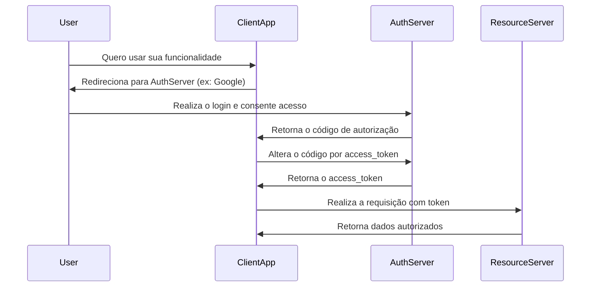

# STATELESS AUTHENTICATION
Este é um modelo de autenticação pensado para economizar recursos no servidor, onde não é armazenada nenhuma informação de sessão sobre o cliente entre as requisições. Isso significa que cada requisição deve conter todas as informações necessárias para autenticar e autorizar o solicitante — o servidor não precisa reconhecer nenhuma requisição anterior. 
Seu fluxo de funcionamento é simples porém muito seguro, o usuário realiza o login fornecendo suas credenciais, então o servidor valida e gera um token, que é enviado ao cliente. O cliente passa a incluir no cabeçalho `Authorization` este token em toda requisição subsequente. Assim, o servidor não armazena o token, apenas o valida e extrai as informações `payload` sempre que o recebe. Vale ressaltar que o cliente pode manter o token localmente, a fim de agilizar as requisições. Algumas das vantagens deste método são:
- **Não há armazenamento no servidor**: O servidor não guarda sessões, economizando memória.
- **Requisições independentes**: Cada requisição é processada isoladamente.
- **Fácil de escalar**: Como não há estado, qualquer instância de servidor pode responder.
- **Token autocontido**: O token carrega todas as informações necessárias, como ID do usuário, permissões e expiração por exemplo.
- **Segurança depende do token**: Tokens devem ser assinados e protegidos por alguma entidade certificadora.

# [OAuth](https://oauth.net)
O **OAuth** é um dos muitos métodos para autorização stateless. Este é um protocolo que permite que aplicações de terceiros acessem recursos protegidos em nome do usuário, sem que o usuário precise compartilhar suas credenciais com essa aplicação. Trata-se de um protocolo aberto para permitir autorização segura de maneira simples e padronizada para aplicações web, mobile e desktop. 
Para ilustrar, imaginemos que uma pessoa precise que um mecânico teste o carro. Não é de bom senso que se entregue a chave original, mas sim a chave reserva com acesso limitado, que não abre o porta malas por exemplo. O OAuth realiza este papel, entrega tokens com permissões específicas. Assim, ele evita que aplicações terceiras acessem credenciais diretamente, garantindo acesso limitado, temporário e revogável. Apesar de parecer muito sofisticado, este protocolo é usado todos os dias por milhões de usuários quando realizam login utilizando suas contas Google em sites de emprego por exemplo, ou então permitir que um aplicativo acesse apenas o Google Calendar e não os demais serviços associados a conta do usuário. Este tipo de autenticação é conhecido como **3 legged**, onde existem 3 partes se comunicando para realizar a autenticação.

**FLUXO DE FUNCIONAMENTO**

Existem diferentes tipos de Tokens neste protocolo:
- **Access Token**: Permite acesso temporário aos recursos.
- **Refresh Token**: Permite renovar o `access_token` sem novo login.
- **ID Token (OpenID)**: Contém identidade do usuário em login social.

Para que as credenciais possam ser validadas, o OAuth utiliza provedores de autenticação, que são as entidades que certificam e garantem que o usuário em questão é realmente quem diz ser. Os principais provedores de OAuth são:
| Provedor | URL de Autorização                          | Scopes comuns                  |
| -------- | ------------------------------------------- | ------------------------------ |
| Google   | `https://accounts.google.com/o/oauth2/auth` | `email`, `profile`, `calendar` |
| GitHub   | `https://github.com/login/oauth/authorize`  | `repo`, `user`, `gist`         |
| Meta     | `https://www.facebook.com/dialog/oauth`     | `public_profile`, `email`      |

<a href="https://github.com/raphaelkaique1/study/blob/main/5-desenvolvimento_web/5.4-seguranca_autenticacao_e_autorizacao/criptografia.md">previous</a>⠀⠀⠀⠀⠀⠀<a href="https://github.com/raphaelkaique1/study#seguranca_autenticacao_e_autorizacao">study</a>⠀⠀⠀⠀⠀⠀<a href="https://github.com/raphaelkaique1/study/blob/main/5-desenvolvimento_web/5.4-seguranca_autenticacao_e_autorizacao/jwt_json_web_tokens.md">next</a>